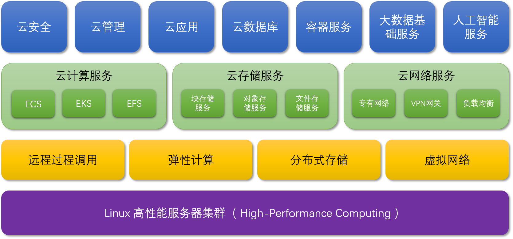

GCloud云计算平台
===

<!-- TOC -->

- [一、什么是云计算？](#一什么是云计算)
    - [1.1 云计算基础知识](#11-云计算基础知识)
    - [1.2 云计算模型](#12-云计算模型)
        - [1.2.1 基础设施即服务 (IaaS)](#121-基础设施即服务-iaas)
        - [1.2.2 平台即服务 (PaaS)](#122-平台即服务-paas)
        - [1.2.3 软件即服务 (SaaS)](#123-软件即服务-saas)
- [二、我们的目标](#二我们的目标)
- [三、平台架构](#三平台架构)
- [四、云产品](#四云产品)
    - [1、Linux 高性能服务器集群](#1linux-高性能服务器集群)
        - [1.1 Beowulf集群](#11-beowulf集群)
        - [1.2 Beowulf集群和COW集群](#12-beowulf集群和cow集群)
        - [1.3 Mosix集群](#13-mosix集群)
    - [2、RPC](#2rpc)
    - [3、Hypervisor](#3hypervisor)
    - [4、Kubernetes](#4kubernetes)
    - [5、云计算](#5云计算)
        - [5.1 云服务器 ECS](#51-云服务器-ecs)
        - [5.2 容器服务 EKS](#52-容器服务-eks)
        - [5.3 函数计算 EFS](#53-函数计算-efs)
    - [6、云存储](#6云存储)
        - [6.1 对象存储 OSS](#61-对象存储-oss)
        - [6.2 文件存储 EFS](#62-文件存储-efs)
        - [6.3 块存储 EBS](#63-块存储-ebs)
    - [7、云网络](#7云网络)
        - [7.1 私有网络 VPC](#71-私有网络-vpc)
        - [7.2 VPN 网关](#72-vpn-网关)
        - [7.3 负载均衡 SLB](#73-负载均衡-slb)
    - [8、云安全](#8云安全)
        - [8.1 Web应用防火墙](#81-web应用防火墙)
        - [8.2 证书服务](#82-证书服务)
        - [8.3 加密服务](#83-加密服务)
        - [8.4 安全管家](#84-安全管家)
    - [9、云管理](#9云管理)
        - [9.1 云监控](#91-云监控)
        - [9.2 访问控制](#92-访问控制)
        - [9.3 资源编排 ROS](#93-资源编排-ros)
        - [9.4 统一身份认证服务 IAM](#94-统一身份认证服务-iam)
    - [10、云数据库](#10云数据库)
        - [10.1 MySQL](#101-mysql)
        - [10.2 PostgreSQL](#102-postgresql)
        - [10.3 Redis](#103-redis)
        - [10.4 MongoDB](#104-mongodb)
        - [10.5 HBase](#105-hbase)
    - [11、云应用](#11云应用)
        - [11.1 日志服务](#111-日志服务)
        - [11.2 消息服务](#112-消息服务)
        - [11.3 即时通讯](#113-即时通讯)
        - [11.4 邮件推送](#114-邮件推送)
        - [11.5 呼叫中心](#115-呼叫中心)
        - [11.6 API网关](#116-api网关)
        - [11.7 容器镜像服务](#117-容器镜像服务)
- [五、云解决方案](#五云解决方案)
    - [1、开发中心Devops](#1开发中心devops)
        - [1.1 什么是 DevOps？](#11-什么是-devops)
        - [1.2 DevOps 的优势](#12-devops-的优势)
            - [1.2.1 速度](#121-速度)
            - [1.2.2 快速交付](#122-快速交付)
            - [1.2.3 可靠性](#123-可靠性)
            - [1.2.4 规模](#124-规模)
            - [1.2.5 增强合作](#125-增强合作)
            - [1.2.6 安全性](#126-安全性)
        - [1.3 DevOps 工具](#13-devops-工具)
            - [1.3.1 CodeCommit](#131-codecommit)
            - [1.3.2 CodePipeline](#132-codepipeline)
            - [1.3.3 CodeBuild](#133-codebuild)
            - [1.3.4 CodeDeploy](#134-codedeploy)
    - [2、大数据解决方案](#2大数据解决方案)
    - [3、公共安全云产品](#3公共安全云产品)

<!-- /TOC -->

# 一、什么是云计算？

## 1.1 云计算基础知识

云计算是通过 Internet 云服务平台按需提供计算能力、数据库存储、应用程序和其他 IT 资源。

云计算让开发人员和 IT 部门可以全身心投入最有价值的工作，避免采购、维护、容量规划等无价值的工作分散精力。

无论您是在运行拥有数百万移动用户的照片共享应用程序，还是要为您的业务的关键运营提供支持，云服务平台都让可以快速访问灵活且成本低廉的 IT 资源。透过云计算，您无需先期巨资投入硬件，再花大量时间来维护和管理这些硬件。与此相反，您可以精准配置所需的适当类型和规模的计算资源，为您的新点子提供助力，或者帮助运作您的 IT 部门。您可以根据需要访问任意多的资源，基本是实时访问。

## 1.2 云计算模型
云计算的模型主要有三种。每种模型代表着云计算世界的一个独特部分。

### 1.2.1 基础设施即服务 (IaaS)
基础设施即服务有时缩写为 IaaS，包含云 IT 的基本构建块，通常提供对联网功能、计算机（虚拟或专用硬件）以及数据存储空间的访问。基础设施即服务提供最高等级的灵活性和对 IT 资源的管理控制，其机制与现今众多 IT 部门和开发人员所熟悉的现有 IT 资源最为接近。

### 1.2.2 平台即服务 (PaaS)
平台即服务消除了组织对底层基础设施（一般是硬件和操作系统）的管理需要，让您可以将更多精力放在应用程序的部署和管理上面。这有助于提高效率，因为您不用操心资源购置、容量规划、软件维护、补丁安装或任何与应用程序运行有关的不能产生价值的繁重工作。

### 1.2.3 软件即服务 (SaaS)
软件即服务提供一种完善的产品，其运行和管理皆由服务提供商负责。通常人们所说的软件即服务指的是终端用户应用程序。使用 SaaS 产品时，服务的维护和底层基础设施的管理都不用您操心，您只需要考虑怎样使用 SaaS 软件就可以了。SaaS 的常见应用是基于 Web 的电子邮件，在这种应用场景中，您可以收发电子邮件而不用管理电子邮件产品的功能添加，也不需要维护电子邮件程序所运行的服务器和操作系统。

# 二、我们的目标

云计算部署模型，有以下三种：

* 公有云：
基于云的应用程序完全部署在云中且应用程序的所有组件都在云中运行。云中的应用程序分为两种，一种是在云中创建，另一种是从现有基础设施迁移到云中以利用云计算的优势。基于云的应用程序可以构建在基础设施组件上，也可以使用较高级的服务，这些服务提供了从核心基础设施的管理、架构和扩展要求中抽象提取的能力。

* 混合云：
混合部署是一种在基于云的资源和非云现有资源之间连接基础设施和应用程序的方法。混合部署最常见的方法是在云和现有内部基础设施之间将组织的基础设施扩展到云中，同时将云资源与内部系统进行连接。

* 私有云：
使用虚拟化和资源管理工具在内部部署资源往往被称作“私有云”。内部部署无法提供云计算的诸多优势，但有时采用这种方案是为了能够提供专用资源。大多数情况下，这种部署模型与旧式 IT 基础设施无异，都通过应用程序管理和虚拟化技术尽可能提高资源利用率。

我们将以**私有云**作为我们的初期目标，在漫长的研发过程中，逐步形成具备咱们业务特色的**共有云**。

在此，我们给这个目标命名为：**Leviathan**。

# 三、平台架构

下图显示了我们对云计算平台的整体设计。

自下而上，第一层采用[通用服务器集群](https://www.ibm.com/developerworks/cn/linux/theme/cluster.html)将物理基础设施管理起来，调度集群的计算、存储资源，支撑分布式应用的部署和执行，并自动进行故障恢复和数据冗余。

第二层是我们云计算的核心，通过自主研发的远程过程调用，通过开源技术的虚拟化技术、存储技术、网路技术提供的API，实现对对底层基础设施的统一控制，自动化运维。

第三层提供三大云基础服务：云计算服务，云存储服务，云网络服务。

第四层构建在第三层的基础之上，为开发者提供丰富的云上应用资源。

下面，将一一介绍云平台中的各项产品。

# 四、云产品

## 1、Linux 高性能服务器集群

集群（cluster）就是一组计算机，它们作为一个整体向用户提供一组网络资源。这些单个的计算机系统就是集群的节点（node）。一个理想的集群是，用户从来不会意识到集群系统底层的节点，在他/她们看来，集群是一个系统，而非多个计算机系统。并且集群系统的管理员可以随意增加和删改集群系统的节点。集群系统主要分为高可用(High Availability)集群,简称 HA 集群，和高性能计算(High Perfermance Computing)集群，简称 HPC 集群。

**这里我们主要采用高性能计算集群，作为平台的基石。**

当论及Linux高性能集群时，许多人的第一反映就是Beowulf。起初，Beowulf只是一个著名的科学计算集群系统。以后的很多集群都采用Beowulf类似的架构，所以，实际上，现在Beowulf已经成为一类广为接受的高性能集群的类型。尽管名称各异，很多集群系统都是Beowulf集群的衍生物。当然也存在有别于Beowulf的集群系统，COW和Mosix就是另两类著名的集群系统。

### 1.1 Beowulf集群

简单的说，Beowulf是一种能够将多台计算机用于并行计算的体系结构。通常Beowulf系统由通过以太网或其他网络连接的多个计算节点和管理节点构成。管理节点控制整个集群系统，同时为计算节点提供文件服务和对外的网络连接。它使用的是常见的硬件设备，象普通PC、以太网卡和集线器。它很少使用特别定制的硬件和特殊的设备。Beowulf集群的软件也是随处可见的，象Linux、PVM和MPI。。

### 1.2 Beowulf集群和COW集群

象Beowulf一样，COW（Cluster Of Workstation）也是由最常见的硬件设备和软件系统搭建而成。通常也是由一个控制节点和多个计算节点构成。COW和Beowulf的主要区别在于：

1. COW中的计算节点主要都是闲置的计算资源，如办公室中的桌面工作站，它们就是普通的PC，采用普通的局域网进行连接。因为这些计算节点白天会作为工作站使用，所以主要的集群计算发生在晚上和周末等空闲时间。而Beowulf中的计算节点都是专职于并行计算，并且进行了性能优化。它们采用高速网（Myrinet或Giganet）上的消息传递（PVM或MPI）进行进程间通信（IPC）。

2. 因为COW中的计算节点主要的目的是桌面应用，所以它们都具有显示器、键盘和鼠标等外设。而Beowulf的计算节点通常没有这些外设，对这些计算节点的访问通常是在管理节点上通过网络或串口线实现的。

3. 因为连接COW中计算节点的通常是普通的局域网，所以COW上的高性能应用通常是象SETI@HOME 这样的SIMD的高吞吐计算。而Beowulf无论从硬件、网络和软件上都对需要频繁交换数据的MIMD应用做了特别的优化。

### 1.3 Mosix集群

实际上把Mosix集群放在高性能集群这一节是相当牵强的，但是和Beowulf等其他集群相比， Mosix集群确实是种非常特别的集群， 它致力于在Linux系统上实现集群系统的单一系统映象SSI(Single System Image)。Mosix集群将网络上运行Linux的计算机连接成一个集群系统。系统自动均衡节点间的负载。因为Mosix是在Linux系统内核中实现的集群，所以用户态的应用程序不需要任何修改就可以在Mosix集群上运行。通常用户很少会注意到Linux和Mosix的差别。对于他来说，Mosix集群就是运行Linux的一台PC。尽管现在存在着不少的问题，Mosix始终是引人注目的集群系统。

## 2、RPC

> 待补充。

## 3、Hypervisor

hypervisor:一种运行在物理服务器和操作系统之间的中间层软件，可以允许多个操作系统和应用共享一套基础物理硬件。可以将hypervisor看做是虚拟环境中的“元”操作系统，可以协调访问服务器上的所有物理设备和虚拟机，所以又称为虚拟机监视器（virtual machine monitor）。

hypervisor是所有虚拟化技术的核心，非中断的支持多工作负载迁移是hypervisor的基本功能。当服务器启动并执行hypervisor时，会给每一台虚拟机分配适量的内存，cpu，网络和磁盘资源，并且加载所有虚拟机的客户操作系统。

采用hypervisor，可以使软硬件架构和管理更高效、更灵活，硬件的效能能够更好地发挥出来。

目前市场上各种x86 管理程序(hypervisor)的架构存在差异，三个最主要的架构类别包括：

* I型：虚拟机直接运行在系统硬件上，创建硬件全仿真实例，被称为“裸机”型。裸机型在虚拟化中Hypervisor直接管理调用硬件资源，不需要底层操作系统，也可以将Hypervisor看作一个很薄的操作系统。这种方案的性能处于主机虚拟化与操作系统虚拟化之间。

* II型：虚拟机运行在传统操作系统上，同样创建的是硬件全仿真实例，被称为“托管（宿主）”型。托管型/主机型Hypervisor运行在基础操作系统上，构建出一整套虚拟硬件平台（CPU/Memory/Storage/Adapter），使用者根据需要安装新的操作系统和应用软件，底层和上层的操作系统可以完全无关化，如Windows运行Linux操作系统。主机虚拟化中VM的应用程序调用硬件资源时需要经过:VM内核->Hypervisor->主机内核，因此相对来说，性能是三种虚拟化技术中最差的。

* Ⅲ型：虚拟机运行在传统操作系统上，创建一个独立的虚拟化实例（容器），指向底层托管操作系统，被称为“操作系统虚拟化”。操作系统虚拟化是在操作系统中模拟出运行应用程序的容器，所有虚拟机共享内核空间，性能最好，耗费资源最少。但是缺点是底层和上层必须使用同一种操作系统，如底层操作系统运行的是Windows系统，则VPS/VE就必须运行Windows。

目前市场主要厂商及产品：VMware vSphere、微软Hyper-V、Citrix XenServer 、IBM PowerVM、Red Hat Enterprise Virtulization、Huawei FusionSphere、开源的KVM、Xen、VirtualBSD等。

## 4、Kubernetes

Kubernetes是Google基于Borg开源的容器编排调度引擎，作为CNCF（Cloud Native Computing Foundation）最重要的组件之一，它的目标不仅仅是一个编排系统，而是提供一个规范，可以让你来描述集群的架构，定义服务的最终状态，kubernetes可以帮你将系统自动地达到和维持在这个状态。Kubernetes作为云原生应用的基石，相当于一个云操作系统，其重要性不言而喻。

Kubernetes发展非常迅速，已经成为容器编排领域的领导者。

主要功能包括：

- 基于容器的应用部署、维护和滚动升级
- 负载均衡和服务发现
- 跨机器和跨地区的集群调度
- 自动伸缩
- 无状态服务和有状态服务
- 广泛的Volume支持
- 插件机制保证扩展性

通常，一个成功的应用编排系统需要有较强的自动化能力，这也是为什么 Kubernetes 被设计作为构建组件和工具的生态系统平台，以便更轻松地部署、扩展和管理应用程序。

用户可以使用Label以自己的方式组织管理资源，还可以使用Annotation来自定义资源的描述信息，比如为管理工具提供状态检查等。

此外，Kubernetes控制器也是构建在跟开发人员和用户使用的相同的API之上。用户还可以编写自己的控制器和调度器，也可以通过各种插件机制扩展系统的功能。

这种设计使得可以方便地在Kubernetes之上构建各种应用系统。

## 5、云计算

弹性计算是在计算虚拟化的基础上，根据实际业务或者计算需要，灵活地分配计算资源。

弹性计算的类型非常多，目前比较流行的弹性计算有以下三种：

### 5.1 云服务器 ECS

云服务器（Elastic Compute Service，ECS）是一种简单高效、处理能力可弹性伸缩的计算服务，帮助您快速构建更稳定、安全的应用，提升运维效率，降低 IT 成本，使您更专注于核心业务创新。

### 5.2 容器服务 EKS

云容器服务（Elastic kubernetes Service，EKS）基于原生 kubernetes 提供以容器为核心的、高度可扩展的高性能容器管理服务。云容器服务完全兼容原生 kubernetes API ，扩展了 CBS、CLB 等 kubernetes 插件，为容器化的应用提供高效部署、资源调度、服务发现和动态伸缩等一系列完整功能，解决用户开发、测试及运维过程的环境一致性问题，提高了大规模容器集群管理的便捷性，帮助用户降低成本，提高效率。

容器服务 EKS 的特性：

* 一键创建Kubernetes集群，自动化部署、运维容器应用，整个生命周期都在容器服务内一站式完成。
* 高可用业务不中断，集群控制面HA和跨AZ高可用，容器应用优雅伸缩，安全下线，保障业务不掉线。
* 丰富的应用调度策略，支持多种亲和反亲和调度策略，用户可方便地根据应用特点在高性能和高可靠中找到平衡点。
* 灵活的弹性伸缩策略，支持按性能、按时间、按周期的弹性伸缩策略，用户可自由组合策略以应对多的突发浪涌。
* 兼容原生Kubernetes和Docker，紧跟社区，3个月同步最新版本，兼容原生API和命令行。
* 可定制化的DevOps能力，支持Java/Python/Go/Node.JS/Vert.x等语言代码开发一键式生成镜像能力。
* IaaS资源深度整合，直接使用云计算、网络、存储能力。

### 5.3 函数计算 EFS

Elastic Function Service 提供基于事件机制，弹性、高可用、扩展性好、极速响应的云端无服务器计算能力。您可以仅关注业务逻辑的代码部分，函数计算会为您准备好计算资源，以弹性、可靠的方式运行您的代码。

## 6、云存储

云存储是云计算的关键组成部分，它承载着应用程序所使用的信息。大数据分析、数据仓库、物联网、数据库、备份和存档应用程序全都依赖于某种形式的数据存储架构。云存储通常比传统的本地存储系统更加安全可靠且可扩展。云存储提供一整套服务来支持应用程序和存档方面的合规性要求。

我们从对象存储服务、文件存储服务、块存储服务开始，设计云 IT 环境的基础。

### 6.1 对象存储 OSS

提供稳定、安全、高效、高可扩展的云存储服务。您可以将任意数量和形式的非结构化数据存入BOS，并对数据进行管理和处理。BOS支持标准、低频、冷存储等多种存储类型，满足您各类场景的存储需求。使用RESTful API 可以在互联网任何位置存储和访问，容量和处理能力弹性扩展，多种存储类型供选择全面优化存储成本。

### 6.2 文件存储 EFS

提供了简单可扩展的文件存储服务，通过标准的文件访问协议，为云上的虚机、容器等计算资源提供无限扩展、高可靠、全球共享的文件存储能力。它易于使用且界面简单，可让您轻松快速地创建和配置文件系统。可在不中断应用程序的情况下按需弹性扩展，在您添加或删除文件时自动扩展或缩减，从而让您的应用程序在需要时获得所需存储。

### 6.3 块存储 EBS

块存储是为云计算提供的低时延、持久性、高可靠的数据块级随机存储。块存储支持在可用区内自动复制您的数据，防止意外硬件故障导致的数据不可用，保护您的业务免于组件故障的威胁。就像对待硬盘一样，您可以对挂载到云服务器实例上的块存储做分区、创建文件系统等操作，并对数据持久化存储。

## 7、云网络

借助云网络，您可以隔离云基础设施、扩展请求处理能力，并将物理网络连接到私有虚拟网络。

### 7.1 私有网络 VPC

基于私有网络，用户可以灵活、自定义设置网络地址空间，实现私有网络安全隔离；多个私有网络之间（同城、跨城）支持高速、稳定对等互通。从而实现安全而轻松的资源访问和应用程序访问。

### 7.2 VPN 网关

VPN网关是一款基于Internet，通过加密通道将企业数据中心、企业办公网络、或internet终端和私有网络(VPC)安全可靠连接起来的服务。VPN 网关具有配置简单，云端配置实时生效、可靠性高等特点，其网关可用性达到 99.95%，保证稳定、持续的业务连接，帮您轻松实现异地容灾、混合云部署等复杂业务场景。

VPN 网关在国家相关政策法规下提供服务，不提供访问 Internet 功能。

### 7.3 负载均衡 SLB

对多台云服务器进行流量分发的负载均衡服务，可以通过流量分发扩展应用系统，对外的服务能力，通过消除单点故障提升应用系统的可用性。

## 8、云安全

云安全性在我们的云计算平台中的优先级最高。
> 待补充。

### 8.1 Web应用防火墙

对网站或者APP的业务流量进行恶意特征识别及防护，将正常、安全的流量回源到服务器。避免网站服务器被恶意入侵，保障业务的核心数据安全，解决因恶意攻击导致的服务器性能异常问题。

### 8.2 证书服务

在云上签发各品牌数字证书，实现网站HTTPS化，使网站可信，防劫持、防篡改、防监听。并进行统一生命周期管理，简化证书部署，一键分发到云上产品。

### 8.3 加密服务

基于国家密码局认证的硬件加密机，提供了云上数据加解密解决方案，用户能够对密钥进行安全可靠的管理，也能使用多种加密算法来对云上业务的数据进行可靠的加解密运算。

### 8.4 安全管家

云安全管家服务是云安全专家基于云平台多年安全最佳实践经验为云上用户提供的全方位安全技术和咨询服务，为云上用户建立和持续优化云安全防御体系，保障用户业务安全。

## 9、云管理

> 待补充。

### 9.1 云监控

云监控服务可用于收集获取云平台资源的监控指标或用户自定义的监控指标，探测服务可用性，以及针对指标设置警报。使您全面了解云平台上的资源使用情况、业务的运行状况和健康度，并及时收到异常报警做出反应，保证应用程序顺畅运行。

### 9.2 访问控制

访问控制是一个稳定可靠的集中式访问控制服务。您可以通过访问控制将云平台资源的访问及管理权限分配给您的企业成员或合作伙伴。

### 9.3 资源编排 ROS

资源编排（Resource Orchestration）是一种简单易用的云计算资源管理和自动化运维服务。用户通过模板描述多个云计算资源的依赖关系、配置等，并自动完成所有资源的创建和配置，以达到自动化部署、运维等目的。编排模板同时也是一种标准化的资源和应用交付方式，并且可以随时编辑修改，使基础设施即代码（Infrastructure as Code）成为可能。

### 9.4 统一身份认证服务 IAM

统一身份认证服务（Identity and Access Management）提供身份认证和权限管理功能，可以管理用户（比如员工、系统或应用程序）账号，并且可以控制这些用户对您名下资源的操作权限。

## 10、云数据库

> 待补充。

### 10.1 MySQL

MySQL 是全球最受欢迎的开源数据库之一，作为开源软件组合 LAMP（Linux + Apache + MySQL + Perl/PHP/Python）中的重要一环，广泛应用于各类应用场景。 

### 10.2 PostgreSQL

PostgreSQL被业界誉为“最先进的开源数据库”，面向企业复杂SQL处理的OLTP在线事务处理场景，支持NoSQL数据类型（JSON/XML/hstore）、支持GIS地理信息处理。 

### 10.3 Redis

云数据库Redis版是兼容Redis协议标准的、提供持久化的内存数据库服务，基于高可靠双机热备架构及可无缝扩展的集群架构，满足高读写性能场景及容量需弹性变配的业务需求。

### 10.4 MongoDB

云数据库MongoDB版支持ReplicaSet和Sharding两种部署架构，具备安全审计，时间点备份等多项企业能力。在互联网、物联网、游戏、金融等领域被广泛采用。

### 10.5 HBase

云数据库 HBase 版（ApsaraDB for HBase）是基于 Hadoop 且100%兼容HBase协议的高性能、可弹性伸缩、面向列的分布式数据库，轻松支持PB级大数据存储，满足千万级QPS高吞吐随机读写场景。

## 11、云应用

> 待补充。

### 11.1 日志服务

日志服务（Log Service，简称LOG/原SLS）是针对实时数据一站式服务，在阿里集团经历大量大数据场景锤炼而成。提供日志类数据采集、消费、投递及查询分析功能，全面提升海量日志处理/分析能力。

### 11.2 消息服务

消息服务，与传统的消息中间件不同，具有大规模，高可靠、高并发访问和超强消息堆积能力的特点。消息服务API采用HTTP RESTful标准，接入方便，跨网络能力强；已全面接入资源访问控制服务（RAM）、专有网络（VPC），支持各种安全访问控制；接入云监控，提供完善的监控及报警机制。消息服务提供丰富的SDK、解决方案、最佳实践和7x24小时的技术支持，帮助应用开发者在应用组件之间自由地传递数据和构建松耦合、分布式、高可用系统。 

### 11.3 即时通讯

即时通信让您可以随时随地在任意终端上与团队成员多方协同、共享内容，提升工作效率。M 服务提供了一整套即时通讯基础能力，通过该平台服务就可以将即时通讯、实时网络能力快速集成至企业自身应用中。

### 11.4 邮件推送

邮件推送（DirectMail）是一款简单高效的电子邮件发送服务，它构建在可靠稳定的云平台基础之上，帮助您快速、精准地实现事务邮件、通知邮件和批量邮件的发送。邮件推送历经两年双11考验，在发送速度、系统稳定性和到达率上表现优异；提供丰富的接口和灵活的使用方式，为企业和开发者解决邮件投递的难题，用户无需自建邮件服务器，开通服务即可享受云平台优质的邮件服务，获得邮件投递的最佳实践。

### 11.5 呼叫中心

云呼叫中心是我们多年研发积累的内部呼叫中心系统的优化输出。您可以自助开通呼叫中心，轻松设置IVR流程，管理并追踪客服绩效，无需具备专业技能，无需管理任何设备。您将获得基于云端呼叫中心平台的全部优势，实现更大的灵活性，更高的可靠性和更低的成本。

### 11.6 API网关

API 网关（API Gateway），提供API托管服务，涵盖API发布、管理、运维、售卖的全生命周期管理。辅助用户简单、快速、低成本、低风险的实现微服务聚合、前后端分离、系统集成，向合作伙伴、开发者开放功能和数据。

### 11.7 容器镜像服务

容器镜像服务（Container Registry）提供安全的镜像托管能力，稳定的国内外镜像构建服务，便捷的镜像授权功能，方便用户进行镜像全生命周期管理。容器镜像服务简化了Registry的搭建运维工作，支持多地域的镜像托管，并联合容器服务等云产品，为用户打造云上使用Docker的一体化体验。

# 五、云解决方案

## 1、开发中心Devops

### 1.1 什么是 DevOps？

DevOps 集文化理念、实践和工具于一身，可以提高组织高速交付应用程序和服务的能力，与使用传统软件开发和基础设施管理流程相比，能够帮助组织更快地发展和改进产品。这种速度使组织能够更好地服务其客户，并在市场上更高效地参与竞争。

在 DevOps 模式下，开发团队和运营团队都不再是“孤立”的团队。有时，这两个团队会合为一个团队，他们的工程师会在应用程序的整个生命周期（从开发测试到部署再到运营）内相互协作，并会因此开发出一系列不限于单一职能的技能。在应用程序的整个生命周期中，质保和安全团队也会与开发和运营工作更紧密地结合在一起。
这些团队会使用实践经验自动执行之前手动操作的缓慢流程。他们使用能够帮助其快速可靠地操作和发展应用程序的技术体系和工具。这些工具还可以帮助工程师独立完成通常需要其他团队协作才能完成的任务（例如部署代码或预置基础设施），从而进一步提高团队的工作速度。

开发中心是一组专门设计的服务，利用这些服务，实践 DevOps 的开发人员和 IT 专业运维人员可以快速安全地交付软件。这些服务结合起来，可以帮助您安全地存储应用程序的源代码并对其进行版本控制，同时还可自动构建、测试应用程序并将其部署到云p或您的内部环境中。您可以利用这些服务和第三方工具通过 CodePipeline 编排端到端软件发布工作流程，或者单独将每个服务与现有工具集成。

### 1.2 DevOps 的优势

#### 1.2.1 速度

高速运转，让您可以更快速地针对客户进行创新、更好地适应不断变化的市场，同时更有效地推动业务成果。DevOps 模式能够帮助您的开发人员和运营团队实现这些目标。例如，微服务和持续交付能够让团队充分掌控服务，然后更快速地发布更新。

#### 1.2.2 快速交付

提高发布的频率和速度，以便您能够更快速地进行创新并完善产品。您发布新功能和修复错误的速度越快，就越能快速地响应客户需求并建立竞争优势。持续集成和持续交付是自动执行软件发布流程（从构建到部署）的两项实践经验。

#### 1.2.3 可靠性

确保应用程序更新和基础设施变更的品质，以便您能够在保持最终用户优质体验的同时，更加快速可靠地进行交付。使用持续集成和持续交付等实践经验来测试每次变更是否安全以及能够正常运行。进行监控和记录实践经验能够帮助您实时了解当前的性能。

#### 1.2.4 规模

大规模运行和管理您的基础设施及开发流程。自动化和一致性可在降低风险的同时，帮助您有效管理复杂或不断变化的系统。例如，基础设施即代码能够帮助您以一种可重复且更有效的方式来管理部署、测试和生产环境。

#### 1.2.5 增强合作

建立一个适应 DevOps 文化模式的更高效的团队，强调主人翁精神和责任感。开发人员和运营团队密切合作，共同承担诸多责任，并将各自的工作流程相互融合。这有助于减少效率低下的工作，同时节约大家的时间（例如，缩短开发人员和运营团队之间的交接时间，编写将运行环境考虑在内的代码）。

#### 1.2.6 安全性

在快速运转的同时保持控制力和合规性。利用自动实施的合规性策略、精细控制和配置管理技术，您可以在不牺牲安全性的前提下采用 DevOps 模式。例如，利用基础设施即代码和策略即代码，您可以大规模定义并追踪合规性。

### 1.3 DevOps 工具

#### 1.3.1 CodeCommit

是一种完全托管的源控制服务，利用它，各公司能够轻松地托管安全且高度可扩展的私有 Git 存储库。CodeCommit 使您无需运作自己的源控制系统或担心基础设施的扩展能力。您可以使用 CodeCommit 将来自源代码的任何数据安全存储为二进制文件，而且它可以无缝兼容您现有的 Git 工具。

#### 1.3.2 CodePipeline

是一种持续集成与持续交付服务，可以实现快速而可靠的应用程序和基础设施更新。每次更改代码时，CodePipeline 都会根据您定义的发布流程模型构建、测试和部署您的代码。这使您能够快速而可靠地提供各种功能和更新。通过使用我们针对 GitHub 等常见第三方服务提供的预建插件，或者是将您自己的自定义插件集成到发布过程中的任何阶段，您可以轻松构建所需要的端到端解决方案。

#### 1.3.3 CodeBuild

是一项完全托管的构建服务，可以编译源代码、运行测试并生成可供部署的软件包。使用 CodeBuild，您无需配置、管理和扩展自己的生成服务器。CodeBuild 可持续缩放和并行处理多个生成任务，因此您的生成任务不必在队列中等待。您可以使用预先打包的生成环境快速开始，也可以创建使用你自己的生成工具的自定义生成环境。使用 CodeBuild，将按使用计算资源的分钟数向您收取费用。

#### 1.3.4 CodeDeploy

是一种可以将代码自动部署到任意实例中的服务，这些实例包括  ECS 实例以及在内部运行的服务器。借助 CodeDeploy，您可以更轻松地快速推出新功能、避免在应用程序部署过程中出现停机，并能帮助您简化应用程序更新。您可以使用 CodeDeploy 自动执行软件部署流程，而无需进行手动操作，手动操作容易出错。此服务还可以与您的基础设施进行扩展，以便您可以轻松部署到一个或上千个实例中。

## 2、大数据解决方案

提供了一系列广泛的服务，以帮助您快速轻松地构建和部署大数据分析应用程序。借助大数据解决方案，您可以快速访问灵活的低成本 IT 资源，这样，您便可以迅速扩展几乎任何大数据应用程序。您无需在前期投入大量的时间和费用来构建和维护基础设施。相反，您可以精确地预置支持大数据应用程序所需的资源类型和大小。

## 3、公共安全云产品

> 待补充。