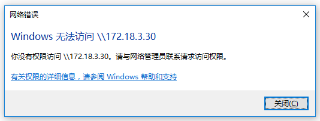

# 基础环境

* 地址：172.18.3.30
* 系统：CentOS 7.3
* 服务：samba-server 4.4.4

# 系统账户
用户 | 密码 | 用户主目录
--- | --- | ---
培训 | 123456 | /home/培训
美工 | p@ssw0rd | /home/美工
数据 | p@ssw0rd | /home/数据
开发 | p@ssw0rd | /home/开发
文档 | p@ssw0rd | /home/文档
QA   | p@ssw0rd | /home/QA
公共 | 123qwe | /home/公共

# 共享目录

共享目录采用了一个策略：
1. 各个用户只可以看见自己主目录下的内容；
2. 公共的，暂存的，单独做了设置；


共享名 | 路径| 权限
--- | --- | ---
homes | All Home Directories | Read/write to all known users
云资源 | /home/公共/云资源 | Read only to all known users
共享资源 | /home/公共/共享资源 | Read only to all known users
虚拟机 | /home/公共/虚拟机 | Read only to all known users
软考学习资料 | /home/公共/软考学习资料 | Read only to all known users
暂存 | /home/暂存 | Read only to all known users

`注意：homes是一个特殊的共享，名称不能修改，samba自动识别系统账户主目录。`

在这样的策略之下，对原有的文件的安排如下：

```
.
├── 公共
│   ├── 共享资源
│   ├── 软考学习资料
│   ├── 虚拟机
│   └── 云资源
├── 开发
│   ├── 3.5&&uvc安装部署资源
│   ├── GAuth安装包发布
│   ├── G-link Installation Package
│   ├── GS-911installFile
│   ├── NOC安装部署资源
│   ├── SIMA安装部署资源
│   ├── TS-GISinstallFile
│   ├── v3.6安装包发布
│   ├── 安装包发布
│   └── 版本发布备份
├── 美工
│   ├── 美工资源库
│   ……
├── 培训
│   └── 新员工培训
├── 数据
│   ├── ArcGIS9.3.1
│   ├── CreateFileGDB_python
│   ……
├── 文档
└── 暂存
    ├── 1
    ├── big data
    ├── Chengzhifeng
    ……
```

# Q&A

## 1、你没有权限访问
如果出现了如下图中的提示：



可以采用下面的命令，清除本机对内网共享资源的连接
```
[c:\~]$ net use * /del /y
你有以下的远程连接:

                    \\172.18.3.26\IPC$
                    \\172.18.3.30\IPC$
继续运行会取消连接。

命令成功完成。

```
然后重新登入。

# 配置文件
```
# See smb.conf.example for a more detailed config file or
# read the smb.conf manpage.
# Run 'testparm' to verify the config is correct after
# you modified it.

[global]
	workgroup = SAMBA
	security = user
	server string = Samba Server Version %v
	passdb backend = tdbsam
	log file = /root/samba-log/log.%m 
    max log size = 50 
	printing = cups
	printcap name = cups
	load printers = yes
	cups options = raw

[homes] 
    comment = Home Directories 
    read only = No 
    browseable = No 
    
[printers]
	comment = All Printers
	path = /var/tmp
	printable = Yes
	create mask = 0600
	browseable = No

[print$]
	comment = Printer Drivers
	path = /var/lib/samba/drivers
	write list = root
	create mask = 0664
	directory mask = 0775


[云资源]
	path = /home/公共/云资源
    
[共享资源]
	path = /home/公共/共享资源 

[虚拟机]
	path = /home/公共/虚拟机 

[软考学习资料]
	path = /home/公共/软考学习资料 

[暂存]
	path = /home/暂存
    read only = No 
    
```