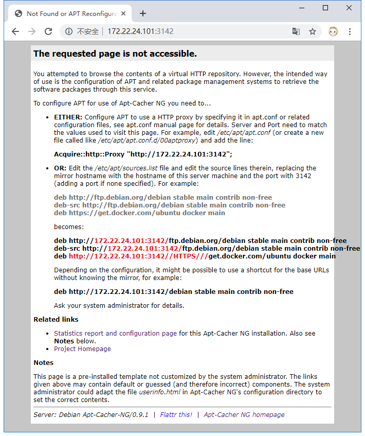

Apt-Cacher-ng在内网中提供包缓存代理服
===

<!-- TOC -->

- [1. 简介](#1-简介)
- [2. 安装](#2-安装)
- [3. 使用](#3-使用)
    - [3.1. CentOS](#31-centos)
    - [3.2. Ubuntu](#32-ubuntu)

<!-- /TOC -->

# 1. 简介

Apt-cacher-ng 本来是服务于 Debian 和 Ubuntu，但是其通用性的设计，同样可以作为 Fedora, CentOS, Cygwin 等软件包代理。

Apt-cacher-ng 本身就是一个 HTTP 协议代理，但是和其他 HTTP 代理服务器的区别在于：

* 能够“识别”出从不同站点（源）请求下载的软件包是否是同一个软件包，即源的合并功能。
* 支持请求重定向。即可以不直接从客户请求的地址下载，而是重定向到预先设定的可能更快的镜像进行下载。

# 2. 安装

前提条件：
* Ubuntu
* 可访问外网

采用下面的命令进行部署：
```
apt-get install apt-cacher-ng -y
```

在浏览器中查看
```
http://<server-ip>:3142/
```



这说明服务已经部署好了。

# 3. 使用

## 3.1. CentOS

添加配置
```
echo 'proxy=http://172.22.24.101:3142' >> /etc/yum.conf
```
使用`yum makecache`检查是否可用。

> 如果出现`https`的错误，可以采用某些mirrors提供的无`https`的配置。
> ```
> cd /etc/yum.repos.d/
> mv CentOS-Base.repo CentOS-Base.repo.backup
> wget http://mirrors.163.com/.help/CentOS7-Base-163.repo
> ```

## 3.2. Ubuntu

添加配置
```
echo 'Acquire::http { Proxy "http://172.22.24.101:3142"; };' > /etc/apt/apt.conf
```
使用`apt-get update`检查是否可用。


