采用Webmin部署DNS Server
===

<!-- TOC -->

- [1. 部署 Webmin](#1-部署-webmin)
- [2. 部署 DNS](#2-部署-dns)
- [3. 使用 DNS](#3-使用-dns)
    - [3.1. 创建主区域](#31-创建主区域)
    - [3.2. 添加地址](#32-添加地址)
    - [3.3. 验证](#33-验证)
- [Wiki](#wiki)

<!-- /TOC -->

# 1. 部署 Webmin


Webmin是目前功能最强大的基于Web的Unix系统管理工具。管理员通过浏览器访问Webmin的各种管理功能并完成相应的管理动作。

本篇指南基于Ubuntu 19.04
---

```
wget http://prdownloads.sourceforge.net/webadmin/webmin_1.920_all.deb
dpkg -i webmin_1.920_all.deb
apt-get install -f -y
```

在浏览器中通过 https://<server-ip>:10000/ 访问管理页面。

默认用户是root用户，填写相应的用户名密码即可。登录后首页如下：

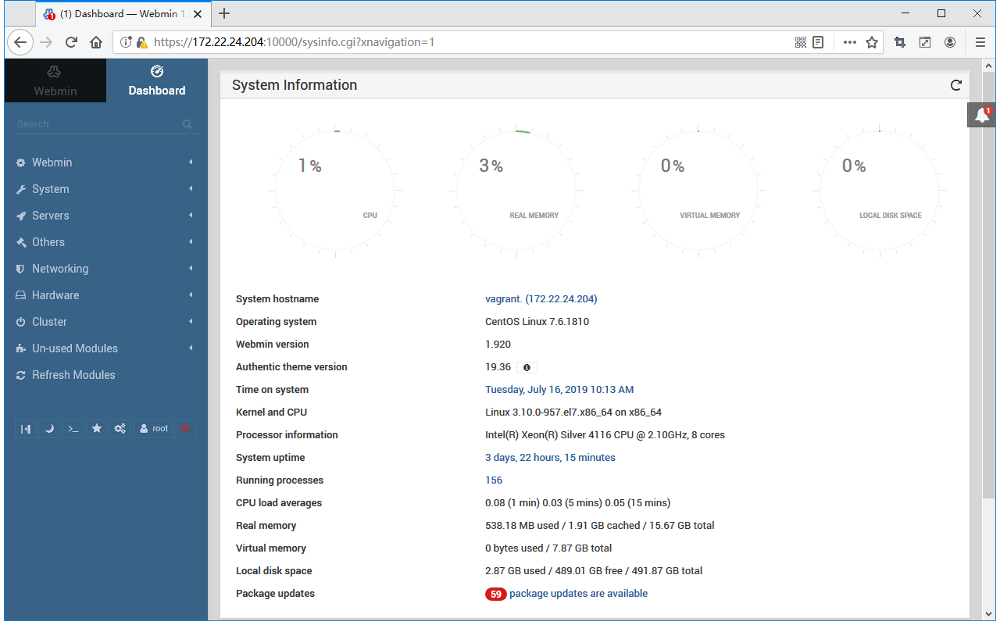

# 2. 部署 DNS

按照下图的方式，部署DNS：

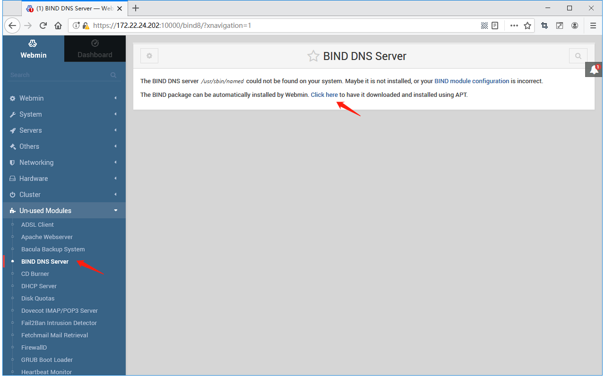

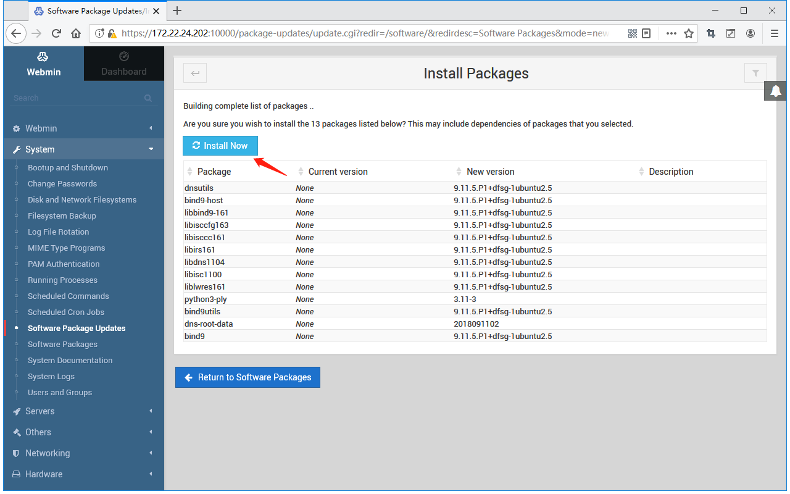

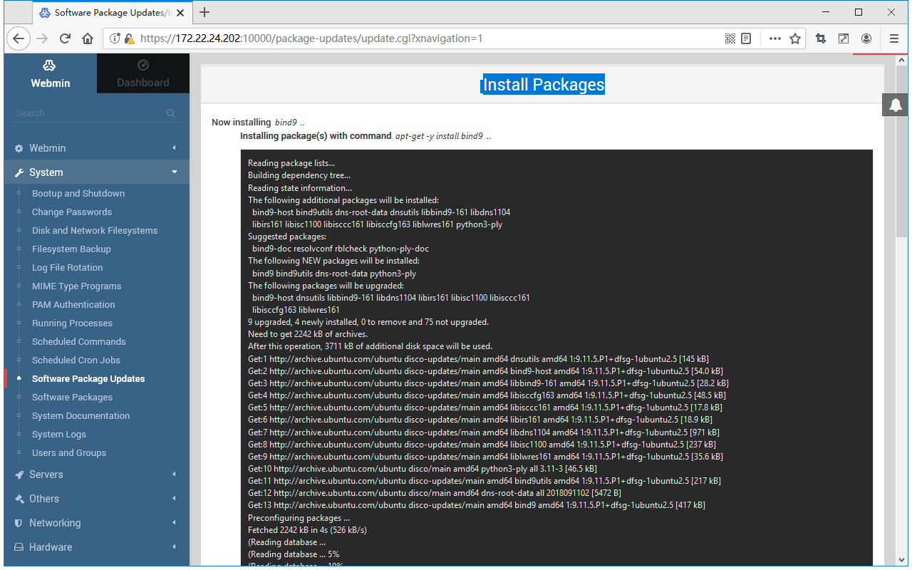

刷新页面

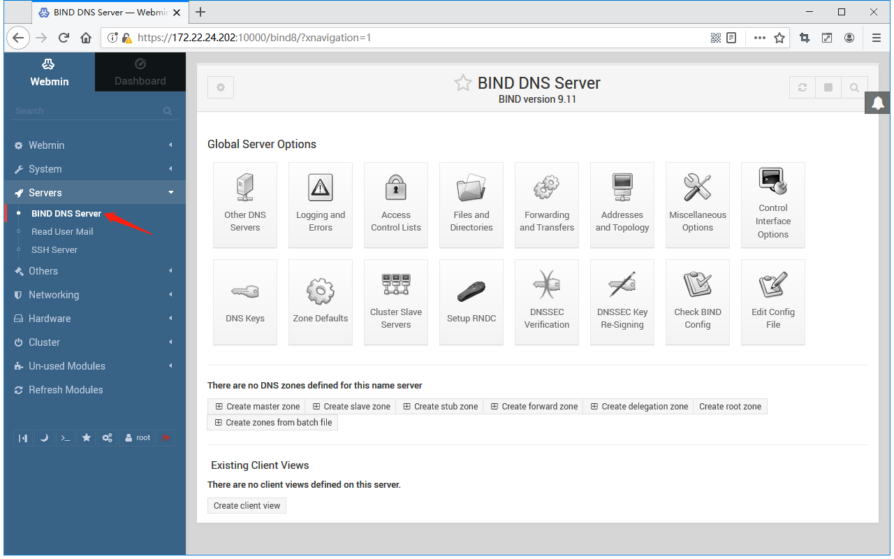


# 3. 使用 DNS

## 3.1. 创建主区域

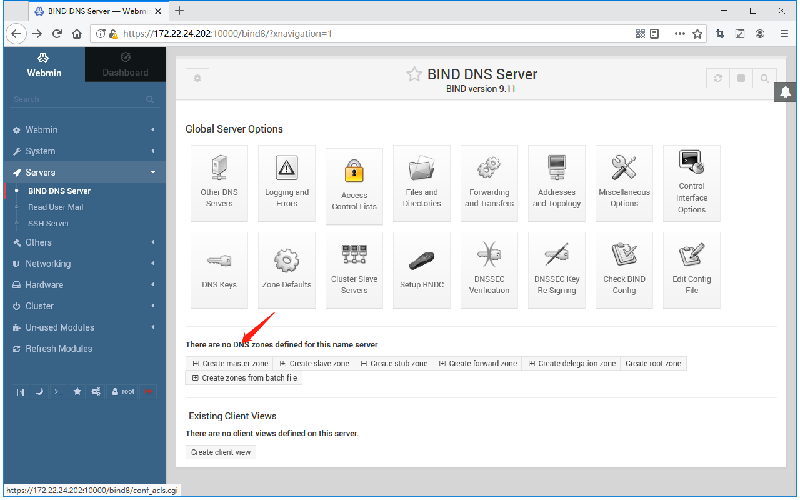

Zone type：分为正向和反向两种，简单测试，只设置正向了就好了。

Domain name / Network：要解析的域名。

Master server：本机的主机名。

Email address：邮箱。

其他的默认就好。

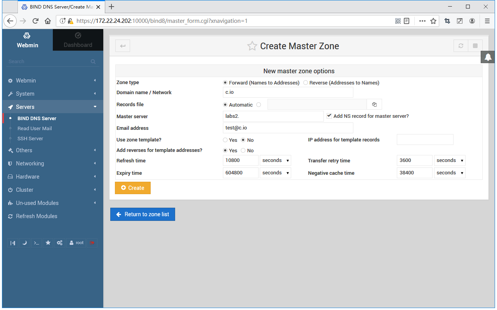

## 3.2. 添加地址

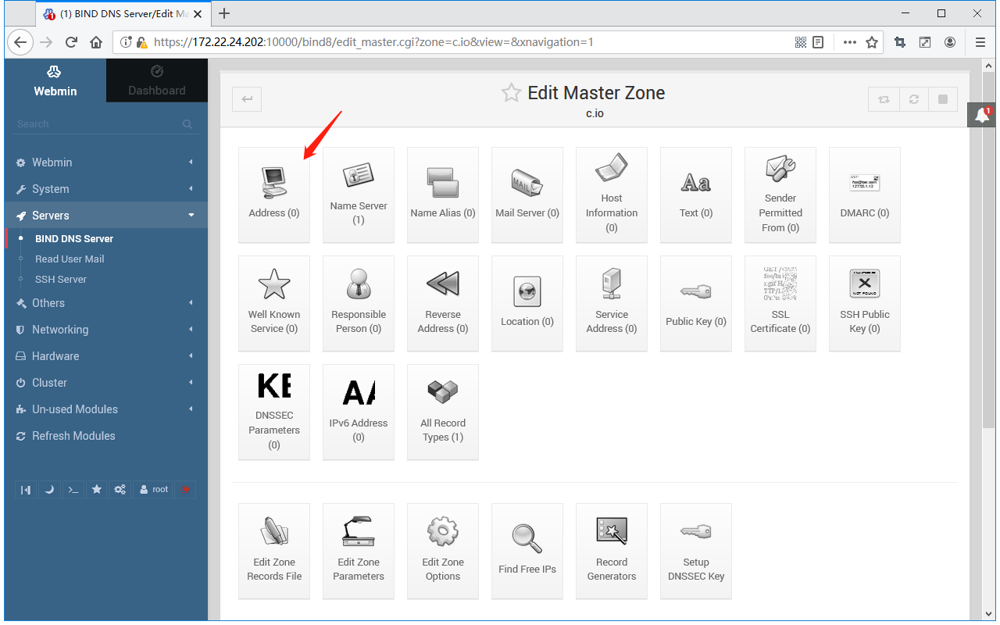

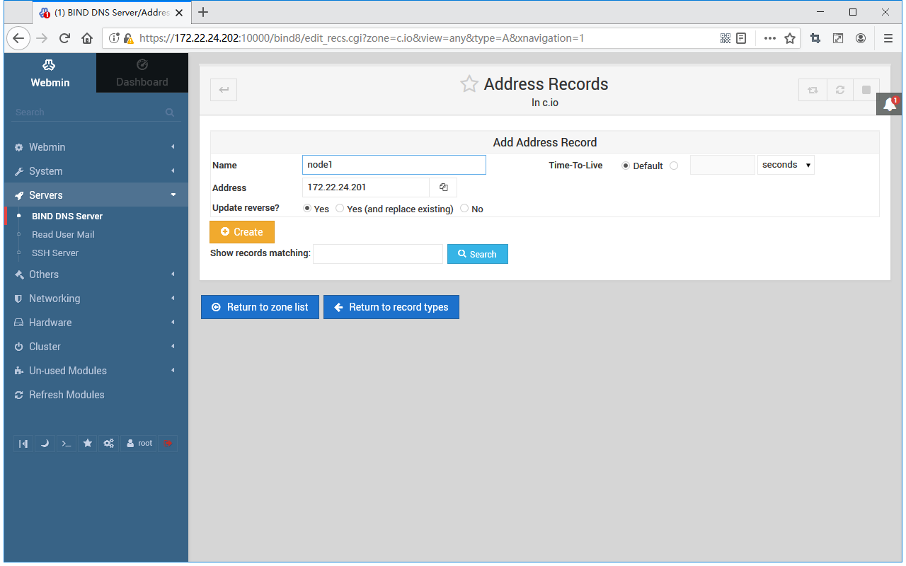

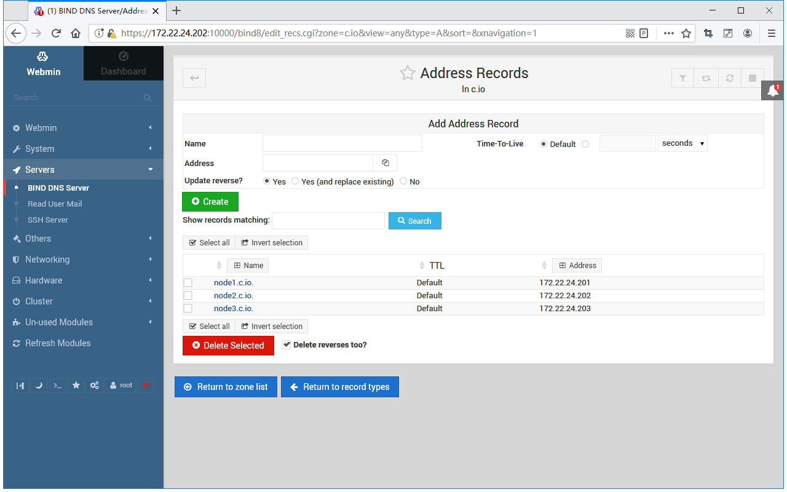

重启服务，以应用以上设置

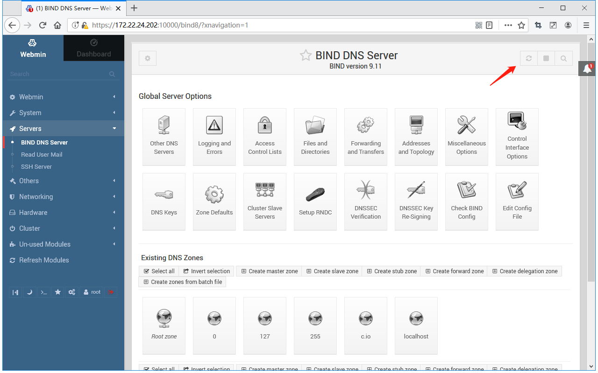

## 3.3. 验证

在其他机器上配置DNS

```
cat > /etc/resolv.conf << EOF
nameserver 172.22.24.202
EOF
```
```
ping node1.c.io
PING node1.c.io (172.22.24.201) 56(84) bytes of data.
64 bytes from 172.22.24.201 (172.22.24.201): icmp_seq=1 ttl=64 time=1.55 ms
64 bytes from 172.22.24.201 (172.22.24.201): icmp_seq=2 ttl=64 time=0.724 ms
64 bytes from 172.22.24.201 (172.22.24.201): icmp_seq=3 ttl=64 time=0.627 ms
64 bytes from 172.22.24.201 (172.22.24.201): icmp_seq=4 ttl=64 time=0.502 ms
```

# Wiki

<div id="mw-content-text" lang="en" dir="ltr" class="mw-content-ltr"><p>On this page the DNS protocol and the <b>BIND DNS server</b> are explained, as is the Webmin module for creating and managing DNS domains. 
</p>
<dl><dd> See <a href="/Webmin/Introduction_to_the_Domain_Name_System" title="Introduction to the Domain Name System">Introduction to the Domain Name System</a></dd></dl>
<div id="toc" class="toc"><div id="toctitle"><h2>目录</h2><span class="toctoggle">&nbsp;[<a role="button" tabindex="0" id="togglelink">隐藏</a>]&nbsp;</span></div>
<ul>
<li class="toclevel-1 tocsection-1"><a href="#The_BIND_DNS_Server_module"><span class="tocnumber">1</span> <span class="toctext">The BIND DNS Server module</span></a></li>
<li class="toclevel-1 tocsection-2"><a href="#Creating_a_new_master_zone"><span class="tocnumber">2</span> <span class="toctext">Creating a new master zone</span></a></li>
<li class="toclevel-1 tocsection-3"><a href="#Adding_and_editing_records"><span class="tocnumber">3</span> <span class="toctext">Adding and editing records</span></a></li>
<li class="toclevel-1 tocsection-4"><a href="#Record_types"><span class="tocnumber">4</span> <span class="toctext">Record types</span></a></li>
<li class="toclevel-1 tocsection-5"><a href="#Editing_a_master_zone"><span class="tocnumber">5</span> <span class="toctext">Editing a master zone</span></a></li>
<li class="toclevel-1 tocsection-6"><a href="#Creating_a_new_slave_zone"><span class="tocnumber">6</span> <span class="toctext">Creating a new slave zone</span></a></li>
<li class="toclevel-1 tocsection-7"><a href="#Editing_a_slave_zone"><span class="tocnumber">7</span> <span class="toctext">Editing a slave zone</span></a></li>
<li class="toclevel-1 tocsection-8"><a href="#Creating_and_editing_a_forward_zone"><span class="tocnumber">8</span> <span class="toctext">Creating and editing a forward zone</span></a></li>
<li class="toclevel-1 tocsection-9"><a href="#Creating_a_root_zone"><span class="tocnumber">9</span> <span class="toctext">Creating a root zone</span></a></li>
<li class="toclevel-1 tocsection-10"><a href="#Editing_zone_defaults"><span class="tocnumber">10</span> <span class="toctext">Editing zone defaults</span></a>
<ul>
<li class="toclevel-2 tocsection-11"><a href="#Defaults_for_new_master_zones"><span class="tocnumber">10.1</span> <span class="toctext">Defaults for new master zones</span></a></li>
<li class="toclevel-2 tocsection-12"><a href="#Default_zone_settings"><span class="tocnumber">10.2</span> <span class="toctext">Default zone settings</span></a></li>
</ul>
</li>
<li class="toclevel-1 tocsection-13"><a href="#Configuring_forwarding_and_transfers"><span class="tocnumber">11</span> <span class="toctext">Configuring forwarding and transfers</span></a></li>
<li class="toclevel-1 tocsection-14"><a href="#Editing_access_control_lists"><span class="tocnumber">12</span> <span class="toctext">Editing access control lists</span></a></li>
<li class="toclevel-1 tocsection-15"><a href="#Setting_up_partial_reverse_delegation"><span class="tocnumber">13</span> <span class="toctext">Setting up partial reverse delegation</span></a></li>
<li class="toclevel-1 tocsection-16"><a href="#Using_BIND_views"><span class="tocnumber">14</span> <span class="toctext">Using BIND views</span></a></li>
<li class="toclevel-1 tocsection-17"><a href="#Module_access_control"><span class="tocnumber">15</span> <span class="toctext">Module access control</span></a></li>
</ul>
</div>

<h3><span class="mw-headline" id="The_BIND_DNS_Server_module">The BIND DNS Server module</span></h3>
<p>BIND (Berkeley Internet Name Domain) is the most common DNS server for Unix systems. Several versions have been released over the years, the most recent being version 9. The BIND DNS Server module (found under the Servers category) supports the configuration of versions 8 and 9. The older version 4 has a different configuration file format, and can be configured using the BIND 4 DNS Server module, documented in a later section of this chapter. 
</p><p>Because BIND is available for almost all Unix systems and works identically regardless of operating system, the instructions in this chapter apply not just to Linux but to other versions of Unix as well. Most versions of Unix and Linux include BIND 8 or 9 as a standard package, so it is rarely necessary to install it. If the module cannot find the DNS server, an error message will be displayed on the main page - if this happens, check your operating system CD or website for a BIND package, or download and compile the source from <a rel="nofollow" class="external free" href="http://www.isc.org/">http://www.isc.org/</a>. 
</p><p>BIND's primary configuration file is /etc/named.conf, which contains all of the zones that the server hosts, and global configuration settings that apply to all zones. The records in each zone are stored in separate files, usually found in the /var/named directory. This Webmin module always updates all of these files directly, instead of by communicating with the running BIND process. This means that if you are running some other program that dynamically updates zones by communicating with BIND (such as a DHCP server), then this module should not be used as it may interfere with these changes. However, very few systems have this kind of dynamic updating activated. 
</p><p>Versions 9 of BIND has some features that version 8 does not. The most important one that is supported by this Webmin module is views. A view is a set of zones that are visible to only some DNS clients. Normally all clients see the same zones, but with BIND 9 you can restrict the visibility of some domains to only particular clients, identified by their IP addresses. This can be useful for creating zones that are only visible to systems on an internal network, even if your DNS server is connected to the Internet. 
</p><p>If you have never set up BIND on your system, when you enter the module for the first time the main page will display a form for setting up the DNS server, as shown below. This form is only shown if Webmin detects that the configuration file named.conf does not exist, or if the zone files directory that is specifies is non-existent. If you are certain that your BIND configuration is valid and that the DNS server is already running, do not click the <b>Create</b> button, as your named.conf file will be overwritten. Instead, click on the <b>Module Config</b> link and check that all the paths are correct for your system. 
</p>
<dl><dd><div class="thumb tnone"><div class="thumbinner" style="width:1030px;"><a href="/Webmin/File:Bind_Install.png" class="image"></a>  <div class="thumbcaption">Bind Install</div></div></div></dd></dl>
<p>When BIND has been set up on your system, the main page will appear as shown in the screenshot below. At the top is a table of icons for setting global options that apply to your entire DNS server. Below them are icons for each of the zones your server hosts, followed by icons for views if you are running BIND version 9. At the very bottom are buttons for applying the current DNS configuration or starting the BIND server. 
</p><p>If you have just set up BIND for the first time, there will probably be only one zone icon - the root zone. Some Linux distributions that include a BIND package come with a basic configuration file that defines zones like localdomain and 127.0.0, which are used for resolving the localhost and 127.0.0.l loopback hostname and IP address. 
</p>
<dl><dd><div class="thumb tnone"><div class="thumbinner" style="width:1034px;"><a href="/Webmin/File:Bind_DNS_Server.png" class="image"></a>  <div class="thumbcaption">Bind DNS Server Main Page</div></div></div></dd></dl>
<h3><span class="mw-headline" id="Creating_a_new_master_zone">Creating a new master zone</span></h3>
<p>A master zone is one for which your DNS server is the authoritative source of information. A single zone may be hosted by multiple servers, but only one is the master - all the rest are slaves. If you want to add a new master zone to your server's configuration, the steps to follow are: 
</p>
<ol><li> Decide on a name for the new zone, such as example.com or internal.  If this is going to be Internet domain that will be visible to other everyone in the world, the domain name must not have been registered by anyone else yet. However, you cannot normally register it yourself until your DNS server has been set up to host it. </li>
<li> On the module's main page, click on the <b>Create a new master zone</b> link below the table of existing zones. This will take you to the page shown in the image below for entering the details of the new zone. </li>
<li> If this is to be a forward zone like example.com or foo.com.au, leave the <b>Zone type</b> field set to <b>Forward</b>. However, if it is a reverse zone for looking up hostnames from IP addresses, set the field to <b>Reverse</b>. </li>
<li> In the <b>Domain name / Network</b> field, enter the name of the zone without any trailing dot. For a reverse zone, just enter the network address like 192.168.1. Webmin will automatically convert this to the in-addr.arpa format for you when the domain is created. </li>
<li> The <b>Records file</b> field controls where the configuration file containing the zone's records is stored. If you leave it set to <b>Automatic</b>, the filename will be determined automatically based on the module's configuration and the directory setting in the named.conf file. This is usually the best option, as it will result in the records file being created in the same directory as any existing zones, such as /var/named. However, if you de-select the <b>Automatic</b> option and enter a filename instead, all records for the zone will be written to that file.  If you enter the name of an existing file, it will be overwritten when the domain is created. </li>
<li> In the <b>Master server</b> field, enter the full domain name of the master DNS server for this zone. This must be the canonical name of your system, such as server.example.com, not a short name like server. This server (and the values from the next </li>
<li> fields) are used to create the new zone's SOA record. </li>
<li> In the <b>Email address</b> field, enter the address of the person responsible for this zone. You can use the @ symbol in the address, which Webmin will automatically convert to a dot for inclusion in the SOA record. </li>
<li> The <b>Refresh time</b> field determines how often secondary servers should check with this master server for updates to the zone. The default is reasonable, but you may want to increase it for zones that rarely change, or decrease it for those that are frequently updated. </li>
<li> The <b>Transfer retry time</b> field determines how long a secondary server should wait after a failed zone transfer before trying again. </li>
<li> The <b>Expiry time</b> field controls the maximum amount of time that a secondary DNS server for the zone should cache records for before re-transferring them from the master. </li>
<li> The <b>Default time-to-live</b> field determines the TTL of records in the zone that do not have one set explicitly. </li>
<li> Click the <b>Create</b> button at the bottom of the page. As long as the form has been filled in correctly and the zone does not already exist on your server, you will be taken to a page for adding new records to the zone. </li>
<li> Return to the module's main page which will now include an icon for your new zone, and click the <b>Apply Changes</b> button at the bottom to activate it. </li></ol>
<dl><dd><div class="thumb tnone"><div class="thumbinner" style="width:888px;"><a href="/Webmin/File:Bind_-_Create_Master_Zone.png" class="image"></a>  <div class="thumbcaption">Create Master Zone.png</div></div></div></dd></dl>
<p>A newly created zone will contain only one record (unless you have set up a template). To add more, follow the instructions in the next section. Once you have set up the basic records in your domain, you can register it with the authority that manages the parent domain, such as .com or .com.au. Some domain authorities will not allow you to register zones that do not have at least two servers (one master and one slave), and name server records in 
the zone for those servers. 
</p>
<h3><span class="mw-headline" id="Adding_and_editing_records">Adding and editing records</span></h3>
<dl><dd><div class="thumb tnone"><div class="thumbinner" style="width:891px;"><a href="/Webmin/File:Bind_-_Edit_Master_Zone.png" class="image"></a>  <div class="thumbcaption">Bind - Edit Master Zone</div></div></div></dd></dl>
<p>The most useful feature of the BIND DNS Server module is the ability to add, edit and delete records in the master zones hosted by your server. For example, if you wanted to set up a <a href="/Webmin/Apache_Webserver" title="Apache Webserver">webserver</a> in your domain example.com, you would need to add an Address record for www.example.com with the IP address of the server. To add a new record like this, the steps to follow are: 
</p>
<ol><li> On the module's main page, click on the icon for the zone that you want to add to. This will bring up the page shown below, at the top of which is a table of icons, one for each record type. </li>
<li> Click on the icon for the type of record that you want to add.  The most common type is <b>Address</b>, which associates an IP address with a hostname. See the <b><a href="#Record_types">#Record types</a></b> section below for a complete list of all the supported record types. </li>
<li> Clicking on the icon will take you to a page listing all existing records of that type. Above the list is a form for entering a new record. </li>
<li> In the <b>Name</b> field, enter the name of the new record relative to the zone name. For example, if you wanted to add the record www.example.com, you should just enter <i>www</i>. It is also possible to enter the full record name, as long as it has a dot at the end to indicate that it is not relative to the zone. Do not enter just <i>www.example.com</i>, as it will be converted to www.example.com.example.com, which is probably not what you want. </li>
<li> If this record is going to change more frequently than the rest of the zone, change the <b>Time-To-Live</b> field from <b>Default</b> to the estimated time between changes. This determines how long DNS clients and other servers will cache the record for. </li>
<li> If you are adding an Address record, enter the complete IP address of the host into the <b>Address</b> field. See the table below for a description of the fields that appear when adding other types of records and what they mean. </li>
<li> The field <b>Update reverse?</b> only appears when adding an Address record. It controls the automatic creation of a corresponding record in a reverse zone which associates the hostname with the IP address. Naturally, this can only be done if the IP that you enter is in a network that your system is the primary reverse DNS server for. This keeps the forward and reverse zones synchronized, which can be very useful. If <b>Yes</b> is selected, a reverse address record will be added as long as one does not already exist in the reverse zone for the same IP address. Often many hostnames will have the same IP, such as those use for name-based virtual hosting. In cases like these, you don't want to change the reverse mapping if one already exists. The *Yes (and replace existing)* option works the same as <b>Yes</b>, but if a reverse record for the IP address already exists it will be updated with the new hostname. This can be useful if you know there is an existing record that you want to replace. If <b>No</b> is selected, no reverse address will be created even if it is possible. </li>
<li> When you are done filling in the form, click the <b>Create</b> button at the bottom. As long as it is filled in correctly, the record will be added to the list below the form. When writing to the zone's records file, Webmin will use the full canonical format for the record name, such as www.example.com., even if you just enter www. </li>
<li> To activate the new record so that it can be looked up by DNS clients and other servers, you will need to click the <i>Apply Changes</i> button on the module's main page. If you are planning to add or edit several records, it is usually better to wait until all the changes are complete before hitting the apply button. If it is available, you can instead use the <i>Apply Changes</i> button at the bottom of the master zone page shown below. This uses the ndc command to tell BIND to re-read only the file for this zone, which can be much faster on a system that hosts are large number of domains. </li></ol>
<dl><dd><div class="thumb tnone"><div class="thumbinner" style="width:881px;"><a href="/Webmin/File:Bind_-_Add_Record_to_Zones.png" class="image"></a>  <div class="thumbcaption">Bind - Add Record to Zones</div></div></div></dd></dl>
<p>Although the instructions above are focused on adding an Address record, the process of adding other record types to a forward zone is almost identical. The <b>Update reverse?</b> field does not exist, and the <b>Address</b> field is replaced with one or more different fields. The <b>Record types</b> section below explains in detail what fields are available for each type of record known to Webmin. 
</p><p>When adding a Reverse Address record to a reverse zone, the form is quite different. The <b>Address</b> field appears before the <b>Hostname</b>, and the hostname must always be entered in canonical form with a dot at the end, like <i>www.example.com.</i>. The <b>Update reverse?</b> field is replaced with <b>Update forward?</b>, which controls the automatic creation of a record in the corresponding forward zone. However, there is no option to overwrite an existing forward record - if one with the same name already exists, it will not be touched even if <b>Yes</b> is selected. 
</p><p>Every time a record is added to or updated in a zone using Webmin, its serial number will be automatically incremented. This also applies to reverse zones that are automatically updated when adding an Address record, and vice-versa. This means that when you apply the changes, other DNS servers will be able to detect that the zone has changed by comparing the new serial number with the old one that they have cached. 
</p><p>To edit an existing record in a zone, the steps to follow are: 
</p>
<ol><li> On the module's main page, click on the icon for the zone that you want to edit, which will bring you to the page show above.</li>
<li> Click on the icon for the type of record that you want to change, which will display a page listing all records of that type in the zone. Alternately, you can click on the <i>All Record Types</i> icon which will bring up a list of every single record in the zone regardless of type. </li>
<li> Click on the name of the record that you want to edit. Your browser will display a form similar to the one used for adding a record, but with the fields already filled in with the details of the existing address. </li>
<li> To re-name the record, edit the contents of the <b>Name</b> field.  It will be shown in canonical form with a dot at the end initially, but you can change it to a name relative to the domain if you wish. </li>
<li> Adjust the <b>Time-To-Live</b> field in you want this record to have a different TTL, or set it to <b>Default</b> to make it the same as the rest of the zone. </li>
<li> If this is an Address record, change the IP in the <b>Address</b> field. For other record types, the fields are the same as those on the record creation form, and have the same meanings. </li>
<li> For Address records, the field <b>Update reverse?</b> is displayed.  Selecting <b>Yes</b> will cause the corresponding record in the reverse zone to be have its name and address changed to match this forward record. If you change the IP so that the reverse address is no longer in the same network, it will be removed from the old reverse zone and added to the new reverse zone (if it is hosted by your server). </li>
<li> For Reverse Address records, the field <b>Update forward?</b> is shown instead. If <b>Yes</b> is selected, the corresponding Address record in its forward zone will be changed to match any changes that you make on this form. </li>
<li> Click the <b>Save</b> button to update the record in the zone file, and return to the list of record types. </li>
<li> To activate the changes, click the <b>Apply Changes</b> button back on the module's main page. </li></ol>
<p>To delete a record from a zone, click on the <b>Delete</b> button on the editing form instead of <b>Save</b>. For Address records, if the <b>Update reverse?</b> field is set to <b>Yes</b>, the corresponding Reverse Address record will be deleted as well. Apart from that, the process of deleting a record is identical no matter what type it is. The same thing happens when deleting a Reverse Address record - the matching Address record is deleted as well, as long as the <i>Update forward?</i> field is set to <b>Yes</b>. 
</p><p>The list of records in a zone is initially sorted according to the module configuration, which usually means that records will be displayed in the order that they were added. To change this, you can click on a column heading like <b>Name</b>, <b>Address</b> or <b>Real Name</b> to sort them by that column instead. The sorting is only temporary though, and will be lost if you return to the main page and re-open the zone. To change it permanently, see the <b>Order to display records in</b> field in the section on <i>Configuring the BIND DNS Server module</i>.
</p>
<h3><span class="mw-headline" id="Record_types">Record types</span></h3>
<p>Webmin does not support all of the record types that BIND knows about, only those that are most commonly used. The list below covers all of the supported types, and explains what they are used for and what fields are available when adding or editing a record of that type in Webmin. Next to each type name is the short code used by BIND itself for identifying the type in the records file. 
</p>
<dl><dt> Address (A)</dt>
<dd> An address record associates an IPv4 address with a hostname. Any system that you want to be able to connect to via HTTP, telnet or some other protocol using its hostname must have an address record so that clients can look up its IP. A single hostname can have more than one Address record, which is often done to spread the load for a website across multiple servers. It is also valid to create multiple records of this type with different names but the same IP, such as when setting up name-based Apache virtual servers. When creating or editing an Address record, the field  <b>Address</b> is displayed for entering the IP associated with the hostname. A field labelled <b>Update reverse?</b> also appears, which controls the automatic creation and modification of a Reverse Address record in the appropriate reverse zone. See the <b>Adding and editing records</b> section above for more details. </dd>
<dt> IPv6 Address (AAAA)</dt>
<dd> An IPv6 address record associates an IPv6 address with a hostname similar to an A record.</dd>
<dt> Name Server (NS)</dt>
<dd> Records of this type defines a name server that is responsible for a zone. Every zone must have at least one Name Server record for itself, and may have additional records that specify the DNS servers responsible for subdomains. If you set up a secondary DNS server for a zone, be sure to add a Name Server record for the zone on the master server. In this case, the name of the record will be the canonical name of the zone, such as <i>example.com.</i>.  When creating or editing a record of this type, a field labelled <b>Name Server</b> will be displayed. This must be filled in with the IP address or hostname of the DNS server that is responsible for the zone. If you enter a hostname, it must have an IP address set by an Address record in some zone on your server.  </dd>
<dt> Name Alias (CNAME)</dt>
<dd> This type of record creates an additional name for an existing Address or Reverse Address record. When a DNS client requests the IP address of a record of this type, it will get the IP of the record that the Name Alias points to instead.  This kind of record can be useful if you have a single host that needs to be accessible under several different names, such as a web server doing name-based virtual hosting. Even though this could also be done by creating multiple Address records, creating just a single Address and multiple Name Aliases is more flexible as it allows easier updating if the IP address of the host ever changes. The forms for editing and creating Name Alias records contains a field labelled <b>Real Name</b>. This must be filled in with either the canonical name of the record that the alias points to (such as <i>webserver.example.com.</i>), or with a short name that is relative to the zone that the Name Alias record is in.</dd>
<dt> Mail Server (MX)</dt>
<dd> Mail Server records tell mail delivery programs like Sendmail and Qmail which system to contact when delivering mail to a domain or host. Without a record of this type, mail for a domain will be delivered to the system whose IP is specified in the Address record for the zone itself. This is not always desirable, as you may want that IP to be the address of a webserver, so that web browsers can connect to <a rel="nofollow" class="external free" href="http://example.com/">http://example.com/</a> as well as <a rel="nofollow" class="external free" href="http://www.example.com/">http://www.example.com/</a>.  A Mail Server record can solve this problem by having only email for example.com sent to another hosts, and all other traffic to the webserver. Each Mail Server record has a priority, which tells mail delivery programs which mail server should be tried first. The record with the lowest priority should point to the system that actually receives and stores email for the domain, while those with higher priorities generally point to systems that will simply relay mail. Delivery programs will try each in turn starting with the lowest, so that if the primary mail server is down email will still be sent to a relay that can hold it until the primary comes back up.</dd>
<dd> When adding or editing a Mail Server record, two additional fields are displayed. The first is labelled <b>Mail Server</b>, and must be filled in with the canonical or relative hostname of a system that can accept mail for the domain or hostname entered in the <b>Name</b> field. The second is labelled <b>Priority</b>, and must be used to specify a numerical priority for this particular mail server. Normally a priority of 5 is used for the primary mail server, and 10 for backup relays. If you only have one mail server for your domain, it doesn't really matter what number is entered into this field. It is possible for two servers to have the same priority, in which case one will be chosen randomly to deliver to. A Mail Server record can use the * wildcard in its name, which indicates to mail programs that a particular mailserver is responsible for all hosts in a domain. For example, a record named like <i>*.example.com</i> would match the hostname pc1.example.com and any other hosts in the zone. This can be useful if you want to force mail that would otherwise be delivered directly to workstations in your domain to go through a central mailserver instead. Webmin will not let you use wildcards unless the <b>Allow wildcards</b> module configuration option is set to <b>Yes</b> though, as explained in the *Configuring the BIND DNS Server module* section.  </dd>
<dt> Host Information (HINFO)</dt>
<dd> Records of this type are used to record information about the hardware and operating system of a particular host. For example, you might create one that says that <i>server1.example.com</i> is an x86 PC running Linux. However, they are very rarely used and are in fact considered a security risk, as they give out information to potential attackers that could be used to take over a server.  When creating or editing a Host Information record, the fields <b>Hardware</b> and <b>Operating System</b> are displayed for entering the architecture and operating system type of a host. The values you enter must not contain any spaces - typically, they are replaced in the hardware type and operating system strings with _ characters.  </dd>
<dt> Text (TXT)</dt>
<dd> A Text record associates an arbitrary message of some kind with a name. TXT-records can be are used to provide ownership information to mail facilities as SPF and DKIM. Be aware though that any such comments will be available to anyone on the Internet that can look up records in your domain, and so should not contain sensitive information. The field <b>Message</b> is displayed when entering or editing a Text record. You can enter any text that you like, including spaces. </dd>
<dt> Well Known Service (WKS)</dt>
<dd> A record of this type associates a hostname, port and protocol with a name. It can be thought of as a generalized variant of the Mail Server record, which tells clients which host provides a particular service for some domain or hostname. However, almost no programs actually look up WKS records, so in practice they are pretty much useless. When adding or editing one of these records, the fields <b>Address</b>, <b>Protocol</b> and <b>Services</b> are available. The first is for entering the IP address of a host that provides the services for the host or domain entered into the <b>Name</b> field. The second is for selecting the network protocol that the services use, either TCP or UDP. The last is for entering a list of port numbers or names (from the /etc/services file) for services that the host provides.</dd>
<dt> Responsible Person (PR)</dt>
<dd> This type of record is used for specifying the person or group responsible for a particular host. Each of these records has two values associated with it - an email address, and the name of Text record containing the person's name. Responsible Person records are rarely seen, and are not used by any mail delivery program or Internet client. The <b>Email Address</b> field shown when editing or adding one of these records is for entering the complete address (like <i>jcameron@example.com</i>) of the person responsible for the host whose name is entered into the <b>Name</b> field. The <b>Text Record Name</b> field is for entering the relative or canonical name of a Text record that contains the person's real name.</dd>
<dt> Location (LOC)</dt>
<dd> Location records are used to specify the physical location in latitude and longitude of a host. They are hardly ever seen, and thus not used by many programs. However, they can be useful in large organizations that have hosts in many countries.  When adding or editing a Location record, the field *Latitude and Longitude* is displayed for entering the location of the host in the <b>Name</b> field. It must be formatted like _42 21 43.528 N 71 05 06.284 W 12.00m 30.00m 10000.00m 10.00m_.</dd>
<dt> Service Address (SRV)</dt>
<dd> Records of this type are used to associate a domain name, service name and protocol with a particular host.  They allow you to specify which server a client should contact for a particular service and hostname, instead of just connecting to the host. In a way, they are like Mail Server records but far  more flexible. For example, you can specify that the POP3 server for example.com is <i>mail.example.com</i>, but the webserver is <i>www.example.com</i>. At the time of writing, SRV records are mostly used by Windows client systems.  When adding or editing a Service Address record, the fields <b>Protocol</b> and <b>Service name</b> are displayed near the <b>Name</b> text box. For the protocol, you must select either TCP or UDP from the menu. For the service name, you must enter a well-known name from the /etc/services file, such as <i>pop3</i> or <i>telnet</i>. To look up an SRV record, a client combines the service name, protocol and name to get a record name like <i>___telnet.___tcp.example.com</i>.  Webmin does this for you automatically when editing or adding a Service Address record, but you can see the combined name on the page listing records of this type. Webmin also automatically added the _s before the service and protocol, but hides them when a SRV record is being displayed or edited. This means that there is no need to enter then manually when creating or editing a record of this type. The <b>Priority</b> field must be used to enter a numeric priority for this server, which has the same meaning as the priority in a Mail Server record. The <b>Weight</b> field must contain a weighing for this particular server, or zero if there is only one record with the same name, protocol and service name. A higher weighting tells clients to try this server more often than one with a lower weight. The <b>Port</b> field must contain a port number for clients to connect to on the server, which does not necessarily have to be the standard port for the service. In the <b>Server</b> field, you must enter the hostname or IP address of the system that actually provides the service, and that clients actually connect to. </dd></dl>
<p>The record types support by Webmin in reverse zones are: 
</p>
<dl><dt> Reverse Address (PTR)</dt>
<dd> A reverse address record associates a hostname with an IP address in a reverse zone. For DNS clients to be able to lookup hostnames from IP addresses in your network, you will need to create one record of this type for each host. However, most of the time this is done automatically by Webmin when adding and editing Address records. If you create your own Reverse Address records, make sure that they are synchronized with the matching Address records. When adding or editing a record of this type, the fields <b>Address</b> and <b>Hostname</b> are displayed. The first is for entering a complete IP address, like <i>192.168.1.10</i>.  This will be automatically converted by Webmin to the in-addr.arpa format used internally by the DNS system for reverse addresses.  The second field is for entering a hostname in canonical form, such as <i>pc1.example.com.</i>, be sure to always put a dot at the end, or else the hostname will be relative to the reverse zone, which is definitely not what you want.  </dd>
<dt> Name Server (NS)</dt>
<dd> Name Server records in a reverse zone have an identical purpose to those in a forward domain - they tell other DNS servers the IP address or hostname of a server responsible for the zone or a sub-domain. This means that one must be added for each primary or secondary DNS server for the zone. The *Zone Name* field that appears when adding or editing a record of this type is for entering the name of the zone that the server is responsible for, which will typically be the zone that contains the record.  However, unlike Reverse Address records this field is not automatically converted to in-addr.arpa format. Instead, you must enter it in fully qualified form like <i>1.168.192.in-addr.arpa.</i> if defining an nameserver for the <i>192.168.1</i> network. In the *Name Server* field, you must enter an IP address or canonical form hostname for the DNS server, such as <i>ns1.example.com.</i>. &lt;/blockquote&gt;</dd>
<dt> Name Alias (CNAME)</dt>
<dd> Records of this type behave exactly the same in reverse zones as they do in forward domains. However, you must fill in the <b>Name</b> and <b>Real Name</b> fields with reverse names in in-addr.arpa format, as Webmin will not convert them for you. Name Alias fields are most useful in reverse zones for doing partial subnet delegation, as covered in the *Partial reverse delegation* section below.</dd></dl>
<h3><span class="mw-headline" id="Editing_a_master_zone">Editing a master zone</span></h3>
<p>You can use Webmin to edit many of the settings that apply to an entire master zone, such as the expiry and retry times, and the clients that are allowed to query it. These settings effectively apply to all records in the zone, although some (such as the TTL) can be overridden on a per-record basis. 
</p><p>Webmin uses the term zone parameters to refer to all information stored in the domain's SOA record, including the primary nameserver, administrator email address and retry and expiry times. All of these are set when the zone is created, but you can edit them at any time by following these steps: 
</p>
<ol><li> On the module's main page, click on the icon for the zone that you want to edit.</li>
<li> Click on the <b>Zone Parameters</b> icon, which will bring up a form for editing the parameters. </li>
<li> The <b>Master server</b> field only needs to be edited if the Internet hostname of the DNS server has changed. Enter a fully-qualified hostname, with a dot at the end. </li>
<li> To change the address of the person responsible for the zone, edit the <b>Email address</b> field. Any @ symbols that it contains will be automatically converted to dots for use in the SOA record, as BIND requires. </li>
<li> The <b>Refresh time</b>, <b>Transfer retry time</b>, <b>Expiry time</b> and <b>Default time-to-live</b> fields all have the same meanings as explained in the section on <b>Creating a new master zone</b>.  If records in your zone are going to be changing frequently in future, you may want to reduce some of these times. However, any changes, may not be detected by secondary servers and DNS clients until the old refresh or expiry time has elapsed, even if the new times are much lower. This is because they will wait for the old times to elapse before checking with the master server again to discovered the new ones. </li>
<li> Click the <b>Save</b> button at the bottom of the page when you are done, and then the <b>Apply Changes</b> button back on the module's main page. The serial number in the SOA record will be automatically incremented when the form is saved, so that secondaries now that the zone has changed. </li></ol>
<p>There is another set of options that you can edit for a master zone, stored in the named.conf file in the zone's section. These control which servers and clients are allowed to query records in the zone, do zone transfers and update records over the network. The most useful of these options specifies a list of slave DNS servers for the zone that should be notified when a change occurs, so that they can perform immediate zone transfers and thus remain synchronized. 
</p><p>To edit these master zone options, the process to follow is: 
</p>
<ol><li> On the module's main page, click on the icon for the zone that you want to edit. This will take you to the form shown in Figure 30-4. </li>
<li> Click on the <b>Edit Zone Options</b> icon, which will bring up a form showing the existing settings. </li>
<li> The <b>Check names?</b> field determines the level of checking that BIND performs on records in this zone when it reads the records file. The available options are&nbsp;:
<dl><dd><dl><dt>Warn</dt>
<dd> If an invalid record is found, an error will be written to the system log file but processing of other records continues normally. </dd>
<dt>Fail</dt>
<dd> Invalid records cause the entire zone to be rejected, but other zones will still be processed normally.</dd>
<dt>Ignore</dt>
<dd> No checking is done at all.</dd>
<dt>Default</dt>
<dd> The global default from the Zone Defaults page is used.  If it is not set, then the default complied into BIND will be used instead, which is to fail when invalid records are encounterd. </dd></dl></dd></dl></li>
<li> To have secondary servers notified when records in the zone change, set the <b>Notify slaves of changes?</b> field to <b>Yes</b>.  BIND works out which slaves will be notified by looking at the Name Server records for the zone, and the list of IP addresses in the <b>Also notify slaves</b> field. If your zone has an secondary servers, then you should definitely turn this option on. </li>
<li> To allow some systems to update records in the zone dynamically, fill in the <b>Allow updates from</b> field with a list of IP addresses, IP networks (like 192.168.1.0/24) and BIND ACL names. Only those hosts that match will be able to modify records using commands like nsupdate, and if the list is left empty updates will not be allowed at all. You should be careful allowing the dynamic update of zones in which Webmin is also being used to edit records, as it is very likely that updates made dynamically will be overwritten by changes made in this module, or vice-versa. </li>
<li> By default, all DNS clients and servers will be able to lookup records in the zone. This may not be what you want for a zone that is used only on an internal network, as it may give away sensitive information to potential attackers. To restrict queries, fill in the <b>Allow queries from</b> field with a list of IP addresses, IP networks and BIND ACL names. If the field is left empty, the field with the same name on the global Zone Defaults page determines which clients are allowed. </li>
<li> To restrict the clients and servers that are allowed to perform zone transfers of all the records in this domain, fill in the <b>Allow transfers from</b> field. Often you will only want to allow secondary servers to perform transfers, especially if your zone is very large or contains records that you want to hide from attackers. Enter a list of IP addresses, IP networks and ACL names into the field to limit transfers to only matching clients. If it is left empty, the <b>Allow transfers from</b> field on the Zone Defaults page applies instead. </li>
<li> To specify additional slave servers to be notified when the zone changes, fill in the <b>Also notify slaves</b> field with a list of IP addresses. BIND normally works out with addresses of all secondary servers for the zone from its Name Server records, but this may not always be complete. </li>
<li> When you are done, click the <b>Save</b> button at the bottom of the page to update the BIND configuration file with your changes.  You will need to use the <b>Apply Changes</b> button on the module's main page to make them active. </li></ol>
<p>If a master zone is no longer needed, you can use this Webmin module to totally delete it along with all the records that it contains. To do this, the steps to follow are: 
</p>
<ol><li> On the module's main page, click on the icon for the zone that you want to edit. </li>
<li> Click on the <b>Delete Zone</b> button at the bottom of the page. </li>
<li> When deleting a forward zone, the field *Delete reverse records in other zones?* controls whether matching Reverse Address records in hosted reverse zones for all of the Address records in this one should be removed as well. This is generally safe to set to <b>Yes</b>, as only records with the exact same IP address and hostname will be deleted. </li>
<li> Similarly, when deleting a reverse zone the field *Delete forward records in other zones?* determines whether matching forward records should be deleted too. </li>
<li> Once you have made your selection and are sure you want to go ahead with the deletion, click the <b>Delete</b> button. The zone's entry in the named.conf file will be removed, and its records file deleted. </li></ol>
<p>You can convert a master zone to a slave zone of the same name without needing to delete and re-create it. This can be useful if the new server is taking over as the master for some domain, or if the master and secondary servers are switching roles. The section on <i>Editing a slave zone</i> explains how to carry out the reverse action of converting a slave zone to a master, which may be useful in this situation. 
</p><p>To convert a zone, the steps to follow are: 
</p>
<ol><li> On the module's main page, click on the icon for the zone that you want to edit, then on the <b>Edit Zone Options</b> icon. </li>
<li> When you click on the <b>Convert to slave zone button</b>, zone's entry in named.conf will be immediately updated to convert it to a slave zone. The browser will then return to the module's main page. </li>
<li> Normally, every slave zone has a list of master server IP addresses that it can use to perform zone transfers from. In the case of converted zones, this list will be initially empty unless the <b>Default master server(s) for slave zones</b> module configuration option is set. Follow the instructions in the *Edit a slave zone* section to set the master servers addresses correctly. </li>
<li> To activate the change, click on the <b>Apply Changes</b> button the module's main page. </li></ol>
<h3><span class="mw-headline" id="Creating_a_new_slave_zone">Creating a new slave zone</span></h3>
<p>A slave or secondary zone is one for which your DNS server gets the list of records from a master server for the zone. Generally, slave servers are used to reduce the load on the primary server, or act as a backup in case it goes down. For important zones (such as a company's Internet domain), you should always have at least one slave server so that your website is still accessible and email can still be delivered even if the primary goes down. 
</p><p>The secondary DNS server for a domain should not usually be located on the same network as the master, so that the failure of that network cannot take them both down. Many ISPs and hosting companies will host secondary zones for their customer's domains for free, on their own DNS servers. If your ISP provides this service and you want to set up a secondary server for an Internet domain, you should take advantage of it. If so, most of this section can be skipped. However, if you want to add a slave server for an internal domain or have a large company network with many connections to the Internet, then the instructions below explain how to set 
it up: 
</p>
<ol><li> On the main page of the BIND DNS Server module, click on the <b>Create a new slave zone</b> link above or below the list of existing zones. This will bring up the form shown below, for entering the details of the new domain. </li>
<li> For a forward zone like <i>example.com</i>, set the <b>Zone type</b> field to <b>Forward</b> and enter the zone name into the *Domain name / Network* field. For a reverse zone that maps IP addresses to hostnames for a network, choose the <b>Reverse</b> option and enter the network address (like <i>192.168.1</i>) into the *Domain name / Network* text field. </li>
<li> The <b>Records file</b> field determines if BIND keeps a cache of the records in this zone in a file, and if so where that file is located. If the option <b>None</b> is chosen, records that the DNS server transfers from the master will be kept in memory only, and lost when the server is re-started. This should only be chosen if there is a good network connect between the master and slave servers, as it will increase the number of zone transfers that your server must perform. If you choose <b>Automatic</b>, Webmin will generate a filename in the zone files directory specified in the named.conf file (usually /var/named). Whenever your server does a zone transfer, all records will be written to this file in the standard format.  If the final option is selected, you can enter the full path to a file in which records should be stored into the field next to. This can be useful if you want to separate the records files for master and slave zones. </li>
<li> In the <b>Master servers</b> field, enter the IP addresses of the master DNS server and any other secondary servers for the zone. BIND will try these servers in order when doing a zone transfer, so the master should be first on the list. You must enter at least one address, so that your server knows where to get records from. </li>
<li> Click the <b>Create</b> button to have the new slave zone added to your server's configuration. Your browser will be re-directed to a page for editing options for the zone. </li>
<li> Return to the module's main page, and click the <b>Apply Changes</b> button on the main page to make the addition active. </li>
<li> On the master server, add a new Name Server (NS) record for the zone with the IP address of the secondary server. This can be easily done in Webmin by following the instructions in the <b>Adding and editing records</b> section. </li>
<li> Configure the master DNS server to notify this slave of any changes to records in the zone. The steps in the section on <b>Editing a master zone</b> explain how. </li>
<li> If this is an Internet domain, notify the registrar for the parent zone of the new secondary server. Most provide online forms for editing the list of nameservers for a domain, to which you can add the secondary's IP. This is necessary so that other hosts on the Internet know to use the slave server is the master is down. </li></ol>
<p><br>
The slave zone creation form
</p><p>Another type of zone that is closely related to the slave zone is the stub. They are like slave zones, but only contain Name Server records that have been transferred from a master server, instead of all the records. Stub zones are rarely used, but can be useful for ensuring that the Name Server records in a zone for its sub-domains are the same as those use in the sub-domain itself. The steps for creating one are almost identical to those above, but in step 1 you must use the <b>Create a new stub zone</b> link on the main page instead. 
</p>
<h3><span class="mw-headline" id="Editing_a_slave_zone">Editing a slave zone</span></h3>
<p>After a slave zone has been created, it is still possible to edit several options that apply to it. Naturally there is no way to add or edit the actual records within the zone, but you can still change the list of master servers, the records file and the clients that allowed to query it. To change these setting, the steps to follow are: 
</p>
<ol><li> On the module's main page, click on the icon for the slave zone that you want to edit. Your browser will display the form shown in the screenshot below. </li>
<li> Scroll down to the <b>Zone Options</b> form at the bottom of the page. </li>
<li> To edit the list of other master and slave servers for this zone, change the IP addresses in the *Master servers *field.  If a new secondary server has been added, it should be added to this list on all other secondaries so that they can do zone transfers from it. If the IP address of the master has changed, the list must be updated with the new address. </li>
<li> To change the amount of time that the server will wait before giving up on a zone transfer, de-select <b>Default</b> for the <b>Maximum transfer time</b> field and enter a number of minutes into the text box next to it. </li>
<li> If the <b>Records file</b> field is set to <b>None</b>, records transferred from the master server for this zone will be kept in memory only. However if a filename is entered, records will be written to that file instead in the standard format. This is the best option, as it minimizes zone transfers and allows you to view the records on the secondary server, as explained below. </li>
<li> To have this DNS server notify others when the zone changes, change the <b>Notify slaves of changes?</b> field to <b>Yes</b>. This is only really useful if there are other secondary servers that perform zone transfers from this one, and may not be able to receive update notifications from the master server.  The DNS servers to notify are determined from the Name Server records for the zone, and the contents of the *Also notify slaves* field. </li>
<li> By default, all DNS clients and servers will be able to lookup records in the zone. To change this, fill in the *Allow queries from* field with a list of IP addresses, IP networks and BIND ACL names. If the field is left empty, the field with the same name on the global Zone Defaults page determines which clients are allowed. </li>
<li> To restrict the clients and servers that are allowed to perform zone transfers of all the records in this domain, fill in the <b>Allow transfers from</b> field with a list of IP addresses, IP networks and ACL names. If it is left empty, the *Allow transfers from* field on the Zone Defaults page applies instead. </li>
<li> The other fields on the form such as <b>Check names?</b> and *Allow updates from?* are not really used for slave zones, and so can be left unchanged. </li>
<li> When you are done making changes, click the Save button. As long as there were no syntax errors in your input, you will be returned to the module's main page. Click the <b>Apply Changes</b> button there to make the modifications active. Note that this will not always force a re-transfer of the zone, even if the master servers have changed. For slave zones that use records files, BIND will only do a transfer when it the zone expires or the server receives notification of a change. </li></ol>
<p><br>
The slave zone editing form
</p><p>When editing a slave zones that uses a records file, it is possible to browse the records in Webmin. At the top of the page that appears when you click on the slave zone's icon is a table of record types, just like the one that appears on the master zone form. Each can be clicked on to list the names and values of records of that type in the zone, as known to the secondary server. Editing or adding to them is impossible of course, as any changes must be made on the master server which is the authoritative source of records for the domain. 
</p><p>To stop your system acting as a slave server for a zone, you will need to delete it from the BIND configuration. This is generally a safe procedure, as the all the records in the zone have been copied from a master server and can be easily replaced. However, you should update the Name Server records in the zone and notify the parent domain's registrar that you system is no longer a secondary for the zone, so that other DNS servers do not waste time querying it. 
</p><p>To delete a slave zone, the steps to follow are: 
</p>
<ol><li> On the module's main page, click on the icon for the slave zone that you want to edit. This will take you to the form shown in the screenshot above. </li>
<li> Click on the <b>Delete</b> button in the bottom right-hand corner of the page, which will display a confirmation form. </li>
<li> Hit the <b>Delete</b> button if you are sure you want to delete the zone. </li>
<li> After your browser returns to the module's main page, click on <b>Apply Changes</b> to make the deletion active. </li>
<li> On the master server, remove the Name Server (NS) record for this secondary server from the zone. </li>
<li> If this is an Internet domain, notify the parent zone registrar of the removal of this secondary server. Failure to do so could cause problems if other DNS servers attempt to query this one for records in the domain when it cannot provide answers. </li></ol>
<p>The final thing that you can do to a slave zone is convert it to a master. This is only possible for zones that use a records file, so that Webmin can view and edit that file in future. If you do such a conversion, make sure that the original master server is changed to become a slave or stops hosting the zone altogether - the same domain cannot be served by two masters. 
</p><p>The steps to convert a zone are: 
</p>
<ol><li> Click on its icon on the module's main page. </li>
<li> Scroll down to the bottom of the slave zone page, and hit the <b>Convert to master zone</b> button. This will immediately update the named.conf file to change the zone's type, but will not make any other changes. </li>
<li> To make the conversion active, click on the <b>Apply Changes</b> button on the module's main page. </li>
<li> You can now edit records in the domain just as you would with any normal master zone, by following the instructions in the section on <b>Adding and editing records</b>. </li></ol>
<h3><span class="mw-headline" id="Creating_and_editing_a_forward_zone">Creating and editing a forward zone</span></h3>
<p>A forward zone is one for which your DNS server simply forwards queries to another server on behalf of whoever is making the request. They can be useful if the zone is actually hosted by another server that cannot be reached by clients of this server. It is possible to set up BIND to forward all requests for any non-hosted zones to another server, as explained in the *Configuring forwarding and transfers* section below. A forward zone entry does the same thing, but for just a single domain. 
</p><p>To set one up, the steps to follow are: 
</p>
<ol><li> On the module's main page, click on the *Create a new forward zone* link above or below the list of existing domain icons.  This will take you to the zone creation form. </li>
<li> Set the <b>Zone type</b> field to either <b>Forward</b> or <b>Reverse</b>, as when creating master and slave zones. </li>
<li> For a forward zone, enter its full name (without a dot at the end) into the <b>Domain name / Network</b> field. For a reverse zone, enter its network (like <i>192.168.1</i>) into the field instead - Webmin will automatically convert it to in-addr.arpa format when the zone is added. </li>
<li> In the <b>Master servers</b> field, enter a list of IP addresses for the DNS servers that can be queried to lookup records in the zone. These must all be master, slave or forward hosts for the domain. If no addresses are entered at all, BIND will always perform normal lookups of records in the zone instead of forwarding requests to another server. This can be used to override the global forwarding settings on the Forwarding and Transfers page for a single zone. </li>
<li> Click the <b>Create</b> button to have the zone added to BIND's configuration file. Your browser will be taken to a page for editing options in the new domain. </li>
<li> Return to the module's main page, and hit the <b>Apply Changes</b> button to make it active. </li></ol>
<p>After a forward zone has been created, you can delete it or edit the few settings that it has by following these steps&nbsp;: 
</p>
<ol><li> Click on the icon for the zone on the module's main page, which will bring your browser to a small form for editing its options. </li>
<li> To change the list of DNS servers that requests are forwarded to, edit the IP addresses in the <b>Master servers</b> field. If none are entered, requests for records in this domain will be looked up directly. </li>
<li> If the <b>Try other servers?</b> field is set to <b>Yes</b>, BIND will try a normal direct lookup for requests in this zone if it cannot contact any of the listed servers. </li>
<li> Click the <b>Save</b> button to store your changes, and then <b>Apply Changes</b> back on the main page to activate them. Or to delete the forward zone, click on <b>Delete</b> and then <b>Delete</b> again on the confirmation page. </li></ol>
<h3><span class="mw-headline" id="Creating_a_root_zone">Creating a root zone</span></h3>
<p>As the introduction explains, a root zone is one that contains the information that your DNS server needs to contain the Internet root servers. Without one, it is impossible to resolve records in domains other than those hosted by your server. Fortunately, one will almost always exist already in your BIND configuration, created either by Webmin or included as part of the default setup. 
</p><p>You may need to create a root zone if one does not exist yet because you selected the <b>internal non-internet use only</b> option when setting up the module for the first time, but have now connected your system to the Internet. Adding a second root zone can also be useful when views have been configured, as explained in the <b>Using BIND views</b> section. 
</p><p>Webmin will only allow you to create a root zone if none exists yet, or if a view exists that does not contain one, because there is no point having two such zones. To add one, the steps to follow are: 
</p>
<ol><li> On the module's main page, click on the <b>Create a new root zone</b> icon. </li>
<li> Fill in the <b>Store root servers in file</b> field with a filename to use for the root zone file. If one already exists, then this field will already contain its path - otherwise, you should enter something like /var/named/db.cache. </li>
<li> The <b>Get root servers from</b> field controls where Webmin copies the root file from. The choices are&nbsp;: *Download from root FTP server *This is the best option, as it tells the module to make an FTP connection to rs.internic.net and download the latest version of the file. However, this may not work if your system cannot make perform FTP downloads due to a firewall. *Use Webmin's older root server information *This option should be used if the first will not work. If selected, the module will use a copy of the root zone file that comes with Webmin, which will work but may not be up to date. *Existing root servers in file *If the file entered in step 2 already exists, then this option should be chosen. If you are adding a root zone to a view and one already exists in another view, it will be selected by default so that the file can be shared between both zones. </li>
<li> Click the <b>Create</b> button to add the zone and return to the module's main page. Then hit <b>Apply Changes</b> to make it active. </li></ol>
<p>Once a root zone has been added, an icon representing it will appear on the main page. You can delete it by clicking on the icon and hitting the <b>Delete</b> button - however, this may prevent the lookup of records in non-hosted Internet domains from working as explained above. 
</p>
<h3><span class="mw-headline" id="Editing_zone_defaults">Editing zone defaults</span></h3>
<h4><span class="mw-headline" id="Defaults_for_new_master_zones">Defaults for new master zones</span></h4>
<p>If you add lots of zones that contain similar records, then it can be a lot of work to add them manually after creating each one. For example, in a web hosting company all of your domains might contain a www Address record for the IP address of your webserver, and an Mail Server record that directs mail to a central server. Fortunately, Webmin allows you to create a list of records that get added to all new domains, called a zone template. 
</p><p>A template consists of one or more records, each of which has a name, type and value. For Address records, the value can be option which indicates that it can be entered by the user at zone creation time. This is useful if one of the records (such as www) in the new domains does not have a fixed address, and you want to be able to easily set it when the zone is added. Templates can only be used when creating forward zones, as they do not make much sense for reverse zones. 
</p><p>It is also possible to edit the default expiry, refresh, TTL and retry times for new zones. Webmin's initial defaults are reasonable, but may not be appropriate for your network. To change these defaults and set up template records, the steps to follow are: 
</p>
<ol><li> On the module's main page, click on the <b>Zone Defaults</b> icon.  The form at the top of the page labeled <b>Defaults for new master zones</b> contains all the fields that need to be edited. </li>
<li> Edit the <b>Refresh time</b>, <b>Transfer retry time</b>, <b>Expiry time</b> and <b>Default time-to-live</b> fields if you want to change the defaults times for new zones. Existing master zones will not be effected by any changes you make here though. </li>
<li> If all your new domains are managed by the same person, enter his address into the <b>Default email address</b> field. This will save you from having to type it in on the master zone creation page every time. </li>
<li> In the <b>Template records</b> table, two blanks rows appear for entering new records. To add more than two, you will need to save this page and re-edit it. The records in existing rows can be edited by just changing their fields, or deleted by clearing out the record name. Under the <b>Record name</b> column you must enter the name of the record relative to the zone, such as www or ftp. To create a record for the zone itself (such as a Mail Server record for the domain), just enter a single dot. Under the <b>Type</b> column, select a type for the record from the list. See the <b><a href="#Record_types">#Record types</a></b> section for more information on what each is used for. As its name suggests, the field under the <b>Value</b> column is for entering a value for the new record.  For the Address type, you can select <b>From form</b> in which case you will be able to enter an address when creating a new domain, which will be used by all template records that have this option selected. For Mail Server records, both the priority and server name must be entered separated by a space, such as _5 mail.example.com._. Values for records of all other types should be entered in the same format as is used when adding a record to a zone. </li>
<li> If you are familiar with the records file format used by BIND, you can create your own file of records to be included in new zones. If a filename is entered into the <b>Additional template file</b> field, its contents will be added to the zone file created by Webmin for new master domains. </li>
<li> When you are done adding template records, click the <b>Save</b> button at the bottom of the page. The changes will apply to any new master zones created from now on. </li></ol>
<p>Now that you have created a template, you can choose whether or not to use it for each new master zone that you create. On the creation form (explained in the <b>Creating a new master zone</b> section) is a field labeled <b>Use zone template?</b>, which is set to <b>Yes</b> by default if there are any template records. Next to it is a field named <b>IP address for template records</b>, which used for entering the IP for records for which the <b>From form</b> option is selected. If you chose to use a template and if there are any records that do not have an IP address specified, then this field must be filled in. 
</p><p><br>
</p>
<h4><span class="mw-headline" id="Default_zone_settings">Default zone settings</span></h4>
<p>At the bottom of the <b>Zone Defaults</b> page you will find several options that apply to all existing domains, but can all be set or overridden on a per-zone basis as explained in the <b>Editing a master zone</b> section. You can control which clients are allowed to query the server, and what kind of checking is done for the records of various domain types. Being able to limit the allowed client hosts is particularly useful, so that you can stop non-internal clients using your DNS server. However, you should make sure that master Internet zones hosted by your server are accessible to everyone, so that other DNS servers on the Internet can look them up. 
</p><p>To change these global options, the steps to follow are:
</p>
<ol><li> On the module's main page, click on the <b>Zone Defaults</b> icon and scroll down to the <b>Default zone settings</b> section. </li>
<li> To control which hosts are allowed to query your DNS server, change the <b>Allow queries from</b> field to <b>Listed</b> and enter a list of IP addresses, IP networks (like 192.168.1.0/24) and ACL names into the text box below. Clients that do not match any entry on the list will be denied, unless they are requesting a record in a zone which has its own separate settings allowing them. </li>
<li> To control which hosts are allowed to perform zone transfers from your server, change the <b>Allow transfers from</b> field to <b>Listed</b> and fill in the text box below with a list of IP addresses, IP networks and ACL names. Only servers that are acting as secondaries for zones that this server hosts really need to be able to do transfers, so it is usually a good idea to enter just their IP addresses. If you are restricting queries, this field must be filled in so that hosts that cannot lookup records are not allowed to perform transfers either. </li>
<li> The fields <b>Check names in master zones?</b> and <b>Check names in slave zones?</b> control the checking of records in all zone files for master and slave zones respectively. The available options for each are:
<dl><dd><dl><dt>Warn</dt>
<dd> If an invalid record is found, an error will be written to the system log file but processing of other records continues normally. </dd>
<dt>Fail</dt>
<dd> Invalid records cause the entire zone to be rejected, but other zones will still be processed normally. </dd>
<dt>Ignore</dt>
<dd> No checking is done at all. </dd>
<dt>Default</dt>
<dd> The default checking level is used, which is <b>Fail</b>. </dd></dl></dd></dl></li>
<li> To have BIND check responses that it receives from other DNS servers, set the <b>Check names in responses?</b> field to <b>Warn</b> or <b>Fail</b>. The default is simply to pass potentially erroneous responses on to clients. </li>
<li> The <b>Notify slaves of changes?</b> field determines whether BIND sends a notification to all slaves of master zones hosted by this server when they change. To turn this on, select <b>Yes</b> - otherwise, select <b>No</b> or <b>Default</b>. Enabling notification is a good idea, as it ensures that secondary servers are kept in sync with the master. </li>
<li> When done, click the <b>Save</b> button at the bottom of the page to update the BIND configuration file, and then the <b>Apply Changes</b> button on the module's main page to make the changes active. The new settings will apply to all zones that do not explicitly override them on their own options pages. </li></ol>
<h3><span class="mw-headline" id="Configuring_forwarding_and_transfers">Configuring forwarding and transfers</span></h3>
<p>BIND can be configured to forward all requests for zones that it is not the master or slave for to another DNS server. When doing this, it acts like a DNS client itself, accepting requests from real clients and then sending them off to another server or servers for resolution instead of carrying out the normal process of contacting the root zone servers and finding the correct server for the domain. This can be useful if your DNS server is unable to contact the rest of the Internet, but can still communicate with a DNS server that does have full network access. For example, it may be on an internal network behind a firewall that only allows 
connections to a limited set of destinations. 
</p><p>To set up forwarding, the steps to follow are: 
</p>
<ol><li> On the module's main page, click on the <b>Forwarding and Transfers</b> icon. </li>
<li> In the form that appears, fill in the <b>Servers to forward queries to</b> field the IP addresses of DNS servers that requests should be sent to. BIND will try them in order until one returns a positive or negative a response. If the list is empty, the server will revert to the normal method of looking up records by contacting the root servers and so on. </li>
<li> If you want your server to attempt to resolve a client's query directly when it cannot contact any of the forwarding servers, set the <b>Lookup directly if no response from forwarder</b> field to <b>Yes</b>. This is only useful if your server is actually capable of doing lookups. </li>
<li> Click the <b>Save</b> button at the bottom of the page, and then hit <b>Apply Changes</b> back on the main page to make the new setting active. Assuming the forwarding list was filled in, your server will now send all client queries to the listed servers. </li></ol>
<p>The same form also contains fields for configuring BIND's behavior when doing zone transfers. You can control how long it will wait for a transfer to complete, the protocol used for transfers and the number that can be active at the same time. To edit these settings, follow these steps: 
</p>
<ol><li> On the module's main page, click on the <b>Forwarding and Transfers</b> icon. </li>
<li> By default, BIND will wait 120 minutes (2 hours) for a zone transfer from a master to complete. To change this, enter a different number of minutes into the *Maximum zone transfer time* field. This can also be set or overridden on a per-slave zone basis. </li>
<li> BIND versions before 8.1 only support the transfer of a single zone at a time. Because this can be slow when transferring many zones from the same master server, the *Zone transfer format* field can be set to <b>Many</b> to use a new format that combines multiple domains into the same transfer. If <b>One at a time</b> or <b>Default</b> is chosen, then each zone will be transferred separately. This is the best choice unless you are sure that all slave servers are running BIND 8.1 or above. </li>
<li> By default, your nameserver will not carry out more than 2 concurrent zone transfers from the same master server. To increase this limit, change the *Maximum concurrent zone transfers* field to something higher. This can speed up the process of transferring a large number of domains, but at the expense of putting a higher load on the master server. </li>
<li> Click the <b>Save</b> button when you are done making changes, and then <b>Apply Changes</b> on the main page to activate them.  The new settings will apply to all subsequent zone transfers. </li></ol>
<h3><span class="mw-headline" id="Editing_access_control_lists">Editing access control lists</span></h3>
<p>An access control list (or ACL) is list of IP addresses, IP networks or other ACLs that are grouped together under a single name. The ACL name can then be used when specifying the list of clients allowed to query, update or perform zone transfers from a zone. This can make be used to reduce the amount of duplication in your BIND configuration, and to make it clearer. For example, the ACL <i>corpnet</i> might match the IP networks <i>192.168.1.0/24</i>, <i>192.168.2.0/24</i> and <i>1.2.3.0/24</i>, which are all part of your company's network. When configuring who can query a zone, you could just enter <i>corpnet</i> instead of that list of network addresses. 
To view and edit ACLs in Webmin, the steps to follow are&nbsp;: 
</p>
<ol><li> On the module's main page, click on the <b>Access Control Lists</b> icon. This will take you to a page listing existing ACLs and allowing the addition of one more. If you want to add more than one ACL, you will need to save the form and re-edit it to force the display of a new blank row. </li>
<li> To add a new ACL, find the blank row at the bottom of the table and enter a short name consisting of only letters and numbers in the <b>ACL Name</b> column. Then in the field under *Matching addresses, networks and ACLs*, enter a list of IP addresses, IP networks and other ACL names that this new ACL will contain.  IP addresses must be entered in their standard format like <i>192.168.1.1</i>, but hostnames are not allowed. IP networks must be entered in network/prefix format like <i>192.168.1.0/24</i> or <i>192.168.1/24</i>. You can also precede any address, network or ACL name with a&nbsp;! to negate it, so for example the entry <i>!192.168.1.0/24</i> would match all hosts outside the_ 192.168.1 _network. </li>
<li> Existing entries in the list can be edited by changing their fields in the table, and ACLs can be deleted by clearing out the field containing their names. </li>
<li> When you are done adding and editing ACLs, click the <b>Save</b> button. To activate the changes, hit <b>Apply Changes</b> back on the main page. As soon as an ACL is created, it can be used in other query, transfer and update restrictions of other zones. </li></ol>
<p>BIND has four built-in ACLs that can be used in all the same places that user-defined ACLs can. They are: 
</p>
<dl><dd><dl><dt>any</dt>
<dd> Matches any client address. </dd>
<dt>none</dt>
<dd> Matches nothing.</dd>
<dt>localhost</dt>
<dd> Matches the IP addresses of all network interfaces on your system. Even though it is called localhost, it doesn't just match 127.0.0.1.</dd>
<dt>localnets</dt>
<dd> Matches all clients on all networks that your system is directly connected to. BIND works this out by looking at the IP addresses and netmasks of all network interfaces.</dd></dl></dd></dl>
<h3><span class="mw-headline" id="Setting_up_partial_reverse_delegation">Setting up partial reverse delegation</span></h3>
<p>Partial reverse zone delegation is method for transferring the management of a small set of reverse IP addresses to another DNS server. Normally, reverse zones cover an entire class C network containing 256 addresses. However, many organizations have networks much smaller than this, containing maybe 16 or 32 addresses. Normally, this would make it impossible for the organization to manage its own reverse address mappings, as the addresses come from a network that is owned by an ISP or hosting company. 
</p><p>Fortunately, there is a solution - the ISP can set up Name Alias (CNAME) records in the reverse zone for the parent network that point to Reverse Address records in a special zone on the organization's DNS server. The parent zone must also contain a Name Server (NS) record for the special sub-zone that points to the customer's server, so that other DNS clients know where to look when resolving the Name Alias records. 
</p><p>An example may make this clearer - imagine for example than an ISP had granted addresses in the range 192.168.1.100 to 192.168.1.110 to Example Corporation, which owns the example.com domain. The company already runs its own DNS server to host the example.com zone, but wants to control reverse address resolution for its IP range as well. The ISP would create Name Alias records in the 192.168.1 zone pointing to the special sub-zone 192.168.1.100-110, which will contain the actual Reverse Address records named like 192.168.1.100-100.101. The ISP also needs to create a Name Server record for 192.168.1.100-110 which tells other servers that Example Corporation's DNS server should be used to find records under that zone. 
</p><p>Webmin handles reverse address delegation well, and automatically converts special network zones like 192.168.1.100-110 to and from the real zone names used by BIND such as 100-110.1.168.192.in-addr.arpa. The exact steps to follow on both the server that hosts the actual class C network zone and the server that a subset of it is being delegated to are&nbsp;: 
</p>
<ol><li> Decide on the range of addresses that are being delegated, such as <i>192.168.1.100</i> to <i>192.168.1.110</i>. Typically, the sub-zone name is based on the range of addresses being delegated, but this does not have to be the case as long as it is under the parent network domain. </li>
<li> On the server that hosts the class C network zone, add a Name Server record for <i>192.168.1.100-110</i> with the server set to the IP address or name of the sub-zone's DNS server. </li>
<li> For each address in the range, add a Name Alias record to the reverse zone named like <i>101.1.168.192.in-addr.arpa.</i> with the <b>Real Name</b> set like <i>101.100-110.1.168.192.in-addr.arpa</i>.  As you can see, the alias points to a record inside the zone for the sub-network. </li>
<li> When all of the Name Alias records have been created, everything that needs to be done on this server is finished and you can hit <b>Apply Changes</b>. </li>
<li> On the DNS server for the sub-network, create a new master zone for the reverse network <i>192.168.1.100-110</i>. Webmin will automatically convert this to the correct in-addr.arpa format for you. </li>
<li> Add Reverse Address records to the new zone as normal for IP addresses like <i>192.168.1.100-110.101</i>. Adding a record for the IP 192.168.1.101 will not work. </li>
<li> When you are done creating reverse records, click the *Apply Changes* button to make them active. You should now be able to look them up using a command like nslookup on the server for the parent network zone. </li></ol>
<p>The instructions above can be used to delegate multiple ranges from a single class C network to several different DNS servers. There is no limit on the size of ranges, nor any requirement that they follow normal network block boundaries - however, for routing reasons most IP allocation is done in power-of-two sized blocks (like 4, 8, 16 and so on), which means that any sub-zone ranges will be the same size. 
</p><p>The only problem with reverse address delegation when using Webmin is that Reverse Address are not automatically created and updated when Address records are. This means that you will have to create all such records manually on the sub-zone server, as in the steps above. 
</p><p>One inconvenience in setting up partial reverse delegation is the number of similar Name Alias records that must be created on the parent network zone server. Fortunately, there is a simpler alternative - record generators. A generator is a special BIND configuration entry that creates multiple similar records using an incrementing counter. This module allows you to created and edit generators, by following these steps&nbsp;: 
</p>
<ol><li> On the module's main page, click on the icon for the reverse zone that you want to create records in. This will typically be a class C network domain that is going to have a range of addresses delegated to some other Server. </li>
<li> Click on the <b>Record Generators</b> icon. This takes you to a page containing a table of existing generators, with a blank row for adding a new one. </li>
<li> In the empty row, select <b>CNAME</b> from the menu under the <b>Type</b> column. </li>
<li> Under the <b>Range</b> column, enter numbers for the start and end of the address range into the first two fields, such as <i>100</i> and <i>110</i>. The third field is for entering the gap between each step, and should be left blank. If you were to enter 2, then the range would go <i>100</i>, <i>102</i>, <i>104</i> and so on. </li>
<li> In the <b>Address pattern</b> field, enter _$_ (a single dollar sign). When the records are created, the $ will be replaced with the number of each record, which will in turn resolve to an IP address in the range. You could also enter <i>$.1.168.192.in-addr.arpa.</i>, which makes things more obvious but is longer to type. </li>
<li> In the <b>Hostname pattern</b> field, enter <i>$.100-110</i>. Similarly, the $ will be replace with the number of each record, which will resolve to something like <i>101.100-110. 1.168.192.in-addr.arpa.</i>. </li>
<li> If you like, enter a comment that describes what this generator is for into the <b>Comment</b> field. </li>
<li> Click the <b>Save</b> button, return to the module's main page and click on <b>Apply Changes</b>. </li></ol>
<p>A generator can replace the Name Alias records that the first set of instructions in this section tell you to create, so there is no need for them anymore. Note that the automatically generated replacements will not be visible or editable in the normal way, only through the Record Generators page.
</p>
<h3><span class="mw-headline" id="Using_BIND_views">Using BIND views</span></h3>
<p>BIND version 9 introduced the concept of views, which are groups of zones that are visible only to certain DNS clients. Views can be used to hide internal zones from the Internet, to present the same zone in two different ways, or to stop non-local clients resolving non-hosted domains through your server. Every view has a unique name, and a list of matching IPs addresses and IP networks that determines which clients and servers it is visible to. 
</p><p>When it detects that you are running BIND 9, several additional features are available in the module. You can create views, move zones from one view to another, and choose which view zones are created in. On the main page, each current view is represented by an icon under <b>Existing Client Views</b> heading, and each zone icon has a label that indicates which view it is in. 
</p><p>If any views exist, then every zone must be in a view. Only if none are defined will Webmin allow the creation of zones outside views, as this is not supported by BIND. This includes the root zone, which must be available to a client for DNS requests for records in domains not hosted by this server to succeed. For this reason, it often makes sense to put the root zone in a view that is available to all clients. 
</p><p>To add a new view to your BIND configuration, the steps to follow are: 
</p>
<ol><li> On the module's main page, click on the <b>Create a new view</b> link in the <b>Existing Client Views</b> section. This will take you to a form for entering its details. </li>
<li> Enter a short alphanumeric name for the view (such as <i>internal</i> or <i>everyone</i>) into the <b>View name</b> field. Each view must have a unique name. </li>
<li> Leave the <b>DNS records class</b> field set to <b>Default</b>. </li>
<li> If this zones in this view are to be visible to everyone, set the <b>Apply this view to clients</b> field to <b>All clients</b>. Otherwise, choose <b>Selected addresses, networks and ACLs</b> and enter a list of IP addresses, IP networks and BIND ACL names into the text box below. Only clients that match one of the entries in this list will have access to the view. </li>
<li> Click the <b>Create</b> button at the bottom of the form. You will be returned to the main page, which will include an icon for your new view. </li>
<li> Move any existing zones that you want to be in this view into it. A zone can be moved by clicking on its icon, then on *Edit Zone Options*, and then selecting the new view from the menu next to the <b>Move to view</b> button before clicking it. If this is your first view, all existing zones must be moved into it (or another view) before the new configuration will be accepted by BIND. </li>
<li> When you are done moving zones, click the <b>Apply Changes</b> button on the main page. </li></ol>
<p>Once a view has been created, you can change the list of addresses and networks that it matches by clicking on its icon on the main page and updating the <b>Apply this view to clients</b> field. Then hit the <b>Save</b> button followed by <b>Apply Changes</b> to make the new client list active. 
</p><p>A view can be deleted by clicking the <b>Delete</b> button on the same form. This will bring up a confirmation page that allows you to choose what should happen to the zones that it contains, if any. The available options are: 
</p>
<dl><dd><dl><dt>Delete totally</dt>
<dd> All zones in the view are deleted, along with their records files. </dd>
<dt>Move out of views</dt>
<dd> Zones in the view are moved out to the top level.  This option should only be used when deleting the last view, for the reasons explained above.</dd>
<dt>Move to view</dt>
<dd> Zones are moved to a different existing view.</dd></dl></dd></dl>
<p>When one or more views have been defined on your system, you can choose which one to use when adding new zones. This is done using the <b>Create in view</b> field on the master, slave, forward and root zone creation forms, which allows you to select a view from its menu. Naturally, there is no option for creating a zone outside of any views as this is not allowed by BIND. 
</p><p>One common use of views is hiding internal zones from clients outside your internal network. This is a good way of hiding the structure of your network and the hosts on it from potential attackers. To set it up, the steps to follow are: 
</p>
<ol><li> Create a new view called <i>internal</i> that matches clients on your internal LAN. </li>
<li> Create a second view called <i>everyone</i> that matches all clients. </li>
<li> Move any zones that are for internal use only into the <i>internal</i> view. Zones for Internet domains such as <i>example.com</i> must not be put in this view, as that would make them inaccessible to the rest of the world. </li>
<li> Move all other zones (including the root zone) to the <i>everyone</i> view. </li></ol>
<p>Views can also be used to prevent clients outside your network looking up non-hosted domains on your server, as follows: 
</p>
<ol><li> Create a new view called <i>internal</i> that matches clients on your internal LAN. </li>
<li> Create a second view called <i>everyone</i> that matches all clients. </li>
<li> Move the root zone to the <i>internal</i> view, which will prevent the server from looking up records for non-local clients that require contact with the root servers. </li>
<li> Move all other zones to the <i>everyone</i> view. </li></ol>
<h3><span class="mw-headline" id="Module_access_control">Module access control</span></h3>
<p>Like others, the BIND DNS Server module allows you to control which of its features are available to a particular Webmin user or group. This can be useful for giving people the rights to manage only records in their own zones and nobody else's. Even though this would normally require root access to the records files, with Webmin it can be granted to people without giving them level of power that a root login would allow. 
</p><p>Once you have created a user with access to the module as explained on <a href="/Webmin/WebminUsers" class="mw-redirect" title="WebminUsers">WebminUsers</a>, the steps to limit his access to only certain zones are: 
</p>
<ol><li> Click on the BIND DNS Server next to the name of the user in the Webmin Users module. This will being up a page of access control options. </li>
<li> Change the <b>Can edit module configuration?</b> field to <b>No</b>, so that the user is not allowed to change the paths that the module uses to named.conf and other files. </li>
<li> For the *Domains this user can edit *field, choose *Selected zones* and select the ones that you want him to have access to from the list to its right. If you want him to be able to edit almost all zones, it may be better to choose <b>All except selected</b> and select only those that he should not be allowed to manage records in. If your DNS server uses views, you can use the *Zones in view* options to allow or deny access to all zones in a view as well. </li>
<li> Change the fields <b>Can create master zones?</b>, *Can create slave/stub zones?*, <b>Can create forward zones?</b> and *Can edit global options?* to <b>No</b>. </li>
<li> If you want Reverse Address records in zones that the user does not have access to to be updated by changes to Address records in zones that he does, set the *Can update reverse addresses in any domain?* field to <b>Yes</b>. This may not be a good idea from a security point of view though, as he would be able to change almost any existing Reverse Address record on your system. For that reason, I suggest that this field be set to <b>No</b>. </li>
<li> To stop the user creating more than one Address record with the same IP, set the *Can multiple addresses have the same IP? <b>field to *No</b>. Even though creating multiple records is harmless, you may want to set this to <b>No</b> to prevent the user allocating the same IP twice. </li>
<li> Leave the <b>Read-only access mode?</b> field set to <b>No</b>. If it is changed to <b>Yes</b>, the user will only be able to view zones and records using the module, and not change anything. This might be useful for creating a different kind of restricted user though - one who can see all settings, but not edit them. </li>
<li> Leave the <b>Can apply changes?</b> field set to <b>Yes</b>, so that he can use the <b>Apply Changes</b> button to make his additions and modifications active. </li>
<li> Unless you want the user to be able to edit his records file manually, change the <b>Can edit records file?</b> field to <b>No</b>.  Most un-trusted users are not smart enough to perform manual editing. </li>
<li> The <b>Can edit zone parameters?</b> field determines if the user can see and use the <b>Edit Zone Parameters</b> icon for his domains.  Setting this to <b>Yes</b> is quite safe, as the user can only harm his own zones by setting the parameters to silly values. </li>
<li> Similarly, the <b>Can edit zone options?</b> field determines if the <b>Edit Zone Options</b> icon is visible or not. You should set this to <b>No</b>, as it is possible for a user to create a syntax error in named.conf by improper use of the zone options form. </li>
<li> Unless you want the user to be able to delete his own domains, change the <b>Can delete zones?</b> field to <b>No</b>. Users should contact the master administrator instead if they can to delete zones. </li>
<li> The <b>Can edit record generators?</b> field can be left set to <b>Yes</b>, as it simply allows the creation of multiple records at once. However, some users may get confused by this feature so it might be a good idea to change the field to <b>No</b>. </li>
<li> The <b>Can lookup WHOIS information?</b> And *Can search for free IP numbers?* fields can also be left on <b>Yes</b>, as those features mere display information to the user. </li>
<li> Change the <b>Can create and edit views?</b> field to <b>No</b>, so that the user cannot manage BIND 9 views. If the user is allowed to create zones, you can use the *Views this user can edit and add zones to* field to limit those that he can create zones in. </li>
<li> <b>Can create slave zones on remote servers?</b> should be set to <b>No</b>, but this doesn't really matter as the user is not going to be allowed to create master or slave zones anyway. </li>
<li> Finally, click the <b>Save</b> button to make the new restrictions for the user active.</li></ol>
<p>See also:
</p>
<ul><li> <a href="/Webmin/Resolution_for_Virtual_Hosts" title="Resolution for Virtual Hosts">Resolution for Virtual Hosts</a></li></ul>

<!-- 
NewPP limit report
Cached time: 20190716024942
Cache expiry: 86400
Dynamic content: false
CPU time usage: 0.079 seconds
Real time usage: 0.082 seconds
Preprocessor visited node count: 71/1000000
Preprocessor generated node count: 80/1000000
Post‐expand include size: 0/2097152 bytes
Template argument size: 0/2097152 bytes
Highest expansion depth: 2/40
Expensive parser function count: 0/100
-->

<!-- 
Transclusion expansion time report (%,ms,calls,template)
100.00%    0.000      1 - -total
-->

<!-- Saved in parser cache with key docs_mediawiki-mw_:pcache:idhash:30-0!*!0!!zh-cn!5!* and timestamp 20190716024942 and revision id 8786
 -->
</div>


