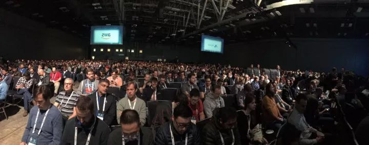
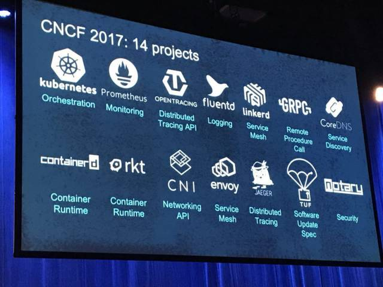
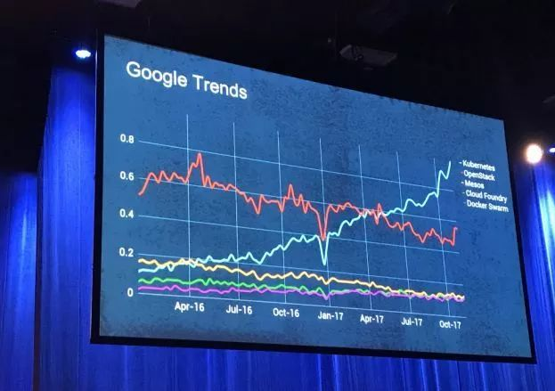
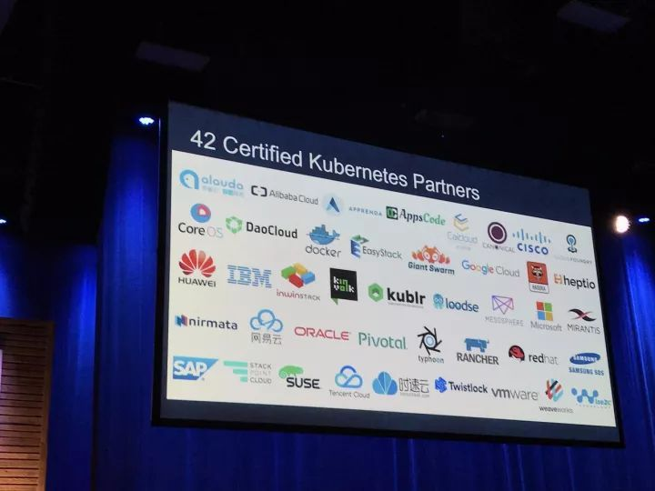

KubeCon+CloudNativeCon峰会123份PPT
==========

奥斯汀时间12月6日9点，北京时间12月6日23点，KubeCon+CloudNativeCon在美国奥斯汀会展中心隆重召开。本次盛会吸引了4000余位技术从业者到场关注，国内外主流厂商包括阿里云、AWS、Azure、EasyStack、Google Cloud、华为、IBM、Intel、redhat 等悉数赞助，全球Kubernetes及云原生在全球的热度可见一斑。

本届峰会，聚焦重磅消息发布和技术更新的 Keynote 环节可谓是信息量巨大，为便于广大社区用户记忆峰会信息点，特为大家选取 KubeCon 北美峰会首日 Keynote 三大关键词，一起 Get 吧：
* 14大项目更新——包括 Kubernetes 在内的十多个 CNCF 项目全部更新
* 全新容器项目 Kata 发布—— OpenStack 联合 20 余家中外企业发布最新容器项目 Kata Containers
* AWS 态度积极——作为全球第一大公有云企业， AWS 积极拥抱 Kubernetes ，其新发布 Elastic Container Service for Kubernetes （ AWS EKS ）值得关注。

# 颠覆式的、破坏式的创新正在发生——云计算的格局在改变

CNCF 执行董事 Dan Kohn 首先带来“ A Community of Builders ”的主题演讲。他提到，今天颠覆式的、破坏式的创新正在发生，云计算的格局正在发生前所未有的跨越式改变。云原生今天拥有无比强大的生态，数百家厂商和技术社区共同构建了无比强大的云原生生态。从管理项目上看，从最初的第一个由 Google 捐赠给 CNCF 的 Kubenetes 至今，短短 2 年时间 CNCF 已经管理包括 Kubernetes 在内的14个项目。

如今，“ Kubernetes 就是云计算领域的 Linux ”，Linux基金会主席 Jim Zemlin 如此评价。没错，从开源社区活力度看， Kubernetes 代码贡献量位列全球开源社区第 9 ，贡献者数量位列全球第 2 。另一方面， Google 搜索指数也是全球技术发展热度的重要衡量指标之一，在过去的一年多之间，Kubernetes 在主要开源技术的 Google 指数上增长了近 5 倍，并且呈现持续快速增长状态。

本届 KubeCon+CloudNativeCon 四千余人参会可谓再创新高，相比上一届的柏林会议参会人数增长近三倍，几乎是前四届大会参会人数的总和，这得益于目前来自 147 个国家的 16000 余名会员。此外，用户的支持和普及程度无疑是衡量一项技术成熟程度的重要标准。CNCF 所管理的项目不仅为广大技术人员广泛使用和支持，在大会 keynote 中展示的用户委员会目前已经有包括29家公司，包括 ebay、twitter、bloomberg、纽约时报等诸多用户广泛采用和支持。

大会同时宣布了 42 家通过 Kubernetes 认证的服务提供商，除了 Google Cloud、IBM 、 VMware 等美国企业外，包括 阿里云、EasyStack 、腾讯云等中国企业也通过了认证。

会员生态非常繁荣，新晋 3 个黄金会员百度、JFrog 、 Salesforce ；今年新晋白金会员：阿里云， AWS ， Dell ，微软， Oracle ， Pivotal ，SAP ， VMWare 。

最后 Dan 宣布，2018年11月 KubeCon+CloudNativeCon 将在中国上海举办，这无疑将进一步加速中国在 Kubernetes 和云原生领域相关技术创新和实践落地。