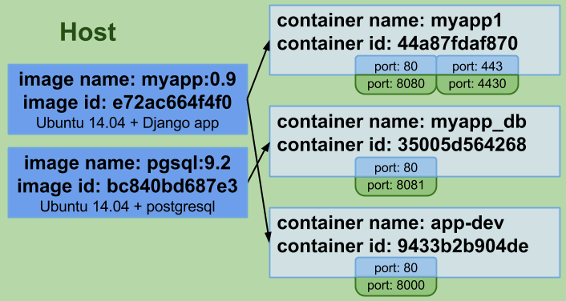
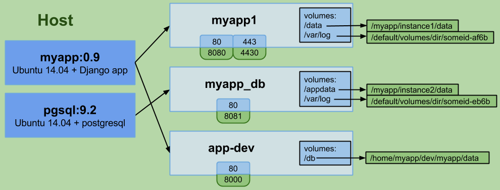
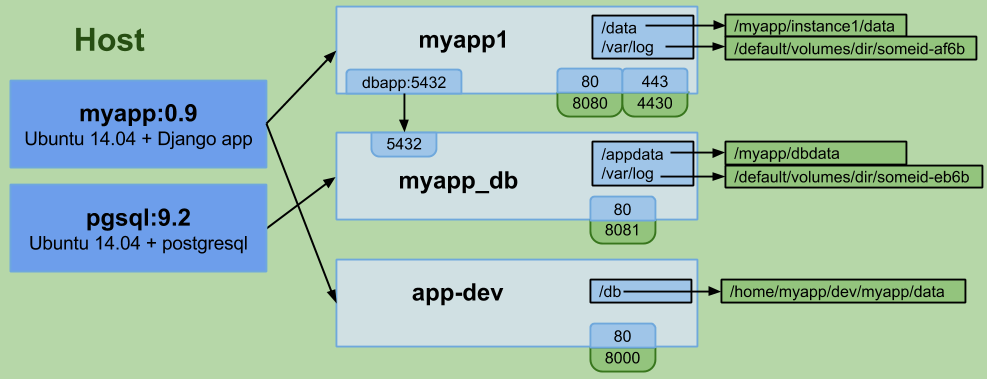
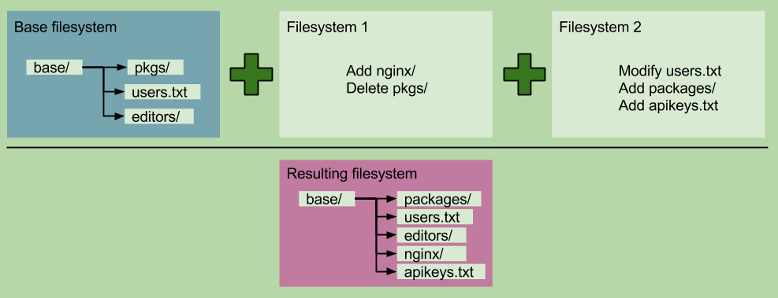

新手指南
=======

# Docker能做什么？

Docker可以解决虚拟机能够解决的问题，同时也能够解决虚拟机由于资源要求过高而无法解决的问题。  
Docker能处理的事情包括：
* 隔离应用依赖
* 创建应用镜像并进行复制
* 创建容易分发的即启即用的应用
* 允许实例简单、快速地扩展
* 测试应用并随后销毁它们

Docker背后的想法是创建**软件程序可移植的轻量容器**，让其可以在任何安装了Docker的机器上运行，而不用关心底层操作系统，就像野心勃勃的造船者们成功创建了集装箱而不需要考虑装在哪种船舶上一样。

# Docker究竟做了什么？

这一节我不会说明Docker使用了哪些技术来完成它的工作，或有什么具体的命令可用，这些放在了最后一节，这里我将说明的是Docker提供的资源和抽象。

Docker两个最重要的概念是镜像和容器。除此之外，链接和数据卷也很重要。我们先从镜像入手。

## 镜像

Docker的镜像类似虚拟机的快照，但更轻量，非常非常轻量（下节细说）。

创建Docker镜像有几种方式，多数是在一个现有镜像基础上创建新镜像，因为几乎你需要的任何东西都有了公共镜像，包括所有主流Linux发行版，你应该不会找不到你需要的镜像。不过，就算你想从头构建一个镜像，也有好几种方法。

要创建一个镜像，你可以拿一个镜像，对它进行修改来创建它的子镜像。实现前述目的的方式有两种：在一个文件中指定一个基础镜像及需要完成的修改；或通过“运行”一个镜像，对其进行修改并提交。不同方式各有优点，不过一般会使用文件来指定所做的变化。

镜像拥有唯一ID，以及一个供人阅读的名字和标签对。镜像可以命名为类似ubuntu:latest、ubuntu:precise、django:1.6、django:1.7等等。

## 容器

现在说容器了。你可以从镜像中创建容器，这等同于从快照中创建虚拟机，不过更轻量。应用是由容器运行的。

举个例子，你可以下载一个Ubuntu的镜像（有个叫docker registry的镜像公共仓库），通过安装Gunicorn和Django应用及其依赖项来完成对它的修改，然后从该镜像中创建一个容器，在它启动后运行你的应用。


容器与虚拟机一样，是隔离的（有一点要注意，我稍后会讨论到）。它们也拥有一个唯一ID和唯一的供人阅读的名字。容器对外公开服务是必要的，因此Docker允许公开容器的特定端口。




与虚拟机相比，容器有一个很大的差异，它们被设计用来运行单进程，无法很好地模拟一个完整的环境（如果那是你需要的，请看看LXC）。你可能会尝试运行runit或supervisord实例来启动多个进程，但（以我的愚见）这真的没有必要。

单进程与多进程之争非常精彩。你应该知道的是，Docker设计者极力推崇“一个容器一个进程的方式”，如果你要选择在一个容器中运行多个进程，那唯一情况是：出于调试目的，运行类似ssh的东西来访问运行中的容器，不过docker exec命令解决了这个问题。

【容器和虚拟机的第二个巨大差异是：当你停止一个虚拟机时，可能除了一些临时文件，没有文件会被删除；当你停止一个Docker容器，对初始状态（创建容器所用的镜像的状态）做的所有变化都会丢失。】（译者注：该论述不正确，已与作者确认，感谢lostsnow指正）

容器是设计来运行一个应用的，而非一台机器。你可能会把容器当虚拟机用，但如我们所见，你将失去很多的灵活性，因为Docker提供了用于分离应用与数据的工具，使得你可以快捷地更新运行中的代码/系统，而不影响数据。

## 数据卷

数据卷让你可以不受容器生命周期影响进行数据持久化。它们表现为容器内的空间，但实际保存在容器之外，从而允许你在不影响数据的情况下销毁、重建、修改、丢弃容器。Docker允许你定义应用部分和数据部分，并提供工具让你可以将它们分开。使用Docker时必须做出的最大思维变化之一就是：容器应该是短暂和一次性的。

卷是针对容器的，你可以使用同一个镜像创建多个容器并定义不同的卷。卷保存在运行Docker的宿主文件系统上，你可以指定卷存放的目录，或让Docker保存在默认位置。保存在其他类型文件系统上的都不是一个卷，稍后再具体说。





卷还可以用来在容器间共享数据，建议你阅读卷的文档做进一步了解。

# 链接

链接是Docker的另一个重要部分。

容器启动时，将被分配一个随机的私有IP，其它容器可以使用这个IP地址与其进行通讯。这点非常重要，原因有二：一是它提供了容器间相互通信的渠道，二是容器将共享一个本地网络。我曾经碰到一个问题，在同一台机器上为两个客户启动两个elasticsearch容器，但保留集群名称为默认设置，结果这两台elasticsearch服务器立马变成了一个自主集群。注：限制容器间通讯是可行的，请阅读Docker的高级网络文档做进一步了解。

要开启容器间通讯，Docker允许你在创建一个新容器时引用其它现存容器，在你刚创建的容器里被引用的容器将获得一个（你指定的）别名。我们就说，这两个容器链接在了一起。

因此，如果DB容器已经在运行，我可以创建web服务器容器，并在创建时引用这个DB容器，给它一个别名，比如dbapp。在这个新建的web服务器容器里，我可以在任何时候使用主机名dbapp与DB容器进行通讯。

Docker更进一步，要求你声明容器在被链接时要开放哪些端口给其他容器，否则将没有端口可用。



## Docker镜像的可移植性

在创建镜像时有一点要注意。Docker允许你在一个镜像中指定卷和端口。从这个镜像创建的容器继承了这些设置。但是，Docker不允许你在镜像上指定任何不可移植的内容。

例如，你可以在镜像里定义卷，只要它们被保存在Docker使用的默认位置。这是因为如果你在宿主文件系统里指定了一个特定目录来保存卷，其他使用这个镜像的宿主无法保证这个目录是存在的。

你可以定义要公开的端口，但仅限那些在创建链接时公开给其他容器的端口，你不能指定公开给宿主的端口，因为你无从知晓使用那个镜像的宿主有哪些端口可用。

你也不能在镜像上定义链接。使用链接要求通过名字引用其他容器，但你无法预知每个使用那个镜像的宿主如何命名容器。

镜像必须完全可移植，Docker不允许例外。

以上就是主要的部分，创建镜像、用它们创建容器、在需要时暴露端口和创造卷、通过链接将几个容器连接在一起。不过，这一切如何能在不引起额外支出条件下达成？

# Docker如何完成它需要完成的东西？

两个词：cgroups和union文件系统。Docker使用cgroup来提供容器隔离，而union文件系统用于保存镜像并使容器变得短暂。

## Cgroups

这是Linux内核功能，它让两件事情变成可能：
限制Linux进程组的资源占用（内存、CPU）
为进程组制作 PID、UTS、IPC、网络、用户及装载命名空间

这里的关键词是命名空间。比如说，一个PID命名空间允许它里面的进程使用隔离的PID，并与主PID命名空间独立开来，因此你可以在一个PID命名空间里拥有自己的PID为1的初始化进程。其他命名空间与此类似。然后你可以使用cgroup创建一个环境，进程可以在其中运行，并与操作系统的其他进程隔离开，但这里的关键点是这个环境上的进程使用的是已经加载和运行的内核，因此额外支出与运行其他进程几乎是一样的。Chroot之于cgroup就好像我之于绿巨人（The Hulk）、贝恩（Bane）和毒液（Venom）的组合（译者注：本文作者非常瘦弱，后三者都非常强壮）。

## Union文件系统

Union文件系统允许通过union装载来达到一个分层的积累变化。在union文件系统里，文件系统可以被装载在其他文件系统之上，其结果就是一个变化的分层的积累变化。每个装载的文件系统表示前一个文件系统之后的变化集合，就像是一个diff。




当你下载一个镜像，修改它，然后保存成新版本，你只是创建了加载在包裹基础镜像的初始层上的一个新的union文件系统。这使得Docker镜像非常轻，比如：你的DB、Nginx和Syslog镜像都可以共享同一个Ubuntu基础，每一个镜像保存的只是在它们需要的功能的基础上的变化。

截至2015年1月4日，Docker允许在union文件系统中使用aufs、btrfs或设备映射（device mapper）。

# 超级、无比简单的步骤说明

第一步，安装Docker。

Docker命令工具需要root权限才能工作。你可以将你的用户放入docker组来避免每次都要使用sudo。

第二步，使用以下命令从公共registry下载一个镜像：
```
$> docker pull ubuntu:latest
ubuntu:latest: The image you are pulling has been verified
3b363fd9d7da: Pull complete
.....<bunch of downloading-stuff output>.....
8eaa4ff06b53: Pull complete
Status: Downloaded newer image for ubuntu:latest
$>
```
这个公共registry上有你需要的几乎所有东西的镜像：Ubuntu、Fedora、Postgresql、MySQL、Jenkins、Elasticsearch、Redis等等。Docker开发人员在这个公共registry里维护着数个镜像，不过你能从上面拉取大量来自用户发布的自建镜像。

也许你需要或想要一个私有的registry（用于开发应用之类的容器），你可以先看看这个。现在，有好几个方式可以设置你自己的私有registry。你也可以买一个。

第三步，列出你的镜像：
```
$> docker images
REPOSITORY  TAG     IMAGE ID      CREATED     VIRTUAL SIZE
ubuntu      latest  8eaa4ff06b53  4 days ago  192.7 MB
```
第四步，从该镜像上创建一个容器。
```
$> docker run --rm -ti ubuntu /bin/bash
root@4638a40c2fbb:/# ls
bin boot dev etc home lib lib64 media mnt opt proc root......
root@4638a40c2fbb:/# exit
```
上一条命令的简要说明：
* --rm：告诉Docker一旦运行的进程退出就删除容器。这在进行测试时非常有用，可免除杂乱
* -ti：告诉Docker分配一个伪终端并进入交互模式。这将进入到容器内，对于快速原型开发或尝试很有用，但不要在生产容器中打开这些标志
* ubuntu：这是容器立足的镜像
* /bin/bash：要运行的命令，因为我们以交互模式启动，它将显示一个容器的提示符

在运行run命令时，你可指定链接、卷、端口、窗口名称（如果你没提供，Docker将分配一个默认名称）等等。

现在，我们在后台运行一个容器：
```
$> docker run -d ubuntu ping 8.8.8.8
31c68e9c09a0d632caae40debe13da3d6e612364198e2ef21f842762df4f987f
$>
```
输出的是分配的ID，因为是随机的，你的将有所不同。我们来检查一下容器是否开始运行了：
```
$> docker ps
CONTAINER ID IMAGE         COMMAND         CREATED        STATUS        PORTS  NAMES
31c68e9c09a0 ubuntu:latest "ping 8.8.8.8"  2 minutes ago  Up 2 minutes         loving_mcclintock
```
我们发现容器就是在那里面，它被自动分配了一个叫loving_mcclintock的名称。我们看看容器里正在发生什么：
```
$> docker exec -ti loving_mcclintock /bin/bash
root@31c68e9c09a0:/# ps -aux|grep ping
root 1 0.0 0.0 6504 636 ? Ss 20:46 0:00 ping 8.8.8.8
root@31c68e9c09a0:/# exit
```
我们所做的是在容器里运行程序，这里的程序是/bin/bash。-ti标志与docker run的作用相同，将我们放置到容器的控制台里。

# 结尾

Docker的大致内容就是这些，它包括了很多内容，但那超出了本文的范围。