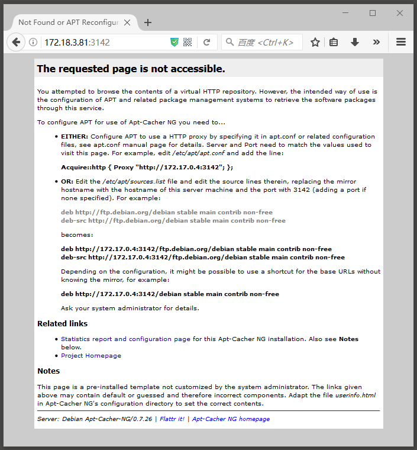

Apt-Cacher-ng在内网中提供包缓存代理服务的探索
==========================================

> 本篇尝试使用容器技术，快速验证以下猜想：
> 1. 通过Apt-Cacher-ng的容器提供代理服务；
> 2. 使用ubuntu的容器作为客户端，设置代理，安装openssh；
> 3. 将Apt-Cacher-ng提交成新镜像；
> 4. 采用新镜像，在一个脱网的服务器上进行步骤1、2。

这里，我们采用第三方镜像 https://hub.docker.com/r/sameersbn/apt-cacher-ng/ 

下载镜像
```
docker pull sameersbn/apt-cacher-ng
```

启动服务
```
docker run --name apt-cacher-ng -d -p 3142:3142 sameersbn/apt-cacher-ng
```

查看服务
```
docker ps -a
CONTAINER ID        IMAGE                      COMMAND                  CREATED          STATUS          PORTS                         NAMES  
fd70f69e1888        sameersbn/apt-cacher-ng    "/sbin/entrypoint...."   28 seconds ago   Up 28 seconds   0.0.0.0:3142->3142/tcp        apt-cacher-ng
```

在浏览器中查看
```
http://<server-ip>:3142/
```



启动测试客户端
```
docker run -ti ubuntu:17.04
```

根据上图，在ubuntu中配置代理地址
```
echo 'Acquire::http { Proxy "http://172.17.0.4:3142"; };' > /etc/apt/apt.conf.d/01proxy
```

以openssh为例，安装程序包
```
apt-get update && apt-get install -y openssh-server
```

安装完成之后，查看`apt-cacher-ng`的缓存区
```
docker exec apt-cacher-ng ls /var/cache/apt-cacher-ng | grep deb
/var/cache/apt-cacher-ng:
security.ubuntu.com
uburep

/var/cache/apt-cacher-ng/security.ubuntu.com:
ubuntu

/var/cache/apt-cacher-ng/security.ubuntu.com/ubuntu:
dists

/var/cache/apt-cacher-ng/security.ubuntu.com/ubuntu/dists:
zesty-security

/var/cache/apt-cacher-ng/security.ubuntu.com/ubuntu/dists/zesty-security:
InRelease
InRelease.head

/var/cache/apt-cacher-ng/uburep:
dists

/var/cache/apt-cacher-ng/uburep/dists:
zesty
zesty-backports
zesty-updates

/var/cache/apt-cacher-ng/uburep/dists/zesty:
InRelease
InRelease.head
universe

/var/cache/apt-cacher-ng/uburep/dists/zesty/universe:
source

/var/cache/apt-cacher-ng/uburep/dists/zesty/universe/source:
by-hash

/var/cache/apt-cacher-ng/uburep/dists/zesty/universe/source/by-hash:
SHA256

/var/cache/apt-cacher-ng/uburep/dists/zesty/universe/source/by-hash/SHA256:
5db7b185a7d4b55a3e44b075df27c4f1d4d4679e921142522b67e03c776df793
5db7b185a7d4b55a3e44b075df27c4f1d4d4679e921142522b67e03c776df793.head

/var/cache/apt-cacher-ng/uburep/dists/zesty-backports:
InRelease
InRelease.head

/var/cache/apt-cacher-ng/uburep/dists/zesty-updates:
InRelease
InRelease.head
```

可以看出缓存已经建立。

将这个运行中的容器提交成新镜像
```
docker commit apt-cacher-ng apt-cacher-ng:openssh
```

在一个脱网的服务器上使用新镜像启动服务
```
docker run --name apt-cacher-ng-openssh -d -p 3142:3142 apt-cacher-ng:openssh
```


查看服务
```
docker ps -a
CONTAINER ID        IMAGE                      COMMAND                  CREATED          STATUS          PORTS                         NAMES  
fd70f69e1888        apt-cacher-ng:openssh      "/sbin/entrypoint...."   28 seconds ago   Up 28 seconds   0.0.0.0:3142->3142/tcp        apt-cacher-ng
```

测试服务
```
curl http://127.0.0.1:3142/
```

发现html标记中，服务的地址为`http://172.17.0.2:3142`

启动测试客户端
```
docker run -ti ubuntu:17.04
```

根据上图，在ubuntu中配置代理地址
```
echo 'Acquire::http { Proxy "http://172.17.0.4:3142"; };' > /etc/apt/apt.conf.d/01proxy
```

再次安装测试程序包
```
apt-get update && apt-get install -y openssh-server
Ign:1 http://security.ubuntu.com/ubuntu zesty-security InRelease
Ign:2 http://security.ubuntu.com/ubuntu zesty-security Release
Ign:3 http://security.ubuntu.com/ubuntu zesty-security/universe Sources
Ign:4 http://security.ubuntu.com/ubuntu zesty-security/restricted amd64 Packages
Ign:5 http://security.ubuntu.com/ubuntu zesty-security/multiverse amd64 Packages

………………

Ign:39 http://archive.ubuntu.com/ubuntu zesty-backports/universe amd64 Packages
Ign:40 http://archive.ubuntu.com/ubuntu zesty-backports/main all Packages
Ign:41 http://archive.ubuntu.com/ubuntu zesty-backports/multiverse amd64 Packages
Ign:42 http://archive.ubuntu.com/ubuntu zesty-backports/multiverse all Packages
Ign:43 http://archive.ubuntu.com/ubuntu zesty-backports/main amd64 Packages
Reading package lists... Done
W: The repository 'http://security.ubuntu.com/ubuntu zesty-security Release' does not have a Release file.
N: Data from such a repository can't be authenticated and is therefore potentially dangerous to use.
N: See apt-secure(8) manpage for repository creation and user configuration details.
W: The repository 'http://archive.ubuntu.com/ubuntu zesty Release' does not have a Release file.
N: Data from such a repository can't be authenticated and is therefore potentially dangerous to use.
N: See apt-secure(8) manpage for repository creation and user configuration details.
W: The repository 'http://archive.ubuntu.com/ubuntu zesty-updates Release' does not have a Release file.
N: Data from such a repository can't be authenticated and is therefore potentially dangerous to use.
N: See apt-secure(8) manpage for repository creation and user configuration details.
W: The repository 'http://archive.ubuntu.com/ubuntu zesty-backports Release' does not have a Release file.
N: Data from such a repository can't be authenticated and is therefore potentially dangerous to use.
N: See apt-secure(8) manpage for repository creation and user configuration details.
E: Failed to fetch http://security.ubuntu.com/ubuntu/dists/zesty-security/universe/source/Sources  503  DNS error for hostname security.ubuntu.com: Temporary failure in name resolution. If security.ubuntu.com refers to a configured cache repository, please check the corresponding configuration file.
E: Failed to fetch http://archive.ubuntu.com/ubuntu/dists/zesty/universe/source/Sources  503  DNS error for hostname archive.ubuntu.com: Temporary failure in name resolution. If archive.ubuntu.com refers to a configured cache repository, please check the corresponding configuration file.
E: Failed to fetch http://archive.ubuntu.com/ubuntu/dists/zesty-updates/universe/source/Sources  503  DNS error for hostname archive.ubuntu.com: Temporary failure in name resolution. If archive.ubuntu.com refers to a configured cache repository, please check the corresponding configuration file.
E: Failed to fetch http://archive.ubuntu.com/ubuntu/dists/zesty-backports/restricted/binary-amd64/Packages  503  DNS error for hostname archive.ubuntu.com: Temporary failure in name resolution. If archive.ubuntu.com refers to a configured cache repository, please check the corresponding configuration file.
E: Some index files failed to download. They have been ignored, or old ones used instead.

```

可以发现，已经建立缓存的代理服务器并不起作用。


