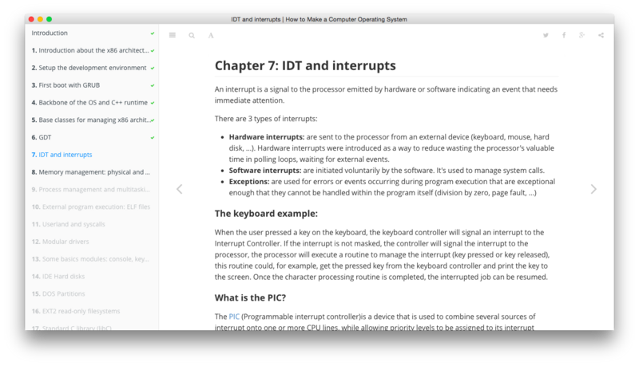

GitBook 简明教程 
===============
  
**Modern book format and toolchain using Git and Markdown**

这是 GitBook 项目主页上对 GitBook 的定义。

GitBook 是一个命令行工具。通过它，你能够使用 Git 和 Markdown 来编排书本。并且通过工具可以自动生成相应的 HTML、PDF 和 epub 格式的文件。

总之，就是好用，好使，加好看。

刚好近日准备通过 GitBook 来写一些教程，这里就先简明介绍一下它的使用。嗯？我写的什么教程？ 哈哈，就不告诉你，等写好了再说 <(￣▽￣)> 哇哈哈…

# 安装

因为 GitBook 是一个基于 Node 开发的命令行工具。因此需要您自行配置 Node 和 npm 环境。如果你已经安装好这些环境之后，GitBook 的安装只需要一步就能完成！

```
$ npm install -g gitbook-cli
```

# 使用

GitBook 的用法非常简单，老规矩，先看一下我们都有哪些命令可以使用:

```
$ gitbook help
    build [book] [output]       build a book
        --log                   Minimum log level to display (Default is info; Values are debug, info, warn, error, disabled)
        --format                Format to build to (Default is website; Values are website, json, ebook)
        --[no-]timing           Print timing debug information (Default is false)

    serve [book] [output]       serve the book as a website for testing
        --port                  Port for server to listen on (Default is 4000)
        --lrport                Port for livereload server to listen on (Default is 35729)
        --[no-]watch            Enable file watcher and live reloading (Default is true)
        --[no-]live             Enable live reloading (Default is true)
        --[no-]open             Enable opening book in browser (Default is false)
        --browser               Specify browser for opening book (Default is )
        --log                   Minimum log level to display (Default is info; Values are debug, info, warn, error, disabled)
        --format                Format to build to (Default is website; Values are website, json, ebook)

    install [book]              install all plugins dependencies
        --log                   Minimum log level to display (Default is info; Values are debug, info, warn, error, disabled)

    parse [book]                parse and print debug information about a book
        --log                   Minimum log level to display (Default is info; Values are debug, info, warn, error, disabled)

    init [book]                 setup and create files for chapters
        --log                   Minimum log level to display (Default is info; Values are debug, info, warn, error, disabled)

    pdf [book] [output]         build a book into an ebook file
        --log                   Minimum log level to display (Default is info; Values are debug, info, warn, error, disabled)

    epub [book] [output]        build a book into an ebook file
        --log                   Minimum log level to display (Default is info; Values are debug, info, warn, error, disabled)

    mobi [book] [output]        build a book into an ebook file
        --log                   Minimum log level to display (Default is info; Values are debug, info, warn, error, disabled)
```


实际上我们最常用的命令只有两个:

* gitbook init: 初始化书籍目录
* gitbook serve: 在编写书籍时启动一个服务器，自动编译&更新内容，并在浏览器中预览


# 使用

## gitbook init

首先，通过终端(PC 下可使用命令提示符)进入到你想要书写内容的目录，然后执行 gitbook init 命令，之后目录中会自动生成 README.md 和 SUMMARY.md 两个文件。

这两个文件在 GitBook 项目中是必须存在的，其中 README.md 是对书籍的简单介绍，SUMMARY.md 是对书籍目录的描述，并且 GitBook 会通过该文件中的目录描述自动生成对应的目录和文件。

其中，SUMMARY.md 文件中内容的格式是这样的:

```
* [Chapter1](chapter1/README.md)
  * [Section1.1](chapter1/section1.1.md)
  * [Section1.2](chapter1/section1.2.md)
* [Chapter2](chapter2/README.md)
```

当你修改了 SUMMARY.md 文件中的内容后，你可以再次使用 gitbook init 来自动生成对应的目录和文件。

## Multi-Languages

如果你要写的书籍是多语言版，你只需要创建一个 LANGS.md 文件，然后编写配置内容即可:

```
* [English](en/)
* [French](fr/)
* [Español](es/)
```

## gitbook serve

书籍目录结构创建完成以后，我们就可以使用 gitbook serve 来编译和预览书籍了：

gitbook serve 命令实际上会首先调用 gitbook build 编译书籍，完成以后会打开一个 web 服务器，监听在本地的 4000 端口。

```
$ gitbook serve
Live reload server started on port: 35729
Press CTRL+C to quit ...

info: 7 plugins are installed 
info: loading plugin "livereload"... OK 
info: loading plugin "highlight"... OK 
info: loading plugin "search"... OK 
info: loading plugin "lunr"... OK 
info: loading plugin "sharing"... OK 
info: loading plugin "fontsettings"... OK 
info: loading plugin "theme-default"... OK 
info: found 6 pages 
info: found 0 asset files 
info: >> generation finished with success in 1.6s ! 

Starting server ...
Serving book on http://localhost:4000
```

之后，你就可以使用浏览器打开 http://127.0.0.1:4000 查看效果了。就是这么简单。

页面效果如下:




你可以尽情的使用 `Markdown` 来编写文章了，完全不需要关心样式和排版呢。

# GitBook 编辑器

如果你不喜欢使用命令行，这里也有 GitBook 可视化编辑器，https://www.gitbook.com/editor/

# GitBook.com

GitBook.com 是一个围绕 GitBook 发行书籍的社区，于 2014 年初创，GitBook.com 提供免费和付费的服务，而且免费账户就可以享受诸多服务，包括：

* 1 本私有书籍
* 托管不限数量的公开书籍
* 售卖不限数量的书籍，并分享 80% 的书籍收入
* 不限数量的协作者
* 免费的在线书籍编辑器


# 其他命令

* gitbook build: 会生成相应的 HTML 文件供分发。
* gitbook pdf: 生成 PDF 文件
* gitbook epub: 生成 epub 文件
* gitbook mobi: 生成 mobi 文件

## 生成PDF

```
# gitbook pdf
info: 7 plugins are installed 
info: 6 explicitly listed 
info: loading plugin "highlight"... OK 
info: loading plugin "search"... OK 
info: loading plugin "lunr"... OK 
info: loading plugin "sharing"... OK 
info: loading plugin "fontsettings"... OK 
info: loading plugin "theme-default"... OK 
info: found 6 pages 
info: found 0 asset files 

InstallRequiredError: "ebook-convert" is not installed.
Install it from Calibre: https://calibre-ebook.com
```

需要先安装gitbook-pdf依赖

```
sudo -v && wget -nv -O- https://download.calibre-ebook.com/linux-installer.py | sudo python -c "import sys; main=lambda:sys.stderr.write('Download failed\n'); exec(sys.stdin.read()); main()"
```
> 详见：http://calibre-ebook.com/download_linux


# 高级技巧

## 个性化配置

我们通过配置 book.json 文件来修改 GitBook 在编译书籍时的行为，例如：修改书籍的名称，显示效果等等。

GitBook 在编译书籍的时候会读取书籍源码顶层目录中的 book.json，book.json 支持的具体配置请参考官方文档

## 安装插件

你可以通过 gitbook install 命令来安装一些诸如 disqus、multipart 这些实用的第三方插件。

yum groupinstall -y "Development tools"
yum install -y zlib-devel bzip2-devel openssl-devel ncurses-devel sqlite-devel