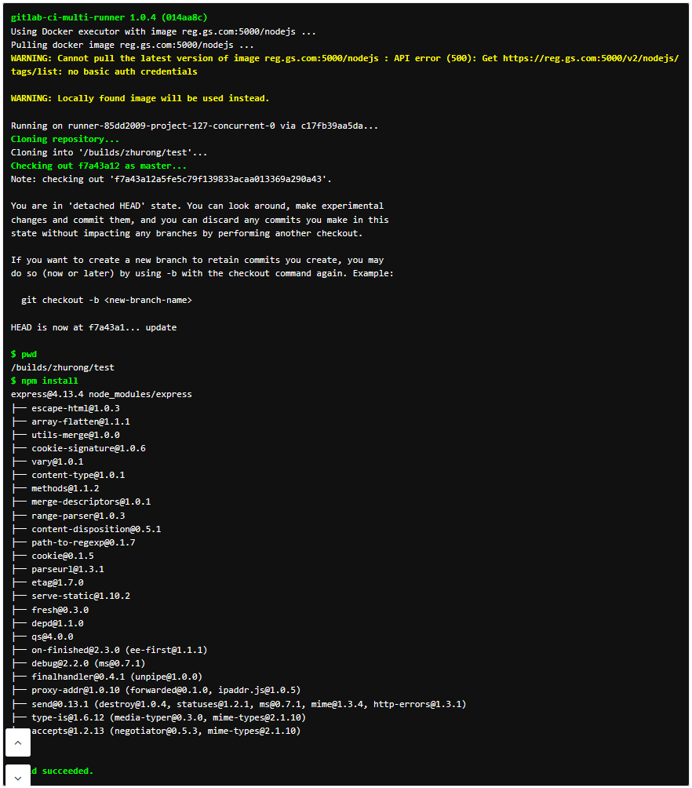
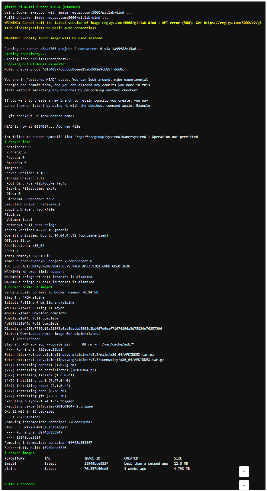
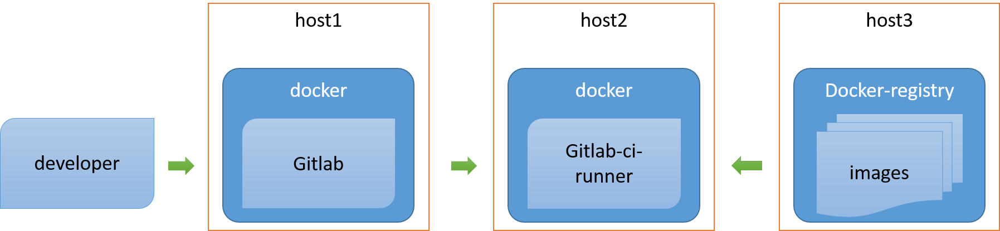

实践之Gitlab-runner
==================

本文主要根据[ GITLAB-CI 搭建以及构建脚本编写 ](http://192.168.3.103/vNextDevTechs/owlet/wikis/gitlab-ci)
里的过程，在 docker 环境中作出实践。

# 1、先决条件
* [Docker 环境](http://192.168.3.103/Hakugei/docker/wikis/Install-by-script)
* [实践之Gitlab](Practice-Gitlab)

# 2、运行gitlab-runner容器
```
sudo docker run -d --name gitlab-runner --restart always \
    -v /var/run/docker.sock:/var/run/docker.sock \
    -v /srv/gitlab-runner/config:/etc/gitlab-runner \
    gitlab/gitlab-runner:alpine
```
这里，我们选择了alpine版本，因为他体积比较小。
```
$ sudo docker images 
REPOSITORY                  TAG                 IMAGE ID            CREATED             SIZE
gitlab/gitlab-ce            latest              07599b40194f        30 hours ago        1.073 GB
gitlab/gitlab-runner        latest              c063d1feed87        37 hours ago        305.2 MB
gitlab/gitlab-runner        alpine              2e9142ae15af        37 hours ago        64.45 MB
```
# 3、构建项目
## 3.1 注册runner
```
sudo docker `exec` -it gitlab-runner gitlab-runner register \
    --non-interactive \
    --url "http://192.168.3.105/ci" \
    --registration-token "cd1SskrwoHy_NmGceAYf" \
    --description "runner-test1" \
    --executor "docker" \
    --docker-image "reg.gs.com:5000/node"
```
这里，我们选择了`docker`作为执行器，根据目标项目的需要，选择适当的镜像作为容器的基础，
这里，我们选择了[reg.gs.com:5000/node](http://192.168.3.103/Hakugei/docker/wikis/Deploying-a-registry-server#4%E5%9C%A8client%E7%AB%AF%E7%99%BB%E5%BD%95)

## 3.2 构建项目
我们选择[Docker中运行Node.js web应用](Dockerizing-a-nodejs-web-app)作为示例。

若要启动构建，我们需要提交`.gitlab-ci.yml`文件：  
```
build:
  script:
    - pwd
    - npm install
```
构建结果如下：



可以看出，以docker为执行环境的runner，为了构建任务，会拉取指定的镜像，
但由于构建所使用的镜像并未配置内网仓库的认证，所以获取不到`reg.gs.com:5000/node`。
```
Pulling docker image reg.gs.com:5000/node ...
WARNING: Cannot pull the latest version of image reg.gs.com:5000/node : API error (500): Get https://reg.gs.com:5000/v2/node/tags/list: no basic auth credentials

WARNING: Locally found image will be used instead.
```
我们需要在构建前，提前使用docker拉取相关镜像。
这么做的好处是，减少构建环节中网络环境带来的干扰，提高效率。

# 4、构建镜像
## 4.1 注册runner
```
sudo docker exec -it gitlab-runner gitlab-runner register \
    --non-interactive \
    --url "http://192.168.24.105/ci" \
    --registration-token "mCK1YS23xqgpWUskkXqS" \
    --description "runner-test2" \
    --executor "docker" \
    --docker-image "reg.gs.com:5000/gitlab-dind" \
    --docker-privileged
```
这里，我们选择了`docker`作为执行器，根据目标项目的需要，选择适当的镜像作为容器的基础，
这里，我们选择了[reg.gs.com:5000/gitlab-dind](http://192.168.3.103/Hakugei/docker/wikis/Deploying-a-registry-server#4%E5%9C%A8client%E7%AB%AF%E7%99%BB%E5%BD%95)

## 4.2 构建镜像
这里，我们使用一个简单的构建任务，`Dockerfile`如下：
```
FROM alpine

RUN  apk add --update git \
     && rm -rf /var/cache/apk/*

ENTRYPOINT ["/usr/bin/git"]
```
若要启动构建，我们需要提交`.gitlab-ci.yml`文件：  
```
before_script:
  - docker info

build_image:
  script:
    - docker build -t image1 .
    - docker images
```
构建结果如下：



# 5、构建过程



1. 开发者向gitlab上提交代码

2. gitlab内部的ci服务，向注册的runner提交任务

3. runner根据注册时的配置，选择使用指定的镜像。通过`docker ps -a`查看

```
$ sudo docker ps -a
CONTAINER ID        IMAGE                          COMMAND                  CREATED             STATUS                      PORTS NAMES
840e9c3d82db        d1921e7f8e86                   "bash"                   16 seconds ago      Up 14 seconds                     runner-85dd2009-project-127-concurrent-0-build
ebea7cdecfc3        6414ab383f2c                   "/docker-entrypoint.s"   16 seconds ago      Created                           runner-85dd2009-project-127-concurrent-0-post
4dbcdc35e8d7        6414ab383f2c                   "/docker-entrypoint.s"   16 seconds ago      Exited (0) 15 seconds ago         runner-85dd2009-project-127-concurrent-0-pre
dedba2080c09        046501f04ed2                   "/entrypoint /builds/"   16 seconds ago      Exited (0) 15 seconds ago         runner-85dd2009-project-127-concurrent-0-cache-5f7242d25ade980e11f9d1ed0ee28e02
1abb24be77c0        046501f04ed2                   "/entrypoint /cache"     17 seconds ago      Exited (0) 16 seconds ago         runner-85dd2009-project-127-concurrent-0-cache-3c3f060a0374fc8bc39395164f415a70
c17fb39aa5da        gitlab/gitlab-runner:alpine    "gitlab-ci-multi-runn"   5 hours ago         Up 5 hours                        gitlab-runner
```
可以看出，以docker为执行环境的runner，在host2上额外创建新的容器，用于构建任务。
当构建完成时，再次查看
```
$ sudo docker ps -a
CONTAINER ID        IMAGE                          COMMAND                  CREATED             STATUS                      PORTS NAMES
dedba2080c09        046501f04ed2                   "/entrypoint /builds/"   42 seconds ago      Exited (0) 42 seconds ago         runner-85dd2009-project-127-concurrent-0-cache-5f7242d25ade980e11f9d1ed0ee28e02
1abb24be77c0        046501f04ed2                   "/entrypoint /cache"     43 seconds ago      Exited (0) 42 seconds ago         runner-85dd2009-project-127-concurrent-0-cache-3c3f060a0374fc8bc39395164f415a70
c17fb39aa5da        gitlab/gitlab-runner:alpine    "gitlab-ci-multi-runn"   5 hours ago         Up 5 hours                        gitlab-runner
```
可以看出，runner并没有移除所有的容器。可以使用下面的命令进行清理
```
sudo docker kill $(sudo docker ps -a | grep "runner-")
sudo docker rm $(sudo docker ps -a | grep "runner-")
```