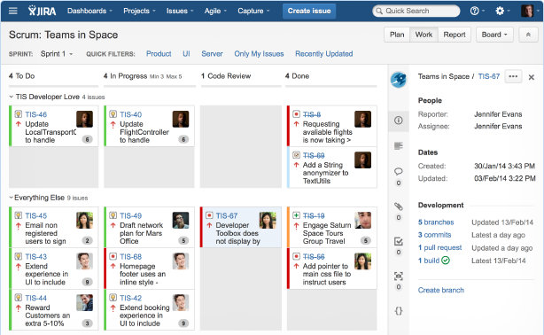
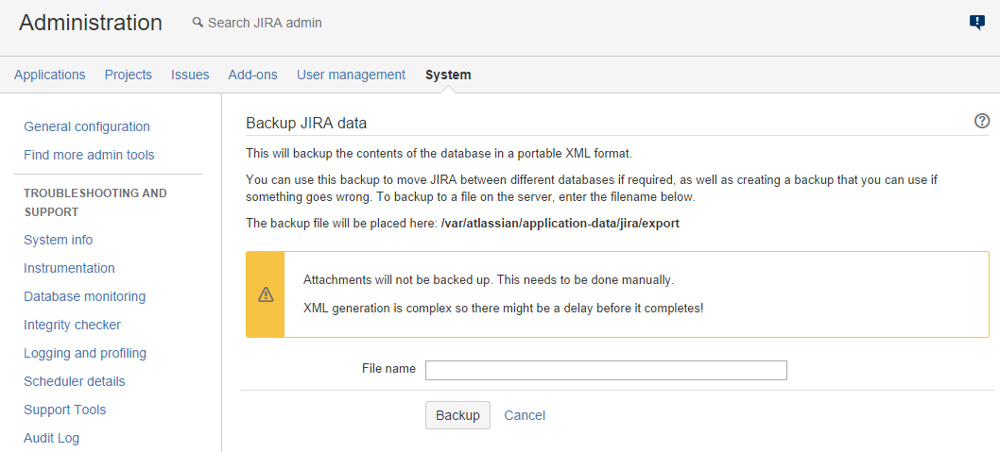
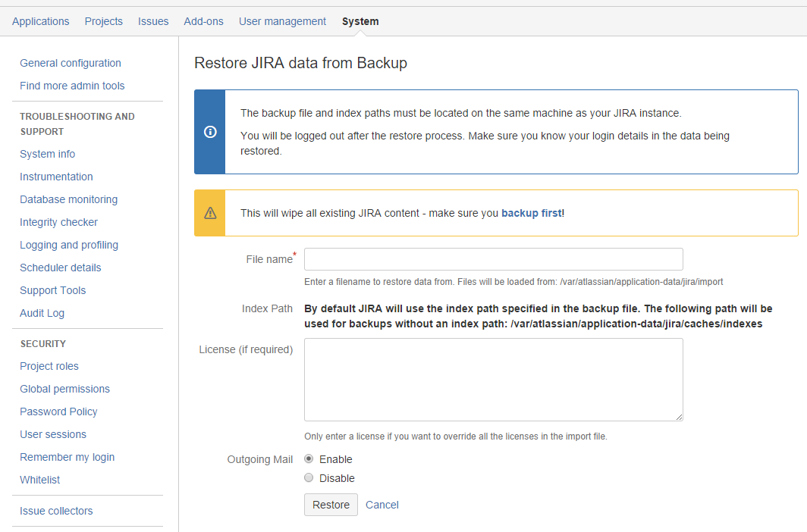

实践之Jira
======================

JIRA是一个专业的项目跟踪管理工具，帮助团队创建计划任务、构建并发布优秀的产品。

全球成千上万的团队选择JIRA，用JIRA来捕获,组织管理缺陷、分配任务，跟踪团队的活动。



# 一、基础搭建

## 1.1 先决条件
* [Docker 环境](http://192.168.3.103/Hakugei/docker/wikis/Install-by-script)
* [Postgresql JDBC driver](https://jdbc.postgresql.org/download.html)
[(9.4.1208 JDBC 42)](https://jdbc.postgresql.org/download/postgresql-9.4.1208.jar)

## 1.2 安装
```
sudo mkdir -p /srv/jira && sudo chown 777 /srv/jira
```
```
sudo docker run --name jira -d \
    -p 8080:8080 \
    -v /srv/jira:/var/atlassian/jira \
    cptactionhank/atlassian-jira
```
现在你可以访问nexus了： http://server:8080
该网站需在联网情况下进行注册，否则要去百度上搜索注册码。

## 1.3 备份
在上面的安装命令中，我们指定了`/srv/jira`用于挂载容器的卷。所以，随时备份这个目录即可。

## 1.4 升级
升级前先备份。
```
sudo docker stop jira
sudo docker rm jira
sudo docker run --name jira -d \
    -p 8080:8080 \
    -v /srv/jira:/var/atlassian/jira \
    cptactionhank/atlassian-jira
```

## 1.5 集群部署
参见[实践之集群和高可用性](http://192.168.3.103/Hakugei/docker/wikis/Practice-Swarm-with-Consul)

# 二、数据迁移

旧有JIRA服务，会有很多项目数据。这些数据可以通过JIRA系统自带的备份还原工具进行迁移。

## 2.1 备份

在右上方小齿轮上选择`system`，在左侧工具栏中选择`Backup system`，给备份文件起个名字，点击`Backup`启动备份。



从`/var/atlassian/application-data/jira/export`拷出备份文件。

## 2.2 还原

将备份文件拷贝到`/var/atlassian/application-data/jira/import`，在左侧工具栏中选择`Restore system`，
填写备份文件的名称，点击`Restore`启动还原。

