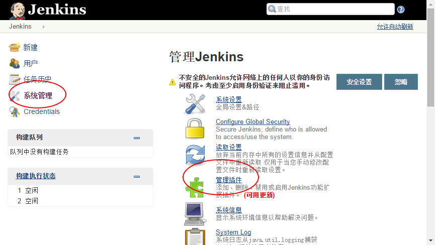
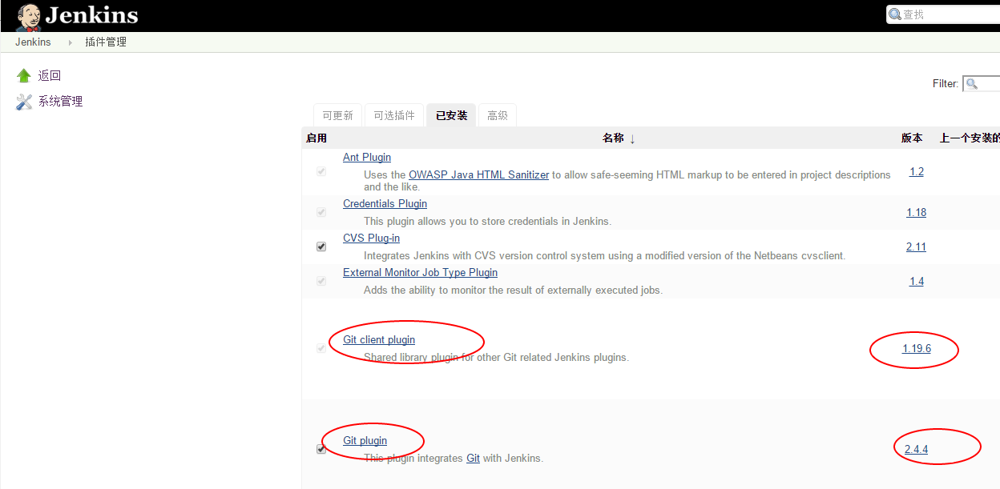

实践之Jenkins
============


[Jenkins](https://jenkins.io/index.html) 是一个可扩展的持续集成引擎。

主要用于：

* 持续、自动地构建/测试软件项目。
* 监控一些定时执行的任务。

Jenkins拥有的特性包括：

* 易于安装-只要把jenkins.war部署到servlet容器，不需要数据库支持。
* 易于配置-所有配置都是通过其提供的web界面实现。
* 集成RSS/E-mail通过RSS发布构建结果或当构建完成时通过e-mail通知。
* 生成JUnit/TestNG测试报告。
* 分布式构建支持Jenkins能够让多台计算机一起构建/测试。
* 文件识别:Jenkins能够跟踪哪次构建生成哪些jar，哪次构建使用哪个版本的jar等。
* 插件支持:支持扩展插件，你可以开发适合自己团队使用的工具。

# 一、基础搭建

## 1、先决条件
* [Docker 环境](http://192.168.3.103/Hakugei/docker/wikis/Install-by-script)

## 2、安装
```
sudo mkdir -p /srv/jenkins
sudo chmod 777 /srv/jenkins
sudo docker run -d \
    --name jenkins \
    -p 10000:8080 -p 50000:50000 \
    -v /srv/jenkins:/var/jenkins_home \
    jenkins
```
现在你可以访问jenkins了： http://server:10000

密码可以在以下路径找到`/var/jenkins_home/secrets/initialAdminPassword`

## 3、备份
在上面的安装命令中，我们指定了`/srv/jenkins`用于挂载容器的卷。所以，随时备份这个目录即可。

## 4、升级
升级前先备份。
```
sudo docker stop jenkins
sudo docker rm jenkins
sudo docker run -d \
    --name jenkins \
    -p 10000:8080 -p 50000:50000 \
    -v /srv/jenkins:/var/jenkins_home \
    jenkins
```

# 二、安装扩展环境

有时候，我们可能需要编译特定的项目，比如：`nodejs`。为此我们需要自定义新的镜像。

## 1、Dockerfile
```
FROM jenkins

USER root
RUN  curl -sL https://deb.nodesource.com/setup_5.x | sh
RUN  apt-get install -y nodejs

USER jenkins 
```

## 2、构建
```
sudo docker build -t jenkins-nodejs .
```

## 3、安装
```
sudo mkdir -p /srv/jenkins-nodejs
sudo chmod 777 /srv/jenkins-nodejs
sudo docker run -d \
    --name jenkins-nodejs \
    -p 10100:8080 -p 50100:50000 \
    -v /srv/jenkins-nodejs:/var/jenkins_home \
    jenkins-nodejs
```

## 4、验证
```
$ sudo docker exec -it jenkins-nodejs bash
jenkins@2ef85a445216:/$ nodejs -v
v5.9.1
```

# 三、安装扩展插件
有时候，我们需要在jenkins中安装一些插件，比如：`git`。为此我们同样可以自定义新的镜像。

## 1、Dockerfile
```
FROM jenkins
COPY plugins.txt /plugins.txt
RUN /usr/local/bin/plugins.sh /plugins.txt
```

## 2、plugins.txt
插件清单须遵循`pluginID:version`格式，如：  
```
scm-api:1.0
git-client:1.19.6
script-security:1.17
matrix-project:1.6
git:2.4.4
```
**注意：这里的 `换行` 须在linux环境里用 `vi` 重新编辑，windows下编辑出来的文件，会导致下面的构建出错！**
采用下面的脚本，可以将以存在的服务器上的插件列表，以标准格式输出
```
JENKINS_HOST=username:password@myhost.com:port
curl -sSL "http://$JENKINS_HOST/pluginManager/api/xml?depth=1&xpath=/*/*/shortName|/*/*/version&wrapper=plugins" | perl -pe 's/.*?<shortName>([\w-]+).*?<version>([^<]+)()(<\/\w+>)+/\1 \2\n/g'|sed 's/ /:/'

translation:1.10
git:2.4.4
windows-slaves:1.0
scm-api:1.1
gitlab-plugin:1.2.1
nodejs:0.2.1
pam-auth:1.1
matrix-auth:1.1
credentials-binding:1.7
script-security:1.13
embeddable-build-status:1.9
matrix-project:1.4.1
cvs:2.11
maven-plugin:2.7.1
plain-credentials:1.2
jira:2.2.1
javadoc:1.1
subversion:1.54
ssh-credentials:1.10
ldap:1.11
mailer:1.11
ant:1.2
credentials:1.18
git-client:1.19.6
antisamy-markup-formatter:1.1
structs:1.1
workflow-step-api:2.1
external-monitor-job:1.4
ssh-slaves:1.9
gradle:1.24
junit:1.2-beta-4
```

## 3、构建
```
sudo docker build -t jenkins-plugins .
```

## 4、安装
```
sudo mkdir -p /srv/jenkins-plugins
sudo chmod 777 /srv/jenkins-plugins
sudo docker run -d \
    --name jenkins-plugins \
    -p 10200:8080 -p 50200:50000 \
    -v /srv/jenkins-plugins:/var/jenkins_home \
    jenkins-plugins
```

## 5、验证
我们再次访问jenkins：http://server:10200 





# Jenkins Debian packages

This is the Debian package repository of Jenkins to automate installation and upgrade. To use this repository, first add the key to your system:
```
wget -q -O - http://pkg.jenkins-ci.org/debian-stable/jenkins-ci.org.key | sudo apt-key add -
```
Then add the following entry in your /etc/apt/sources.list:
```
deb http://pkg.jenkins-ci.org/debian-stable binary/
```
Update your local package index, then finally install Jenkins:
```
sudo apt-get update
sudo apt-get install jenkins
```