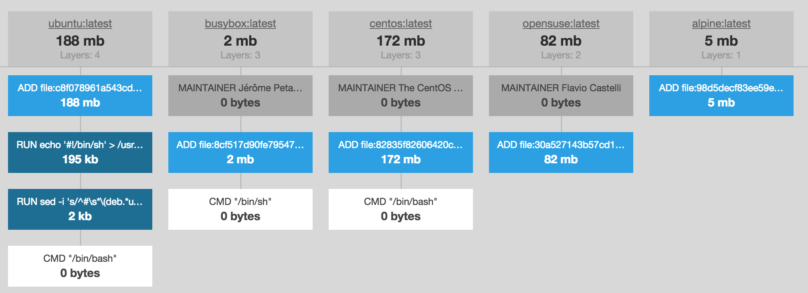

容器技术实践总结
==============

>1. [案例](Practice-summary#1-%E6%A1%88%E4%BE%8B)
2. [工具](Practice-summary#2-%E5%B7%A5%E5%85%B7)
3. [经验](Practice-summary#3-%E7%BB%8F%E9%AA%8C)
4. [后续](Practice-summary#4-%E5%90%8E%E7%BB%AD)

# 1 案例

## 1.1 Docker registry
什么是docker registry？  
我们把docker镜像看成是“源代码文件”，registry server就是“git仓库”。平时，我们写好的代码文件都需要
push到代码仓库中，对于docker镜像也一样，镜像打包好以后需要提交到registry server服务器上，让测试人
员构建测试环境，或者是让运维人员部署业务。

> http://172.18.3.103/Hakugei/docker/wikis/Deploying-a-registry-server

## 1.2 Docker registry web
对于docker registry，所有操作都是基于命令行的，哪怕是查看一下我们具备了哪些镜像。
docker registry提供了一些restful api，去查看这些内容，但我们有更好的选择，以站点的形式去查阅。

hub.docker.com上有许多这样的镜像，我们选择`hyper/docker-registry-web` 。

> http://172.18.3.103/Hakugei/docker/wikis/docker-registry-web

## 1.3 常见服务
* [MongoDB](http://172.18.3.103/Hakugei/docker/wikis/Dockerizing-MongoDB)
* [Redis](http://172.18.3.103/Hakugei/docker/wikis/Dockerizing-a-Redis-service)
* [PostgreSQL](http://172.18.3.103/Hakugei/docker/wikis/Dockerizing-PostgreSQL)
* [MySQL](http://172.18.3.103/Hakugei/docker/wikis/Dockerizing-MySQL)
* [Nginx](http://172.18.3.103/Hakugei/docker/wikis/Dockerizing-Nginx)
* [Tomcat](http://172.18.3.103/Hakugei/docker/wikis/Dockerizing-a-tomcat-service)

其中docker hub官方提供的有：Redis，MySQL，Nginx，Tomcat。
但不论是否存在官方镜像，以上这些服务可以通过很简单的方式构建出属于我们自己想要的镜像。

## 1.4 常见任务
* [Docker中运行 Node.js web 应用](http://172.18.3.103/Hakugei/docker/wikis/Dockerizing-a-nodejs-web-app)
* [Docker中运行 asp.net-core 应用](http://172.18.3.103/Hakugei/docker/wikis/Dockerizing-aspnet-core-webapp)

这些任务有一个通用的过程：
1. 选择一个合适的基础环境。比如，asp.net-core的应用，微软官方就给出了一个镜像
`microsoft/aspnet:1.0.0-rc1-update1`。从名称可以看出这个镜像的版本。
* 拷贝项目软件构建输出的必要文件，到容器的相关目录。比如，/app。这跟应用类型有关，可以灵活选择。
* 暴露相关端口，比如：80，443，或其他一些业务端口。
* 指定CMD命令，比如`CMD ["node", "app.js"]`，这个是用来执行镜像中的应用，比如启动业务服务。

## 1.5 Gitlab
gitlab向docker hub提交了镜像，这里通过这些镜像来搭建gitlab环境。

版本|说明
--- |---
gitlab/gitlab-ce    |社区版
gitlab/gitlab-ee    |企业版
gitlab/gitlab-runner|持续集成
gitlab/dind         |基于docker，用于构建项目的容器，其内部包含docker基础工具

> [实践之Gitlab](http://172.18.3.103/Hakugei/docker/wikis/Practice-Gitlab)

## 1.6 Gitlab-runner
为了实现持续构建，网上办法比较多。这里选择`gitlab/gitlab-runner`作为容器基础。

搭建`gitlab-runner`的挑战来自如何选择`executor`。

| Executor                                          | Shell   | Docker | Docker-SSH | VirtualBox | Parallels | SSH  |
|---------------------------------------------------|---------|--------|------------|------------|-----------|------|
| Clean build environment for every build           | no      | ✓      | ✓          | ✓          | ✓         | no   |
| Migrate runner machine                            | no      | ✓      | ✓          | partial    | partial   | no   |
| Zero-configuration support for concurrent builds  | no      | ✓      | ✓          | ✓          | ✓         | no   |
| Complicated build environments                    | no      | ✓      | ✓          | ✓         | ✓        | no   |
| Debugging build problems                          | easy    | medium | medium     | hard       | hard      | easy |

这里，我们选择了docker这类`executor`。

> [实践之Gitlab-runner](http://172.18.3.103/Hakugei/docker/wikis/Practice-Gitlab)

## 1.7 Jenkins

> * [基础搭建](http://172.18.3.103/Hakugei/docker/wikis/Practice-Jenkins#%E4%B8%80%E5%9F%BA%E7%A1%80%E6%90%AD%E5%BB%BA)
* [安装扩展环境](http://172.18.3.103/Hakugei/docker/wikis/Practice-Jenkins#%E4%BA%8C%E5%AE%89%E8%A3%85%E6%89%A9%E5%B1%95%E7%8E%AF%E5%A2%83)
* [安装扩展插件](http://172.18.3.103/Hakugei/docker/wikis/Practice-Jenkins#%E4%B8%89%E5%AE%89%E8%A3%85%E6%89%A9%E5%B1%95%E6%8F%92%E4%BB%B6)

## 1.8 SVN
根据Subversion在linux上的安装过程，基于ubuntu构建SVN镜像。
> http://wiki.ubuntu.org.cn/SubVersion  
http://172.18.3.103/Hakugei/docker/wikis/Practice-Subversion

## 1.9 Jira
JIRA是一个专业的项目跟踪管理工具，帮助团队创建计划任务、构建并发布优秀的产品。

全球成千上万的团队选择JIRA，用JIRA来捕获,组织管理缺陷、分配任务，跟踪团队的活动。

> http://172.18.3.103/Hakugei/docker/wikis/Practice-Jira

## 1.10 Nexus
Nexus 是Maven仓库管理器。

在docker hub上没有官方的镜像，这里选择了`sonatype/nexus`。

> http://172.18.3.103/Hakugei/docker/wikis/Practice-nexus

## 1.11 cnpm
这个未能达成。

cnpm自身的搭建是没问题的。与之配套的mysql数据容器，数据的初始化没有成功。最后还需要连接两个容器，也无法展开研究。

## 1.12 Swarm with Consul

[Docker Swarm 简介](http://172.18.3.103/Hakugei/docker/wikis/docker-swarm-overview)

本次演练的架构

> http://172.18.3.103/Hakugei/docker/wikis/Practice-Swarm-with-Consul

**注意: 该架构是容器平台的集群，并不是应用层的集群。**

# 2 工具

## 2.1 Xshell 5
Xshell 是一个极好用的免费 SSH 客户端,可以作为 Telnet、Rlogin、SSH、SFTP、Serial 等协议的安全终端模拟软件,让你轻松管理远程主机。

## 2.2 Xftp 5
是一个基于 MS windows 平台的功能强大的SFTP、FTP 文件传输软件。可以配合Xshell协同工作。

## 2.3 Visual Studio Code
VSCode支持多种语言，其中就有Dockerfile。

下图选自微软官方

> https://code.visualstudio.com/docs/languages/dockerfile

# 3 经验

## 3.1 知识基础
* linux系统操作管理：ubuntu
* 各种流行应用的安装与配置：jenkins,gitlab,nginx...
* 网络配置：交换，路由
* 软件系统环境配置：nodejs,java,python,gc++...

## 3.2 alpine vs ubuntu
Alpine Linux 是一个社区开发的面向安全应用的轻量级 Linux 发行版。Alpine采用了musl libc和busybox
以减小系统的体积和运行时资源消耗，在保持瘦身的同时，Alpine Linux还提供了自己的包管理工具apk，可以
在其网站上查询，或者直接通过apk命令查询和安装。

Alpine更小，更轻。像Ubuntu这样的操作系统，它基于Linux内核和GNU工具组，同时默认安装了一些程序。但
Docker可能并不需要那些被默认安装的程序，所以还有很大的可以精简的空间。

存在的问题：

两者的包管理不同，alpine采用的是apk，ubuntu采用的是debian系列的apt。  
在实际镜像制作过程中，方便快捷，是首要考虑的。虽然镜像与容器的运作是docker的事情，但是内部环境的安装，依然需要考虑包源和网速。  
另外，基于不同的包管理，就会有不同的trouble，就会有不同的shooting。这两者没有完全取代对方，需要综合使用。

## 3.3 混杂的平台管理端
镜像，容器，仓库，集群，这些docker平台的常见资产，都有着对应的管理端，多以web的形式体现。

目前在docker hub和github上都能找到许多管理端，分别尝试了一下，都不太完善，并且有些管理端还存在官方承认的BUG。

# 4 后续

## 4.1 资产管理
1. 搭建镜像仓库：收集官方资源，存储项目资源；
2. 管理构建文件：使用 gitlab统一管理Dockerfile，并使用CI来确保正确性；
3. 统一数据存储：将各个docker host上的卷使用清空，由专人建立，集中登记。

## 4.2 基于consul的swarm集群实践
在[1.12 Swarm with Consul](Practice-summary#112-swarm-with-consul)的基础上，加入对应用的监控。

计划采用nginx和keepalive，但在这中间如何调用docker的api，依然没有什么头绪。

## 4.3 基于Docker和Jenkins的大规模CI

* [Docker在英雄联盟游戏中的实践探索（一）](Docker-in-lol-apply-1)
* [Docker在英雄联盟游戏中的实践探索（二）](Docker-in-lol-apply-2)
* [Docker在英雄联盟游戏中的实践探索（三）](Docker-in-lol-apply-3)
* [Docker在英雄联盟游戏中的实践探索（四）](Docker-in-lol-apply-4)
* [Docker在英雄联盟游戏中的实践探索（五）](Docker-in-lol-apply-5)

## 4.4 基于Kubernetes的容器平台
Kubernetes是Google开源的容器集群管理系统，其提供应用部署、维护、 扩展机制等功能，
利用Kubernetes能方便地管理跨机器运行容器化的应用，其主要功能如下：
1. 使用Docker对应用程序包装(package)、实例化(instantiate)、运行(run)。
2. 以集群的方式运行、管理跨机器的容器。
3. 解决Docker跨机器容器之间的通讯问题。
4. Kubernetes的自我修复机制使得容器集群总是运行在用户期望的状态。
当前Kubernetes支持GCE、vShpere、CoreOS、OpenShift、Azure等平台，除此之外，也可以直接运行在物理机上。

> Kubernetes系统架构简介  
http://172.18.3.103/Hakugei/kubernetes/wikis/Kubernetes-system-architecture-introduction

