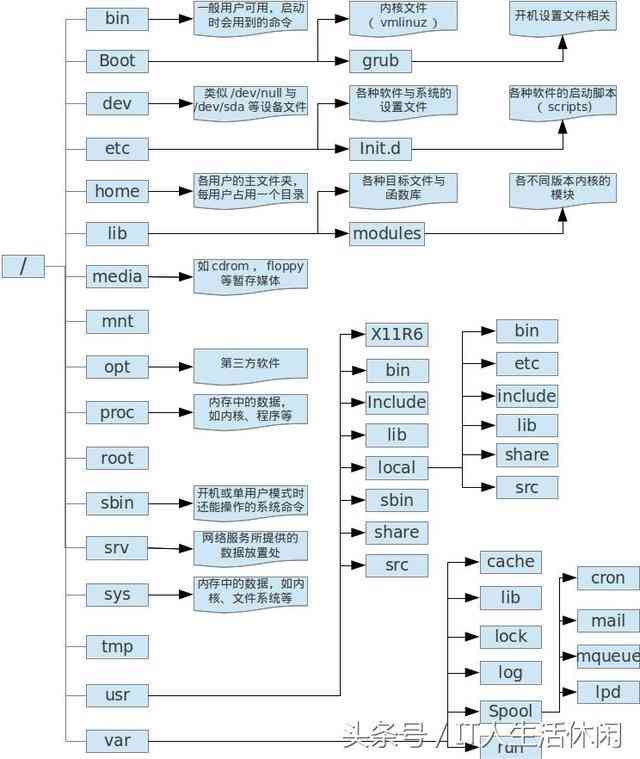

Linux目录详细说明
====================

> 方便你以后合理规划及管理

"/" : 根目录Linux文件系统的入口。也是最高级，最重要的的目录。除衍生出其它目录，还和系统的开机，还原，系统修复有的，一般要求不要把任务应用程序直接放在根目录下，如果满了，可能就登录不了了（需要注意是否日志输出在根目录下）

"/bin":基本系统所需要的命令，主要是单用户模式下，还能执行的命令。主要有cat，mv，mkdir，cp，bash ，ls

"/boot":内核和加载内核所需要的文件。grub系统引导管理器也在这个目录下，存在/boot/grub/

"/dev":在linux系统下，任何设备及接口设备，都是以文件的形式存在，设备文件存储目录，像终端、磁盘等。比较重要的有：
  - /dev/null （crontab经常把不想输出输到这里）;
  - /dev/zero;
  - /dev/tty;
  - /dev/lp*;
  - /dev/hd*;
  - /dev/sd*

"/etc":系统的主要配置文件都放在这个目录下，一般来说，这个普通人是看不到这些文件的;这里最好也不要放可执行文件。常见的目录有如下：
  - /etc/inittab ;
  - /etc/init。d/;
  - /etc/modprobe。conf ;
  - /etc/X11/ ;
  - /etc/fstab/ ;
  - /etc/sysconfig/ ;
  - /etc/init。d/开机启动脚本放在这里;
  - /etc/xinetd。d/ super daemon启动脚本放在这里
  - /etc/sysconfig/network/scripts/网管配置放在下面下

"/home":普通用户的目录默认存储目录。主文件夹有两种代号：
  - ~ 代表这个用户的主目录
  - ~dmtsai:代表 dmtsai的主文件夹

"/lib":库文件和内核模块存放目录。主要是开机用到，以及在/bin/;/sbin目录下命 令会调用的库函数。/lib/modules会放内核相关的模块。

"/lib64":和/lib类似，主要是64的库函数

"/usr" 是存放可以分享与不可以动的内容，不是user的缩写，而是UNIX Software Resource 的缩写，就是UNIX操作系统的软件资源。主要子目录有：
  - /usr/X**/ X Windows数据存在于此
  - /usr/bin/ 绝大部分用户可用命令在此
  - /usr/include/ C/C++等的头文件与包含文件在些。如果以源码的*。tar。gz安装软件时，可能会引用下面的文件
  - /usr/lib/ 包含应用程序函数库及目标文件，以及不被一般用户惯用的执行文件或脚 本
  - /usr/lib64/ 与/usr/lib/相似，会对64位的
  - /usr/local/ 本机自己安装的的软件，建议安装到这里，下面也有bin，etc，include，lib子目录，这些子目录功能大家可以想到
  - /usr/sbin/ 非系统正常运行所需要的命令，最常见的就是网络服务器软件的daemon
  - /usr/share/ 放共享文件的地方，基本是文本文件，可读的。子目录有
  - /usr/share/man 在线帮助文件
  - /usr/share/doc 软件杂项的说明文件
  - /usr/share/zoneinfo 软件杂项的说明文件
  - /usr/src 软件源码放在这里

"/media":即插即用设备的挂载点自动存放在这个目录下。像U盘，cdrom/dvd自动挂载后，就会在这个目录下。常见有/media/floppy，/media/cdrom

"/mnt":临时文件系统的挂载点目录。以前和/media一样，但有专门/media后，专门做临时挂载

"/opt":第三方软件的存放目录。什么叫第三方呢？像KDE，就是第三方的，只是集成到linux里，当然你可以放自己的东西到下面。

"/root":Linux超级权限用户root的跟目录。单独存放，也方便在进入单用户模式的操作。

"/sbin":基本的系统维护命令，只能由超级用户使用。这些命令为开机、修复、还原系统过程所需要的。常见的命令有fdisk，fsck，ifconfig，init，mkfs

"/srv":存放一些服务器启动之后需要提取的数据。主要存放网络服务后的一些数据，如www，ftp

"/tmp":临时文件目录，这个目录任何人可以访问，有可能需要定期清理。

"/usr":存放用户使用系统命令和应用程序等信息。像命令。帮助文件等。

"/var":存放经常变动的数据，像日志。邮件等。这个目录下的数据，需要定期清理，最好写个脚本，放在crontab里。常见的子目录：
  - /var/cache/ 执行中的缓存文件
  - /var/lib/ 软件本身执行的过程中，用到的数据。比如Mysql数据一般放在/var/lib/mysql/;而rpm数据则放在 /var/lib/rpm/
  - /var/lock/ 资源被锁时，放在此。有些资源只能一个程序使用，比如刻录机。
  - /var/log/ 系统日志存在地，有可能需要定时清理
  - /var/mail/ 系统邮件，看情况需要定时清理
  - /var/run/ 某些程序或服务启动后，PID放在下现
  - /var/spool/放置队列数据， 看情况需要定时清理

"/lost+found" 是ext2/ext3文件系统才产生的，目的是当文件系统产生错误里，将一些丢失的片段防在这个目录下。

"/proc" 是一个虚拟文件系统。放置内存中的数据，当有一个进程启动时，就有一个文件夹。比较重要的/proc/meminfo，/proc/cpuinfo可以通过这两文件查看内存和CPU情况，当然还有/proc/dma，/proc/interrupts，/proc/ioports，/proc/net/*等

"/sys" 和/proc相似，也是虚拟文件系统，主要记录内核相关，比如内核模块，内核检测的硬件信息。