基于Docker和Kubernetes的最佳架构实践
===

> 原创 2018-03-15 胡震 译 Docker

<!-- TOC -->

- [从现实生活到开发工作流](#从现实生活到开发工作流)
- [设置开发环境](#设置开发环境)
- [自动化测试](#自动化测试)
- [系统交付](#系统交付)
- [集成和交付的连续性](#集成和交付的连续性)
- [系统回滚](#系统回滚)
- [确保信息安全和审计](#确保信息安全和审计)
- [从开发流程到架构](#从开发流程到架构)
- [微服务架构](#微服务架构)
- [生态系统的关键组件和解决方案](#生态系统的关键组件和解决方案)
- [身份认证](#身份认证)
- [自动化服务配置](#自动化服务配置)
- [Git代码库和任务跟踪器](#git代码库和任务跟踪器)
- [跟踪系统](#跟踪系统)
- [监控和告警](#监控和告警)
- [API Gateway和单点登录](#api-gateway和单点登录)
- [事件总线和企业集成/服务总线](#事件总线和企业集成服务总线)
- [数据库和其他有状态的服务](#数据库和其他有状态的服务)
- [依赖镜像](#依赖镜像)
- [从架构到真实生活](#从架构到真实生活)

<!-- /TOC -->

软件开发领域在Docker和Kubernetes时代是如何变化的？ 是否有可能使用这些技术搭建一劳永逸的架构？ 当所有东西都被“打包”进容器中时，是否有可能统一开发及集成的流程？ 这些决策的需求是什么？ 它们会带来什么限制？ 它们会让开发人员更轻松，或者相反，反而增加不必要的复杂性吗？

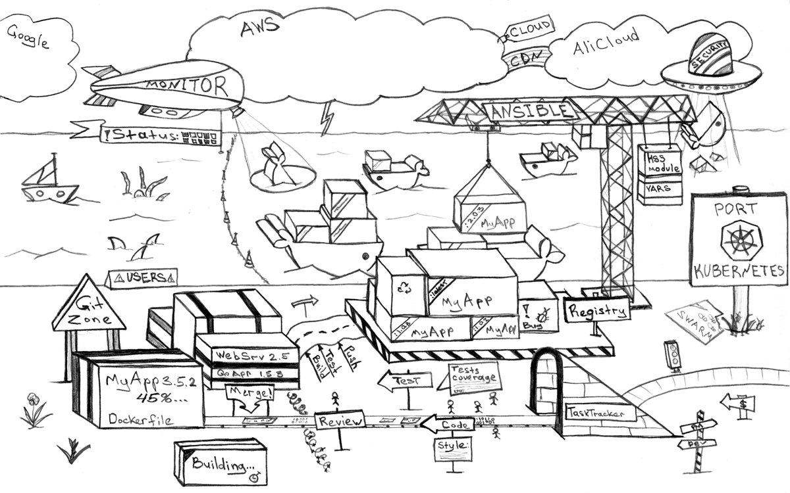

现在是时候以文本和原始插图方式阐明这些以及其他问题了！

这篇文章将带您踏上从现实生活到开发流程再到架构最后回到现实生活的旅程，并一路为您解答在这些停靠站点上遇到的最重要问题。 我们将试图确定一些应该成为架构一部分的组件和原则，并演示一些示例，但不会进入其实现领域。

文章的结论可能会让你心烦意乱，或者无比开心，这一切都取决于你的经验、你对这三章故事的看法，甚至在阅读本文时你的心情。 在下面可以发表评论或提出问题，让我知道您的想法！

# 从现实生活到开发工作流

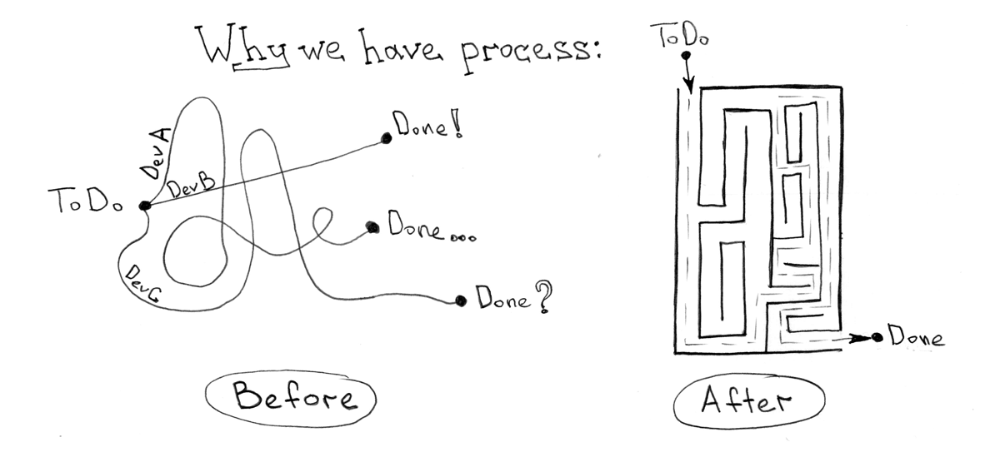

在大多数情况下，我所见过的或者很荣幸搭建的所有开发流程都只是为了一个简单的目标——缩短从概念产生到交付生产环境之间的时间间隔，同时保持一定程度的代码质量。

想法的好坏无关紧要。 因为糟糕的想法来也匆匆，去也匆匆——你只要尝试一下，就可以把它们丢进故纸堆里。 这里值得一提的是，从一个糟糕的想法回滚是可以落在自动化设施的肩膀上的，这可以自动化您的工作流程。

持续集成和交付看起来像是软件开发领域的救命稻草。 究竟还有什么比这更简单呢？ 如果你有一个想法，你有代码，那么就去做吧！ 如果不是轻微的问题，这将是完美无瑕的——集成和交付过程相对而言难以独立于公司特有的技术和业务流程之外。

然而，尽管任务看起来很复杂，但在生活中不时会出现一些优秀的想法，这些想法可以让我们（当然，我自己是确定的）更接近构建一个无瑕疵的并且几乎可以在任何场合使用的机制。 对我来说，离这样的机制最近的步骤是Docker和Kubernetes，他们的抽象层次和思想方法使我认为现在可以用几乎相同的方法解决80％的问题。

其余的20％的问题显然还在原地踏步，但正因如此你才可以将你发自内心的创意天赋聚焦在有趣的工作上，而不是处理重复的例行公事。 只要照料一次“架构框架”，就可以让您忘掉已经解决的80％问题。

这一切意味着什么？以及Docker是如何解决开发工作流程的问题的？ 让我们看一个简单的过程，这对于大多数工作环境来说也足够了：

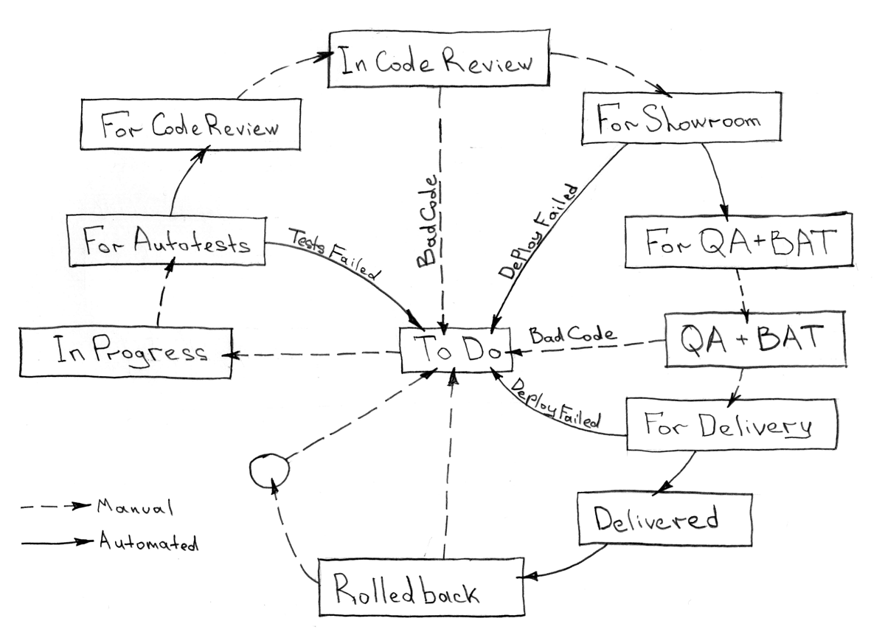

通过适当的方法，您可以自动化并整合上面序列图中的所有内容，并在未来几个月内将其抛之脑后。

# 设置开发环境



一个项目应该包含一个docker-compose.yml文件，这可以让你省去考虑在本地机器上运行应用程序/服务需要做些什么以及如何操作的问题。 一个简单的命令docker-compose up应该启动您的应用程序及其所有依赖项，使用fixtures填充数据库，上传容器内的本地代码，启用代码跟踪以便即时编译，并最终在期望的端口开始响应请求。 即使在设置新服务时，您也不必担心如何启动、在哪里提交更改或使用哪个框架。 所有这些都应该提前在标准说明中描述，并由针对不同设置的服务模板指定：`前端、后端和worker`。

# 自动化测试



所有你想知道的关于“黑匣子”（至于为什么我把容器称之为如此的更多信息，将在文章中的稍后部分阐明）的情况是，它里面的一切都完好无损，是或否，1或0。您可以在容器内部执行有限数量的命令，而docker-compose.yml描述了它的所有依赖关系，您可以轻松自动化和整合这些测试，而不必过分关注实现细节。

比如，像这样! https://gist.github.com/paunin/3303c8cb8dd231f961c01c0b69188c59

在这里，测试不仅意味着单元测试，还包括功能测试、集成测试、（代码样式）测试和副本、检查过时的依赖关系以及已使用软件包的许可证正常与否等等。 关键是所有这些都应该封装在Docker镜像中。

# 系统交付

无论在何时何地想安装您的项目都无所谓。 结果就像安装进程一样，应该始终如一。 至于您要安装的是整个生态系统的哪个部分或者您将从哪个Git仓库获得代码也没有区别。 这里最重要的组件是幂等性。 唯一应该指定的是控制安装过程的变量。

以下是我在解决这个问题时相当有效的算法：

1. 从所有Dockerfiles收集镜像(例如像这样 https://github.com/paunin/images-builder )

2. 使用元项目，通过Kube API (https://kubernetes.io/docs/reference/generated/kube-apiserver/ )将这些镜像交付给Kubernetes。 启动交付通常需要几个输入参数：
    - Kube API端点
    - 一个“机密”对象，因不同的环境而异（本地/测试/预发布/生产）
    - 要展示的系统名称以及针对这些系统的Docker镜像的标签（在上一步中获取）

作为一个涵盖所有系统和服务的元项目的例子（换句话说，是一个描述生态系统如何编排以及如何交付更新的项目），我更愿意使用Ansible playbooks，通过这个模块(https://github.com/paunin/ansible-kubernetes-module )来与Kube API集成。 然而，复杂的自动化可以参考其他选项，我稍后将详细讨论自己的选择。 但是，您必须考虑中心化/统一的管理架构的方式。 这样一个方式可以让您方便、统一地管理所有服务/系统，并消除即将到来的执行类似功能的技术和系统丛林可能带来的任何复杂情况。

通常，需要如下的安装环境：

* “测试”——用于对系统进行一些手动检查或调试
* “预发布”——用于近乎实时的环境以及与外部系统的集成（通常位于DMZ而不是测试环境）
* “生产”——最终用户的实际环境

# 集成和交付的连续性

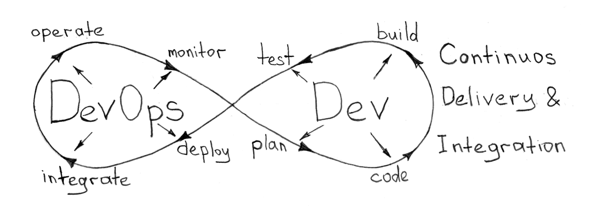

如果你有一个统一的方式来测试Docker镜像——或者“黑盒子”——你可以假设这些测试结果可以让你无缝地（并且问心无愧）将功能分支集成到你的Git仓库的上游或主分支中。

也许，这里唯一的交易断路器是集成和交付的顺序。如果没有发行版，那么如何通过一组并行的功能分支阻止一个系统上的“竞争条件”？

因此，只有在没有竞争的情况下才能开始这个过程，否则“竞争条件”会萦绕脑海：

1. 尝试将功能分支更新到上游（git rebase/ merge）
1. 从Dockerfiles构建镜像
1. 测试所有构建的镜像
1. 开始并等待，直到系统交付了构建自步骤2的镜像
1. 如果上一步失败，则将生态系统回滚到之前的状态
1. 在上游合并功能分支并将其发送到存储库

在任何步骤中的任何失败都应终止交付过程，并将任务返回给开发人员以解决错误，无论是失败的测试还是合并冲突。

您可以使用此过程来操作多个存储库。只需一次为所有存储库执行每个步骤（步骤1用于代码库A和B，步骤2用于代码库A和B等），而不是对每个单独的存储库重复执行整个流程（步骤1-6用于代码库A ，步骤1-6用于代码库B，等等）。

此外，Kubernetes允许您分批次地推出更新以进行各种AB测试和风险分析。 Kubernetes是通过分离服务（接入点）和应用程序在内部实现的。您可以始终以所需的比例平衡组件的新旧版本，以促进问题的分析并为潜在的回滚提供途径。

# 系统回滚

架构框架的强制性要求之一是能够回滚任何部署。反过来，这又需要一些显式和隐式的细微差别。以下是其中最重要的一些事项：

服务应该能够设置其环境以及回滚更改。例如，数据库迁移、RabbitMQ schema等等。
如果无法回滚环境，则该服务应该是多态的，并支持旧版本和新版本的代码。例如：数据库迁移不应该中断旧版本的服务（通常是2或3个以前的版本）
向后兼容任何服务更新。通常，这是API兼容性，消息格式等。

在Kubernetes集群中回滚状态相当简单（运行`kubectl rollout undo deployment/some-deployment`，Kubernetes将恢复先前的“快照”），但是为了让此功能生效，您的元项目应包含有关此快照的信息。但是更为复杂的交付回滚算法让人望而生畏，尽管它们有时是必需的。

以下是可以触发回滚机制的内容：

* 发布后应用程序错误的高比例
* 来自关键监控点的信号
* 失败的冒烟测试[4]
* 手动模式——人为因素

# 确保信息安全和审计

没有一个工作流程可以奇迹般地“搭建”刀枪不入的安全性并保护您的生态系统免受外部和内部威胁，因此您需要确保您的架构框架是在每个级别和所有子系统里按照公司的标准和安全策略执行的。

我将在后面的关于监控和告警的章节讨论有关解决方案的所有三个级别，它们本身也是系统完整性的关键。

Kubernetes拥有一套良好的针对访问控制(https://kubernetes.io/docs/admin/authorization/ )、网络策略(https://kubernetes.io/docs/concepts/services-networking/network-policies/ )、事件审计(https://kubernetes.io/docs/tasks/debug-application-cluster/audit/ )以及其他与信息安全相关的强大工具的内置机制，可用于构建一个良好的防护边界，以抵御和阻止攻击及数据泄露。

# 从开发流程到架构

应该认真考虑将开发流程与生态系统紧密集成的想法。将这种集成的需求添加到架构的传统需求集（弹性、可伸缩性、可用性、可靠性、抵御威胁等）中，可以大大提高架构框架的价值。 这是至关重要的一个方面，由此导致出现了一个名为“DevOps”（开发运维）的概念，这是实现基础设施全面自动化并优化的合理步骤。 但是，如果有一个设计良好的架构和可靠的子系统，DevOps任务可以被最小化。

# 微服务架构

没有必要详细讨论面向服务的架构——SOA[5]的好处，包括为什么服务应该是“微”的。 我只会说，如果你决定使用Docker和Kubernetes，那么你很可能理解（并接受）单体应用架构是很困难甚至根子上就是错误的。 Docker旨在运行一个进程并持久化，Docker让我们聚焦于DDD框架（领域驱动开发）内进行思考。 在Docker中，打包后的代码被视为具有一些公开端口的黑盒子。

# 生态系统的关键组件和解决方案

根据我在设计具有更高可用性和可靠性的系统方面的经验，有几个组件对于微服务的运维是至关重要的，稍后我会列出并讨论这些组件，我将在Kubernetes环境中引用它们，也可以参考我的清单作为其它任何平台的检查单。

如果你（像我一样）会得出这样的结论，即将这些组件作为常规的Kubernetes服务来管理，那么我建议你在除“生产环境”之外的单独集群中运行它们。 比如“预发布”集群，因为它可以在生产环境不稳定并且你迫切需要其镜像、代码或监控工具的来源时节省你的时间。 可以说，这解决了鸡和鸡蛋的问题。

# 身份认证



像往常一样，它始于访问——服务器、虚拟机、应用程序、办公室邮件等。 如果您是或想成为主要的企业平台（IBM、Google、Microsoft）之一的客户，则访问问题将由供应商的某个服务处理。 但是，如果您想拥有自己的解决方案，难道只能由您并在您的预算之内进行管理？

此列表[6]可帮助您确定适当的解决方案并估算设置和维护所需的工作量。 当然，您的选择必须符合公司的安全政策并经信息安全部门批准。

# 自动化服务配置

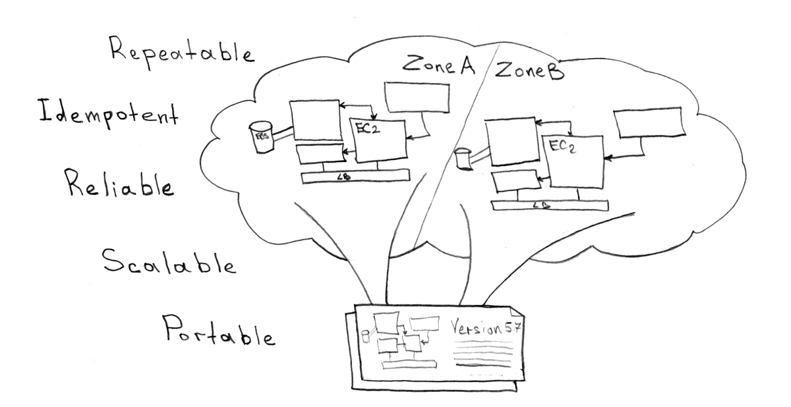

尽管Kubernetes在物理机器/云虚拟机（Docker、kubelet、kube proxy、etcd集群）上只需要少量组件，但对于新机器的添加和集群管理仍然需要自动化。 以下是一些简单的方法：

* KOPS——此工具允许您在两个云供应商（AWS或GCE）之一上安装集群
* Teraform——这可以让您管理任何环境的基础设施，并遵循IAC（基础架设施即代码）的思想
* Ansible——用于任何类型的通用自动化工具

就个人而言，我更喜欢第三个选项（带有一个Kubernetes的集成模块<https://github.com/paunin/ansible-kubernetes-module > ），因为它允许我使用服务器和Kubernetes对象并执行任何类型的自动化。 但是，没有什么能阻止您使用Teraform及其Kubernetes模块(https://www.terraform.io/docs/providers/kubernetes/ )。 KOPS在“裸机”方面效果不佳，但它仍然是与AWS/GCE一起使用的绝佳工具！

# Git代码库和任务跟踪器

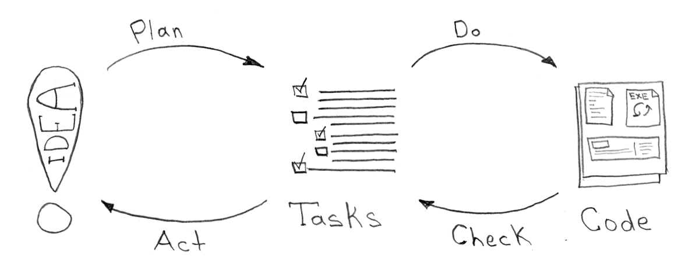

对于任何Docker容器，使其日志可访问的唯一方法是将它们写入正在容器中运行的根进程的STDOUT或STDERR，服务开发人员并不关心日志数据接下来的变化，而主要是它们应该在必要时可用，并且最好包含过去某个点的记录。满足这些期许的所有责任在于Kubernetes以及支持生态系统的工程师。

在官方文档中(https://kubernetes.io/docs/concepts/cluster-administration/logging/ )，您可以找到关于处理日志的基本（和好的）策略的说明，这将有助于您选择用于聚合和存储大量文本数据的服务。

在针对日志系统的推荐服务中，同一文档提到fluentd用于收集数据（在集群的每个节点上作为代理启动时）以及用于存储和索引数据的Elasticsearch(https://kubernetes.io/docs/user-guide/logging/elasticsearch )。即使你可能不赞同这个解决方案的效率，但鉴于它的可靠性和易用性，我认为这至少是一个好的开始。

Elasticsearch是一个资源密集型的解决方案，但它可以很好地扩展并有现成的Docker镜像，可以运行在单个节点以及所需大小的集群上。

# 跟踪系统

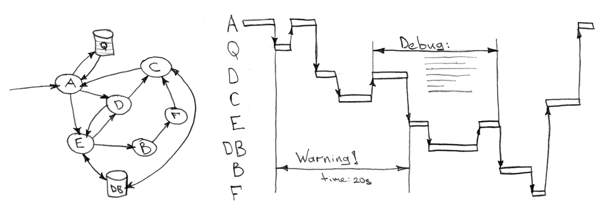

即使代码非常完美，然而还是会确实发生故障，接着你想在生产环境中非常仔细地研究它们，并试图了解“如果在我的本地机器上一切工作正常，那么在生产环境上究竟发生了什么错误？”。比如缓慢的数据库查询、不正确的缓存、较慢的磁盘或与外部资源的连接、生态系统中的交易，瓶颈以及规模不足的计算服务都是您不得不跟踪和估算在实际负载下代码执行时间的一些原因。

Opentracing和Zipkin足以应付大多数现代编程语言的这一任务，并且在封装代码之后不会增加额外的负担。当然，收集到的所有数据应该存储在适当的地方，并作为一个组件使用。

通过上述的开发标准和服务模板可以解决在封装代码以及通过服务、消息队列、数据库等转发“Trace ID”时出现的复杂情况。后者也考虑到了方法的一致性。

# 监控和告警

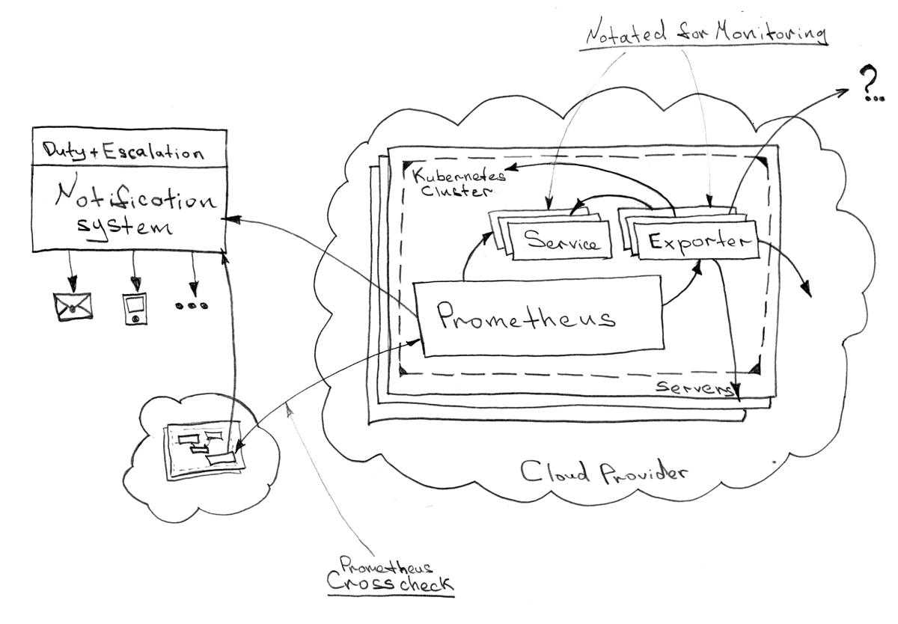

Prometheus已经成为现代监控系统中事实上的标准，更重要的是，它在Kubernetes(https://coreos.com/blog/monitoring-kubernetes-with-prometheus.html )上获得了开箱即用的支持。您可以参考官方Kubernetes文档(https://kubernetes.io/docs/tasks/debug-application-cluster/core-metrics-pipeline/ )来了解更多关于监控和警报的信息。

监控是必须安装在集群内的少数几个辅助系统之一，集群是一个受监控的实体。但是对于监控系统的监控（抱歉有些啰嗦）只能从外部进行（例如，从相同的“预发布”环境）。在这种情况下，交叉检查可作为一个针对任何分布式环境的便捷解决方案，这不会使高度统一的生态系统架构复杂化。

整个监控范围可以分为三个完全逻辑隔离的层级。以下是我认为的在每个层级最重要的跟踪点例子：

* 物理层：网络资源及其可用性——磁盘（I/O，可用空间）——单个节点（CPU、RAM、LA）的基本资源
* 集群层：——每个节点上主集群系统的可用性（kubelet、kubeAPI、DNS、etcd等）——可用资源数量及其均匀分布——允许的可用资源相对于服务消耗的实际资源的监控——pod的重新加载
* 服务层：——任何类型的应用程序监控——从数据库内容到API调用频率——API网关上的HTTP错误数量——队列大小和worker的利用率——数据库的多个度量标准（复制延迟、事务的时间和数量、缓慢的请求等）——对非HTTP进程的错误分析——发送到日志系统请求的监控（可以将任何请求转换为度量标准）

至于在每个层级的告警通知，我想推荐使用了无数次的其中一个外部服务，可以发送通知电子邮件，短信或打电话给手机号码。我还会提到另一个系统——OpsGenie[8]——它与Prometheus的alertmanaer(https://prometheus.io/docs/alerting/configuration/#%3Copsgenie_config%3E )是紧密集成的。

OpsGenie是一种弹性的告警工具，可帮助处理升级、全天候工作、通知渠道选择等等。在团队之间分发告警也很容易。例如，不同级别的监控应向不同的团队/部门发送通知：物理——Infra + Devops，集群——Devops，应用程序——每一个相关的团队。

# API Gateway和单点登录

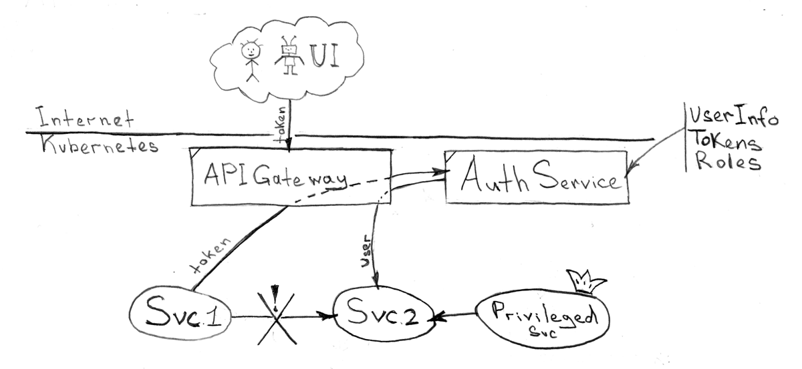

要处理诸如授权、认证、用户注册（外部用户——公司客户）和其他类型的访问控制等任务，您需要高度可靠的服务，以保持与API Gateway的弹性集成。使用与“身份服务”相同的解决方案没有什么坏处，但是您可能需要分离这两种资源以实现不同级别的可用性和可靠性。

内部服务的集成不应该很复杂，您的服务不应该担心用户和对方的授权和身份验证。相反，架构和生态系统应该有一个处理所有通信和HTTP流量的代理服务。

让我们考虑一下最适合与API Gateway集成的方式，即整个生态系统——令牌。此方法适用于所有三种访问方案：从UI、从服务到服务以及从外部系统。接着，接收令牌（基于登录名和密码）的任务由用户界面本身或服务开发人员完成。区分UI中使用的令牌的生命周期（较短的TTL）和其他情况（较长的和自定义的TTL）也是有意义的。

以下是API Gateway解决的一些问题：

* 从外部和内部访问生态系统服务（服务不直接相互通信）
* 与单点登录服务集成：令牌转换和附加HTTPS请求，头部包含所请求服务的用户标识数据（ID、角色和其他详细信息）——根据从单点登录服务接收到的角色启用/禁用对所请求服务的访问控制
* 针对HTTP流量的单点监控
* 复合不同服务的API文档（例如，复合Swagger的json/yml文件）
* 能够根据域和请求的URI管理整个生态系统的路由
* 用于外部流量的单一接入点，以及与接入供应商的集成

# 事件总线和企业集成/服务总线



如果您的生态系统包含数百个可在一个宏域中工作的服务，则您将不得不处理服务通信的数千种可能方式。为了简化数据流，您应该具备在发生特定事件时将信息分发到大量收件人的能力，而不管事件的上下文如何。换句话说，您需要一个事件总线来发布基于标准协议的事件并订阅它们。

作为事件总线，您可以使用任何可以操作所谓Broker的系统：RabbitMQ、Kafka、ActiveMQ等。一般来说，数据的高可用性和一致性对于微服务是至关重要的，但是由于CAP定理[10]，您仍然不得不牺牲某些东西来实现总线的正确分布和集群化。

自然，事件总线应该能够解决各种服务间通信问题，但随着服务数量从几百个增加到几千个甚至几万个，即使是最好的基于事件总线的架构也会望而却步，您将需要寻找另一种解决方案。一个很好的例子就是集成总线方法，它可以扩展上述“Dumb管——智能消费”策略的功能。

有几十个使用“企业集成/服务总线”方法的理由(https://en.wikipedia.org/wiki/Enterprise_service_bus )，其目的是减少面向服务架构的复杂性。以下是其中几个理由：

* 聚合多个消息
* 将一个事件拆分为几个事件
* 对于事件的系统响应的同步/事务分析
* 接口的协调，这对于与外部系统的集成特别重要
* 事件路由的高级逻辑
* 与相同服务的多重集成（从外部和内部）
* 数据总线的不可扩展中心化

作为企业集成总线的一款开源软件，您可能需要考虑Apache ServiceMix[12]，其中包含几个对于此类SOA的设计和开发至关重要的组件。

# 数据库和其他有状态的服务

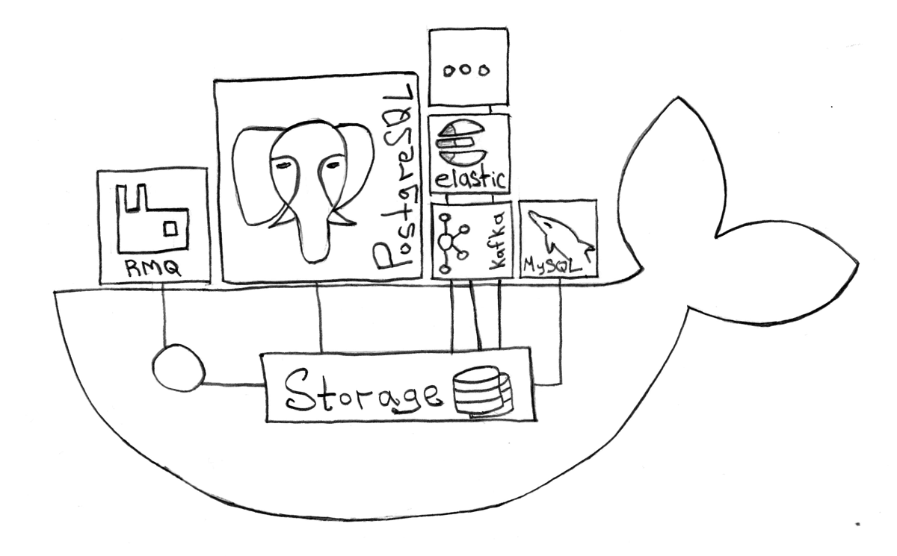

和Kubernetes一样，Docker一次又一次地改变了所有用于需要数据持久化以及与磁盘紧密相关的服务的游戏规则。有人说服务应该在物理服务器或虚拟机上以旧的方式“生存”。我尊重这一观点，并且不会谈论它的优点和缺点，但我相当肯定这种说法的存在仅仅是因为在Docker环境中暂时缺乏管理有状态服务的知识、解决方案和经验。

我还应该提到数据库经常占据存储世界的中心位置，因此您选择的解决方案应该完全准备好在Kubernetes环境中工作。

根据我的经验以及市场情况，我可以区分以下几组有状态的服务以及每个服务最适合的Docker解决方案的示例：

* 数据库管理系统——PostDock(https://github.com/paunin/PostDock )是在任何Docker环境中PostgreSQL简单可靠的解决方案
* 队列/消息代理——RabbitMQ是构建消息队列系统和路由消息的经典软件。 RabbitMQ配置中的cluster_formation参数对于集群设置是必不可少的
* 高速缓存服务——Redis(https://github.com/paunin/redis )被认为是最可靠和弹性的数据高速缓存解决方案之一
* 全文搜索——我上面已经提到过的Elasticsearch技术栈，最初用于全文搜索，但同样擅长存储日志和任何具有大量文本数据的工作
* 文件存储服务——用于任何类型的文件存储和交付（ftp，sftp等）的一般化服务组

# 依赖镜像

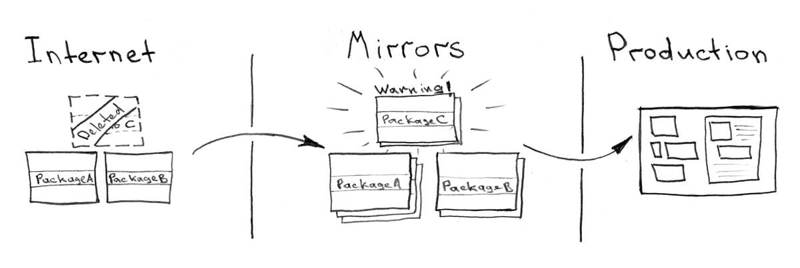

如果您尚未遇到您需要的软件包或依赖项已被删除或暂时不可用的情况，请不要认为这种情况永远不会发生。 为避免不必要的不可用性并为内部系统提供安全保护，请确保构建和交付服务都不需要Internet连接。 配置镜像和复制所有的依赖项到内部网络：Docker镜像、rpm包、源代码库、python/go/js/php模块。

这些以及其他任何类型的依赖关系都有自己的解决方案。 最常见的可以通过查询“private dependency mirror for ...”来Google搜索。

# 从架构到真实生活



不管你喜不喜欢，你的整个架构命中注定迟早会难以为继。它总是会发生：技术过时很快（1 - 5年），方法和方法论——有点慢（5 - 10年），设计原则和基础——偶尔（10 - 20年），但终归是不可避免的。

考虑到技术的过时，需要总是试图让自己的生态系统处于技术创新的高峰期，计划并推出新的服务以满足开发人员、业务和最终用户的需求，向您的利益相关者推广新的实用程序，交付知识来推动您的团队和公司前进。

通过融入专业社区、阅读相关文献并与同事交流，保持自己处于生态链的顶端。注意项目中的新机会以及正确使用新趋势。试验并应用科学方法来分析研究结果，或依靠您信任和尊重的其他人的结论。

除非你是本领域的专家，否则很难为根本性的变化做好准备。我们所有人只会在我们的整个职业生涯中见证一些重大的技术变化，但并不是我们头脑中的知识数量使得我们成为专业人士并让我们攀登到顶峰的，而是我们思维的开放性以及接受蜕变的能力。

回到标题中的问题：“是否有可能搭建一个更好的架构？”。答案显而易见：不，不是“一劳永逸”，但一定要在某种程度上积极争取，在未来某个“很短的时间”，你一定会成功的！

相关链接
---

* https://gist.github.com/paunin/3303c8cb8dd231f961c01c0b69188c59
* https://github.com/paunin/images-builder
* https://github.com/paunin/ansible-kubernetes-module
* https://en.wikipedia.org/wiki/Smoke_testing_%28software%29
* https://www.google.com/search?q=SOA
* https://en.wikipedia.org/wiki/List_of_single_sign-on_implementations
* https://kubernetes.io/docs/concepts/cluster-administration/logging/
* https://www.opsgenie.com/
* https://swagger.io/
* https://en.wikipedia.org/wiki/CAP_theorem
* https://en.wikipedia.org/wiki/Enterprise_service_bus
* http://servicemix.apache.org/

原文链接：https://hackernoon.com/the-best-architecture-with-docker-and-kubernetes-myth-or-reality-77b4f8f3804d